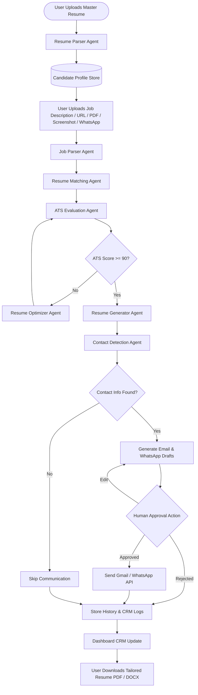

# 🗺️ AI Implementation Roadmap — AI Job Copilot Layer

This document serves as the single source of truth and architectural reference for implementing the **AI Layer** of the **AI Job Copilot**. It outlines the system design, the agentic workflow, detailed development phases, folder structures, and verification strategies to bring the copilot to production readiness.

---

## 📋 Table of Contents

- [1. Project Goal](#-1-project-goal)
- [2. Current Project Status](#-2-current-project-status)
- [3. Final AI Workflow](#-3-final-ai-workflow)
- [4. AI Development Phases](#-4-ai-development-phases)
  - [Phase 1: Candidate Intelligence Layer](#phase-1-candidate-intelligence-layer)
  - [Phase 2: Job Intelligence Layer](#phase-2-job-intelligence-layer)
  - [Phase 3: Resume Matching Layer](#phase-3-resume-matching-layer)
  - [Phase 4: ATS Evaluation Layer](#phase-4-ats-evaluation-layer)
  - [Phase 5: Resume Optimization Layer](#phase-5-resume-optimization-layer)
  - [Phase 6: Resume Generator](#phase-6-resume-generator)
  - [Phase 7: Communication Layer](#phase-7-communication-layer)
  - [Phase 8: Human Approval Layer](#phase-8-human-approval-layer)
  - [Phase 9: Dashboard Analytics](#phase-9-dashboard-analytics)
  - [Phase 10: Full AI Orchestration](#phase-10-full-ai-orchestration)
- [5. Folder Structure](#-5-folder-structure)
- [6. AI Tech Stack](#-6-ai-tech-stack)
- [7. Testing Plan](#-7-testing-plan)
- [8. Phase Checklist](#-8-phase-checklist)
- [9. MVP Complete Checklist](#-9-mvp-complete-checklist)
- [10. Version 2 Roadmap](#-10-version-2-roadmap)
- [11. Notes & Implementation Considerations](#-11-notes--implementation-considerations)
- [12. Future Improvements Section](#-12-future-improvements-section)

---

## 🎯 1. Project Goal

The primary goal of the **AI Layer** is to close the gap between a candidate's credentials and target job requisitions. 

Specifically, the AI Layer must:
1. **Optimize Resumes Iteratively**: Evaluate a user's master resume against any ingested job description and dynamically rewrite relevant sections (summaries, bullet points, skills taxonomy) in an agentic loop until the computed **ATS Compatibility Score reaches at least 90 / 100**.
2. **Automate Outreach Intelligently**: Scan target job listings or sources for recruiter contact details. Only when valid recruiter contact information is identified, the system will draft personalized, contextual outreach emails (via Gmail API) and chat outreach (via WhatsApp Business API).
3. **Keep the Human in the Loop**: Provide a secure dashboard staging state where the user must explicitly inspect, modify, and approve or reject any generated resume version and outreach draft before dispatch.

---

## 📊 2. Current Project Status

The foundation of the AI Job Copilot is fully developed, tested, and operational. The system is designed to host the new agentic layers directly. The following architectural components are completed:

- [x] **Authentication**: JWT-based login, registration, token refresh, and blacklisting.
- [x] **Resume Upload**: Endpoints handling physical PDF/DOCX multi-part streams up to 10MB.
- [x] **Job Upload**: Core text ingestion and analysis models.
- [x] **Resume Workspace**: CRUD operations tracking active master resumes and active tailoring versions.
- [x] **Job Workspace**: Ingestion logs and structured job profiles storage.
- [x] **Dashboard**: CRM dashboard aggregating applications today, drafts pending, and search indexing.
- [x] **Email APIs**: Service hooks for drafts, OAuth flow callbacks, and sending dispatch logs.
- [x] **Resume APIs**: Database versioning endpoints and mocked PDF download endpoints.
- [x] **Job APIs**: Ingest, retrieve, analyze, and delete job records.
- [x] **Database**: Fully configured SQLAlchemy migrations mapping PostgreSQL relations and local SQLite configurations.
- [x] **Frontend**: Complete UI skeletons with interactive forms, search filters, workspaces, and navigation.
- [x] **Backend**: FastAPI app with layered routing, dependency-injected services, and error handling.
- [x] **Tests Passing**: 68+ tests covering authentications, services, database operations, and user flows.

> [!NOTE]
> All AI integration points currently return mocked schemas. The core objective is replacing these mock endpoints with production-ready agent workflows.

---

## 🔄 3. Final AI Workflow

Below is the conceptual flow of the end-to-end AI workflow.

### System Flowchart (Mermaid)



### Complete End-to-End Execution Sequence

1. **Profile Ingestion**: Candidate uploads a PDF resume. The **Resume Parser Agent** parses the text, extracts structural elements, and populates the **Candidate Profile Store**.
2. **Job Ingestion**: The system ingests job descriptions via arbitrary text, scraping a URL, OCR-parsing a screenshot, reading attachments, or capturing WhatsApp alerts. The **Job Parser Agent** transforms this into a structured JSON schema.
3. **Matching & Assessment**: The **Resume Matching Agent** performs semantic skill gap analysis. The **ATS Evaluation Agent** computes scores across key pillars: Skill Score, Keyword Match, Experience Alignment, and Formatting.
4. **Agentic Optimization Loop**: If the ATS score is `< 90`, the **Resume Optimizer Agent** rewrites section blocks. It presents the updated resume back to the ATS Evaluator. This continues iteratively (up to a hard safety limit of 5 runs) until `Score >= 90`.
5. **Output Compilation**: Once the score threshold is met, the **Resume Generator Agent** produces print-ready PDF and DOCX files.
6. **Communication Dispatch**: The **Contact Detection Agent** inspects the job listing for recruiter name, email, or telephone. If found, custom outreach scripts are written. The user reviews them on the dashboard, making optional manual edits before triggering sending routines.

---

## 🚀 4. AI Development Phases

---

### Phase 1: Candidate Intelligence Layer
*   **Goal**: Parse unstructured master resumes into high-fidelity structured JSON and index sections into a vector space for semantic retrieval.
*   **Modules**: `Resume Parser Agent`, `Candidate Profile Store`, Gemini Embeddings, PGVector.
*   **Input**: Binary PDF/DOCX file streams.
*   **Output**: Structured candidate profile Pydantic model (`CandidateProfileSchema`) and 768-dimension segment embeddings.
*   **Files to Create**:
    - `backend/app/ai/agents/resume_parser.py` (Gemini-backed extraction)
    - `backend/app/ai/agents/candidate_profile.py` (Data model structures)
    - `backend/app/ai/services/candidate_intelligence.py` (Service layer wrapping agents)
    - `backend/tests/ai/test_phase1_candidate.py` (Modular unit/integration tests)
*   **Files to Modify**:
    - `backend/app/resume/router.py` (Route upload data streams to new service)
    - `backend/app/resume/services.py` (Replace mock storage parsing with real AI execution)
*   **Database Changes**:
    - Enable `pgvector` extension: `CREATE EXTENSION IF NOT EXISTS vector;`
    - Add database tables:
      - `candidate_profiles`: storing parsed personal details, summary, and metadata.
      - `candidate_profile_sections`: storing work experience blocks, projects, and education with a `vector(768)` embedding column.
*   **Testing Strategy**:
    - **Unit Tests**: Mock Gemini API responses for specific formatting edge cases.
    - **Integration Tests**: Verify database roundtrips to PGVector, validating cosine distance queries.
    - **API Tests**: Call POST `/api/v1/resume/upload` and assert exact JSON structure returned.
*   **Expected Output**:
    ```json
    {
      "name": "Jane Doe",
      "email": "jane.doe@example.com",
      "skills": ["Python", "FastAPI", "PostgreSQL", "LangGraph"],
      "experience": [
        {
          "company": "Tech Corp",
          "role": "Software Engineer",
          "highlights": ["Designed microservices with 99.9% uptime."]
        }
      ]
    }
    ```
*   **Completion Criteria**: Replaces mock parser. Extraction accuracy over 95% on contact info, skills, and experience items. Vector indices successfully store and search sections.

---

### Phase 2: Job Intelligence Layer
*   **Goal**: Parse and synthesize job information from arbitrary formats (raw text, URLs, OCR images, Emails, WhatsApp alerts) into structured job specifications.
*   **Modules**: `Job Parser Agent`, `URL Parser`, `OCR Engine`, `Email Parser`, `WhatsApp Parser`.
*   **Input**: Plain text, HTML page strings, raw image files (PNG/JPG), message objects, or emails.
*   **Output**: Structured job schema (`JobDescriptionSchema`) containing role details, skill lists, keywords, and recruiter contact records.
*   **Files to Create**:
    - `backend/app/ai/agents/job_parser.py` (LLM-based structured job analysis)
    - `backend/app/ai/utils/scraper.py` (Web parser for job board URL extraction)
    - `backend/app/ai/utils/ocr.py` (Text extraction from images using Gemini multimodal capability)
    - `backend/tests/ai/test_phase2_job.py`
*   **Files to Modify**:
    - `backend/app/jobs/router.py`
    - `backend/app/jobs/services.py`
*   **Database Changes**:
    - Update `jobs` database table: Add `recruiter_email` (string), `recruiter_name` (string), `job_source_url` (string), and `raw_ingested_content` (text).
*   **Testing Strategy**:
    - **Unit Tests**: Evaluate parser against mock job descriptions containing obfuscated emails.
    - **Integration Tests**: Run URL scraper against local mock job board templates.
    - **API Tests**: Post images or URLs to `/api/v1/jobs/ingest` and assert metadata outputs.
*   **Expected Output**:
    ```json
    {
      "job_title": "Senior Backend Engineer",
      "company": "Innovate LLC",
      "required_skills": ["Python", "PostgreSQL", "Docker"],
      "ats_keywords": ["FastAPI", "Redis", "Asyncio"],
      "recruiter_contact": {
        "name": "Sarah Connor",
        "email": "sconnor@innovate.com"
      }
    }
    ```
*   **Completion Criteria**: Dynamic conversion of job text, image screenshots, or URLs into matching schema definitions. Recruiter credentials successfully parsed when available.

---

### Phase 3: Resume Matching Layer
*   **Goal**: Identify semantic alignments and structural gaps between candidate records and job requirements.
*   **Modules**: `Resume Matching Agent`, `Gap Analyzer`, `Semantic Match Engine`.
*   **Input**: `CandidateProfile` and `JobDescriptionSchema`.
*   **Output**: Skill similarity scores, experience matches, and structured lists of missing competencies.
*   **Files to Create**:
    - `backend/app/ai/agents/matcher.py` (Core matching engine using vector distance & LLM logic)
    - `backend/app/ai/services/matching_service.py`
    - `backend/tests/ai/test_phase3_matching.py`
*   **Files to Modify**:
    - `backend/app/resume/services.py` (Link matching calculations to optimization triggers)
*   **Database Changes**:
    - None (reads from existing vector stores and structured job logs).
*   **Testing Strategy**:
    - **Unit Tests**: Compare resume containing "FastAPI" with job demanding "Flask" using cosine distance metric.
    - **Integration Tests**: Verify matching query response times stay below 200ms.
    - **API Tests**: Verify that `/api/v1/resume/optimize` correctly executes matching checks first.
*   **Expected Output**:
    ```json
    {
      "match_percentage": 78.5,
      "skill_gaps": ["Kubernetes", "gRPC"],
      "matching_strengths": ["Python", "SQLAlchemy", "REST APIs"]
    }
    ```
*   **Completion Criteria**: Accurately computes matching strengths and lists explicit skill deficiencies, providing the downstream optimization agents with a targeted rewrite checklist.

---

### Phase 4: ATS Evaluation Layer
*   **Goal**: Quantify the resume's alignment against target ATS parsers using mathematical models measuring keywords, skill taxonomy, experiences, and formatting.
*   **Modules**: `ATS Evaluation Agent`, `Scoring Engine`.
*   **Input**: Tailored Resume Model, Target Job Description.
*   **Output**: ATS compatibility report (`ATSScoreReport`) with breakdown scores and a total composite rating (0–100).
*   **Files to Create**:
    - `backend/app/ai/agents/ats_evaluator.py` (Computes keyword densities, phrase checks, and formatting rules)
    - `backend/tests/ai/test_phase4_ats.py`
*   **Files to Modify**:
    - `backend/app/jobs/analysis/services.py`
*   **Database Changes**:
    - Update `job_analyses` table to include: `ats_score` (integer), `keyword_score` (integer), `skills_score` (integer), `experience_score` (integer), `formatting_score` (integer), and `evaluation_feedback` (JSON).
*   **Testing Strategy**:
    - **Unit Tests**: Evaluate scoring algorithms directly with edge-case keyword profiles.
    - **Integration Tests**: Verify database persistence of the multi-score breakdown columns.
*   **Expected Output**:
    ```json
    {
      "composite_ats_score": 82,
      "breakdown": {
        "keyword_score": 75,
        "skills_score": 85,
        "experience_score": 90,
        "formatting_score": 80
      },
      "feedback": "Add exact keywords: 'Redis', 'Celery' inside the experience description."
    }
    ```
*   **Completion Criteria**: Replaces mock ATS analysis. Emits a deterministic score vector mapping resume optimization potential.

---

### Phase 5: Resume Optimization Layer
*   **Goal**: Rewrite resume descriptions, project metrics, and professional summaries until the target ATS score exceeds 90, maintaining factual integrity.
*   **Modules**: `Resume Optimizer Agent`, `Rewrite Critic Engine`.
*   **Input**: Master Resume, Gap Analysis, ATS Score Report.
*   **Output**: Rewritten resume text sections and updated metadata.
*   **Files to Create**:
    - `backend/app/ai/agents/optimizer.py` (LLM-driven re-writer and editor)
    - `backend/tests/ai/test_phase5_optimizer.py`
*   **Files to Modify**:
    - `backend/app/resume/services.py` (Integrate the recursive optimization logic)
*   **Database Changes**:
    - Add to `resume_optimizations` table: `iteration_count` (integer), `optimized_sections` (JSON), and `score_history` (integer array).
*   **Testing Strategy**:
    - **Unit Tests**: Validate that the agent does not invent fictional companies or fake job durations (factual safety checks).
    - **Integration Tests**: Run the optimizer loop across mock resumes and verify it terminates safely if it cannot cross 90 score after 5 iterations.
*   **Expected Output**:
    ```json
    {
      "revised_summary": "Experienced Backend Engineer specializing in building scalable FastAPI services...",
      "revised_highlights": [
        "Optimized PostgreSQL queries reducing latency by 40% using Redis caching layers."
      ]
    }
    ```
*   **Completion Criteria**: Programmatic generation of optimized sections that achieve >=90 score inside the test sandbox environments.

---

### Phase 6: Resume Generator
*   **Goal**: Compile optimized JSON configurations into styled, high-quality, ATS-friendly PDF and DOCX files.
*   **Modules**: PDF Compiler (WeasyPrint / ReportLab), DOCX Template Engine.
*   **Input**: Optimized Resume Schema.
*   **Output**: Binary PDF and DOCX documents written to storage.
*   **Files to Create**:
    - `backend/app/ai/agents/resume_generator.py` (Formats resume into HTML/CSS to generate documents)
    - `backend/app/ai/utils/pdf_compiler.py` (WeasyPrint wrapper)
    - `backend/app/ai/utils/docx_compiler.py` (python-docx builder)
    - `backend/tests/ai/test_phase6_generator.py`
*   **Files to Modify**:
    - `backend/app/resume/router.py` (Download paths serving generated assets)
*   **Database Changes**:
    - Update `resume_versions` table: add `pdf_file_path` (string) and `docx_file_path` (string).
*   **Testing Strategy**:
    - **Unit Tests**: Test PDF binary formatting, font sizes, and layout margins.
    - **Integration Tests**: Verify physical file storage writes and reads (MinIO/local storage).
*   **Expected Output**: Valid binary stream with MIME-type `application/pdf`.
*   **Completion Criteria**: Replaces mock file response. Exported PDF compiles cleanly, looks visually correct, is fully indexable, and does not exceed file size limits.

---

### Phase 7: Communication Layer
*   **Goal**: Detect recruiter channels and compile contextual email and WhatsApp messages.
*   **Modules**: `Contact Detection Agent`, `Email Generator`, `WhatsApp Generator`.
*   **Input**: Job Analysis metadata, Candidate Profile details, Optimized Resume Highlights.
*   **Output**: Structured message objects (`OutreachDraftSchema`).
*   **Files to Create**:
    - `backend/app/ai/agents/contact_detector.py`
    - `backend/app/ai/agents/email_generator.py`
    - `backend/app/ai/agents/whatsapp_generator.py`
    - `backend/tests/ai/test_phase7_comm.py`
*   **Files to Modify**:
    - `backend/app/email/services.py`
    - `backend/app/email/router.py`
*   **Database Changes**:
    - Create `outreach_drafts` table: tracking email drafts and WhatsApp messages, linked to application, storing `subject` (string), `body` (text), `channel` (string), and `status` (string: pending_approval, sent, failed).
*   **Testing Strategy**:
    - **Unit Tests**: Confirm message templates incorporate the company name and candidate traits correctly.
    - **Integration Tests**: Ensure drafts are successfully logged and linked to target job records.
*   **Expected Output**:
    ```json
    {
      "recruiter_email": "sconnor@innovate.com",
      "email_subject": "Application: Senior Backend Engineer - Jane Doe",
      "email_body": "Hi Sarah, I recently applied to your Senior Backend Engineer role...",
      "whatsapp_body": "Hi Sarah, I just applied to your Backend role at Innovate LLC..."
    }
    ```
*   **Completion Criteria**: Draft payloads are created automatically following job ingestion and saved into database tables in a `pending_approval` state.

---

### Phase 8: Human Approval Layer
*   **Goal**: Present drafts to users for verification, modification, or rejection before executing actual email sends via Gmail OAuth or dispatching WhatsApp messages.
*   **Modules**: Approval Workflow engine, Gmail OAuth Sender, WhatsApp Business Dispatcher.
*   **Input**: User modification input, OAuth tokens, Outreach Draft records.
*   **Output**: Dispatched network messages, updated status logs.
*   **Files to Create**:
    - `backend/app/ai/services/approval_workflow.py`
    - `backend/tests/ai/test_phase8_approval.py`
*   **Files to Modify**:
    - `backend/app/email/router.py` (Update `/send` and `/drafts` endpoints to process changes)
    - `backend/app/email/services.py` (Connect actual Gmail OAuth tokens and Twilio/WhatsApp APIs)
*   **Database Changes**:
    - None (updates states on `outreach_drafts` and `applications`).
*   **Testing Strategy**:
    - **Unit Tests**: Mock Gmail API client send calls.
    - **Integration Tests**: Validate state transitions from `pending_approval` to `sent` or `rejected`.
*   **Expected Output**: Updated application logs showing send success status.
*   **Completion Criteria**: Replaces mock email sender. Sends real emails via Gmail OAuth and alerts via WhatsApp Business API upon user approval.

---

### Phase 9: Dashboard Analytics
*   **Goal**: Expose real-time and aggregate analytics tracking optimization histories, ATS evolution metrics, email delivery pipelines, and resume conversions.
*   **Modules**: Metrics Engine, Activity Logs aggregator.
*   **Input**: Application records, database optimization logs, email statuses.
*   **Output**: Analytics reporting payloads (`DashboardMetricsSchema`).
*   **Files to Create**:
    - `backend/app/dashboard/services/analytics.py`
    - `backend/tests/ai/test_phase9_analytics.py`
*   **Files to Modify**:
    - `backend/app/dashboard/router.py` (Expose true telemetry instead of static list totals)
*   **Database Changes**:
    - Add indices on `applications(user_id, status)` and `resume_optimizations(user_id, created_at)`.
*   **Testing Strategy**:
    - **Unit Tests**: Populate test database tables with dynamic metrics and assert calculated stats.
    - **API Tests**: Call GET `/api/v1/dashboard/summary` and check response metrics.
*   **Expected Output**:
    ```json
    {
      "total_applications": 42,
      "applications_today": 3,
      "pending_approvals": 5,
      "average_ats_improvement": 24,
      "emails_sent": 12
    }
    ```
*   **Completion Criteria**: Backend database queries perform full analytics aggregations, feeding telemetry dashboards.

---

### Phase 10: Full AI Orchestration
*   **Goal**: Stitch all individual agents into an integrated multi-agent system managed by a LangGraph optimization workflow state machine.
*   **Modules**: LangGraph state workflows, Celery Task Runner, Redis Cache.
*   **Input**: Master Resume and Job Ingest events.
*   **Output**: Fully orchestrated application records with tailormade resumes and generated communications.
*   **Files to Create**:
    - `backend/app/ai/workflow/optimization_graph.py` (State machine definition)
    - `backend/app/tasks/orchestration_tasks.py` (Celery background worker queue definition)
    - `backend/tests/ai/test_phase10_orchestration.py`
*   **Files to Modify**:
    - `backend/app/main.py` (Celery initialization setups)
*   **Database Changes**:
    - None (orchestrator handles existing tables).
*   **Testing Strategy**:
    - **Integration Tests**: Execute an end-to-end flow asynchronously on Celery workers.
    - **E2E Tests**: Run the complete workflow from resume upload to email dispatch.
*   **Expected Output**: System executes all sub-agents sequentially in a single Celery task.
*   **Completion Criteria**: Replaces all residual mock methods in the backend. End-to-end pipeline executes, from ingest to approval stages.

---

## 📂 5. Folder Structure

The code for the AI Layer will live in `backend/app/ai/`. The layout is designed to group domain logic cleanly:

```
backend/
└── app/
    ├── ai/
    │   ├── __init__.py
    │   ├── agents/
    │   │   ├── __init__.py
    │   │   ├── resume_parser.py       # Phase 1: Gemini-based resume parser
    │   │   ├── candidate_profile.py   # Phase 1: Structured profile manager
    │   │   ├── job_parser.py          # Phase 2: Job description extraction
    │   │   ├── matcher.py             # Phase 3: Semantic comparison engine
    │   │   ├── ats_evaluator.py       # Phase 4: Keyword/skill weight grading
    │   │   ├── optimizer.py           # Phase 5: Iterative rewrite agent
    │   │   ├── resume_generator.py    # Phase 6: PDF/DOCX compiler integration
    │   │   ├── contact_detector.py    # Phase 7: Recruiter detail parsing
    │   │   ├── email_generator.py     # Phase 7: Recruiter email drafter
    │   │   └── whatsapp_generator.py  # Phase 7: Recruiter WhatsApp drafter
    │   ├── workflow/
    │   │   ├── __init__.py
    │   │   └── optimization_graph.py  # Phase 10: LangGraph state chart
    │   ├── prompts/
    │   │   ├── __init__.py
    │   │   ├── resume_prompts.py      # System prompts for resume re-writes
    │   │   ├── job_prompts.py         # System prompts for job parsing
    │   │   └── email_prompts.py       # System prompts for outreach emails
    │   ├── schemas/
    │   │   ├── __init__.py
    │   │   └── ai_models.py           # Unified Pydantic inputs and outputs
    │   ├── utils/
    │   │   ├── __init__.py
    │   │   ├── scraper.py             # URL parser utils
    │   │   ├── ocr.py                 # Screenshot OCR engine
    │   │   ├── pdf_compiler.py        # PDF formatting wrapper
    │   │   └── docx_compiler.py       # Word format exporter
    │   └── services/
    │       ├── __init__.py
    │       └── orchestration.py       # Top-level API interaction controller
    ├── tasks/
    │   ├── __init__.py
    │   └── orchestration_tasks.py     # Celery tasks linking endpoints to LangGraph
    └── main.py
```

---

## 🛠️ 6. AI Tech Stack

The AI Job Copilot's AI Layer leverages a modern, robust infrastructure footprint:

| Component | Technology | Description |
| :--- | :--- | :--- |
| **API Framework** | FastAPI | Async Python framework for routing and JSON data validation. |
| **Orchestration** | LangGraph | State management to run multi-agent critique loops. |
| **Core LLM** | Gemini 2.5 Flash | High-speed, multimodal LLM for parsing, writing, and OCR. |
| **Embeddings** | Gemini Embeddings | Generates 768-dimension vectors for semantic search. |
| **Vector Store** | PGVector | PostgreSQL extension for indexing resume segments. |
| **Database** | PostgreSQL | Relational database engine for CRM storage. |
| **Caching Layer**| Redis | In-memory key-value database caching LLM calls and Celery task statuses. |
| **Task Queue** | Celery | Background worker pool running long-running LangGraph processes. |
| **Blob Storage** | MinIO | S3-compatible local bucket storage for PDF/DOCX copies. |
| **Outreach APIs** | Gmail API (OAuth) | Authenticates user access to stage drafts and send emails. |
| | WhatsApp Business API | Sends text message templates to detected recruiters. |

---

## 🧪 7. Testing Plan

Every phase must include tests across all validation boundaries.

### 📋 Testing Strategy Checklist

#### 1. Unit Tests
- [ ] Mock LLM calls using pytest fixtures.
- [ ] Validate parser models against standard JSON layouts.
- [ ] Test scoring metrics for keyword checks.
- [ ] Test PDF layout engines using output memory streams.

#### 2. Integration Tests
- [ ] Test pgvector write, read, and vector distance queries against test database.
- [ ] Test Celery job creation and execution pipelines in local environments.
- [ ] Test Redis token caching and metadata retrieval performance.
- [ ] Validate Gmail draft creation using sandbox OAuth credentials.

#### 3. API Tests
- [ ] Execute POST requests with invalid parameters to ensure response code 422.
- [ ] Verify endpoints `/resume/upload`, `/jobs/ingest`, `/email/send` returns correct HTTP codes.
- [ ] Authenticate routes to block requests with invalid JWT tokens.

#### 4. Manual Tests
- [ ] Run test scripts feeding bad formatting PDF files (e.g. nested tables, columns) to the parser.
- [ ] Review PDF rendering across common viewers.
- [ ] Validate that WhatsApp messages are received on test handsets.

#### 5. Frontend Tests
- [ ] Test upload drag-and-drop actions.
- [ ] Test formatting of CRM dashboard items.
- [ ] Verify that approval action triggers correctly from the dashboard UI.

---

## 🏁 8. Phase Checklist

Track implementation progress across the development timeline:

- [ ] **Phase 1**: Candidate Intelligence Layer (Resume Parser, Vector Indexes)
- [ ] **Phase 2**: Job Intelligence Layer (Job Parser, OCR, Url scrapers)
- [ ] **Phase 3**: Resume Matching Layer (Gap Analysis, Distance Calculations)
- [ ] **Phase 4**: ATS Evaluation Layer (Pillar-based Grading Logic)
- [ ] **Phase 5**: Resume Optimization Layer (Iterative Writing Engine)
- [ ] **Phase 6**: Resume Generator (PDF and Word document outputs)
- [ ] **Phase 7**: Communication Layer (Recruiter Discovery, Email/WhatsApp drafts)
- [ ] **Phase 8**: Human Approval Layer (Verification forms, Gmail & Twilio APIs)
- [ ] **Phase 9**: Dashboard Analytics (System summaries, history databases)
- [ ] **Phase 10**: Full AI Orchestration (LangGraph Workflow, Celery Tasks integration)

---

## 🏆 9. MVP Complete Checklist

The following requirements must be verified and checked off before declaring the MVP complete and transitioning to Version 2 features:

- [ ] **Resume Upload**: Handles raw file ingestion.
- [ ] **Resume Parser**: Extracts structured records from uploaded files.
- [ ] **Candidate Profile**: Creates database profiles and stores them in PGVector.
- [ ] **Job Parser**: Converts unstructured text, screenshots, and URLs into structured requirements.
- [ ] **Matching**: Identifies profile gaps relative to job specifications.
- [ ] **ATS Evaluation**: Scores resumes against jobs.
- [ ] **Optimization**: Programmatic rewrites achieve scores >= 90.
- [ ] **Resume Generator**: Generates download-ready PDF and DOCX files.
- [ ] **Email Generator**: Drafts outreach communications based on target contacts.
- [ ] **Human Approval**: Provides dashboard controls to verify and edit drafts before sending.
- [ ] **Dashboard**: Displays aggregated application metrics, search, and statuses.
- [ ] **Download Resume**: Delivers physical, optimized files to the user.

---

## 🔮 10. Version 2 Roadmap

The following ideas are planned for the next system generation:

*   **AI Insights**: High-level feedback explaining why specific optimizations were proposed.
*   **Resume Comparison**: Side-by-side visual diff highlighting optimizations.
*   **Skill Gap Analysis**: Suggests educational courses, online materials, or projects to fill missing qualifications.
*   **Interview Preparation**: AI interviewer asking role-specific questions based on the job description.
*   **Learning Roadmap**: Dynamically schedules lessons to master required skills.
*   **Portfolio Analyzer**: Inspects user's personal website and projects to suggest highlights.
*   **LinkedIn Optimizer**: Drafts improvements for user's profile sections.
*   **GitHub Analyzer**: Evaluates code repositories to extract projects and language expertise.
*   **Application Tracking**: Browser extensions parsing active applications directly from Linkedin/Indeed.
*   **AI Career Coach**: Interactive chat interface answering career and salary questions.
*   **Mock Interview**: Voice/Text chat interface running mock interviews.
*   **Cover Letter Generator**: Drafts tailored cover letters alongside target resumes.
*   **Analytics**: In-depth charting detailing interview conversions and application metrics over time.

---

## 📝 11. Notes & Implementation Considerations

> [!IMPORTANT]
> **LLM Token Costs and Rate Limits**: 
> Multi-agent loops can be token-intensive. In Phase 5, optimization runs are capped at a maximum of 5 iterations per application. Implementing Redis caches on repeating prompts is critical.

> [!TIP]
> **Agent Prompting**:
> To ensure deterministic JSON structures from Gemini, utilize Pydantic model configurations in combination with Gemini Structured Outputs (`response_schema`). This eliminates parser errors and simplifies backend validation.

---

## 💡 12. Future Improvements Section

1. **Local Model Alternatives**: Evaluate running local instances of models (e.g. Llama 3) for the parser and optimizer steps to lower external API dependency costs.
2. **Cold-start Optimization**: Use pre-computed template embeddings to accelerate initial matching steps when users upload profiles.
3. **Advanced Parser Resiliency**: Add support for parsing scanned image PDFs via localized layout-aware parser libraries prior to passing content to Gemini.
