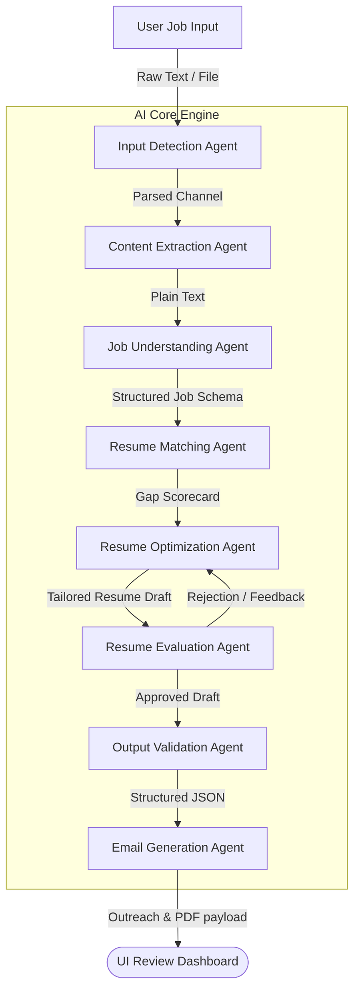
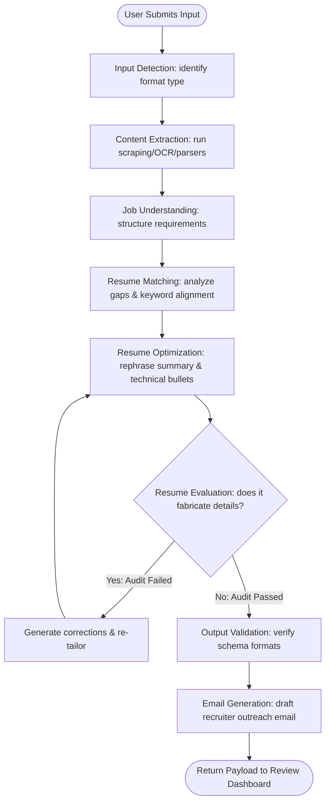
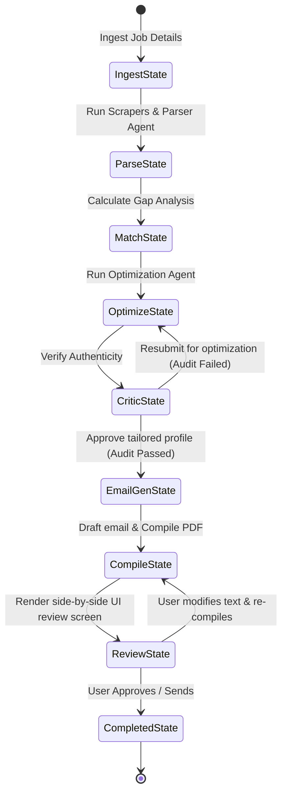
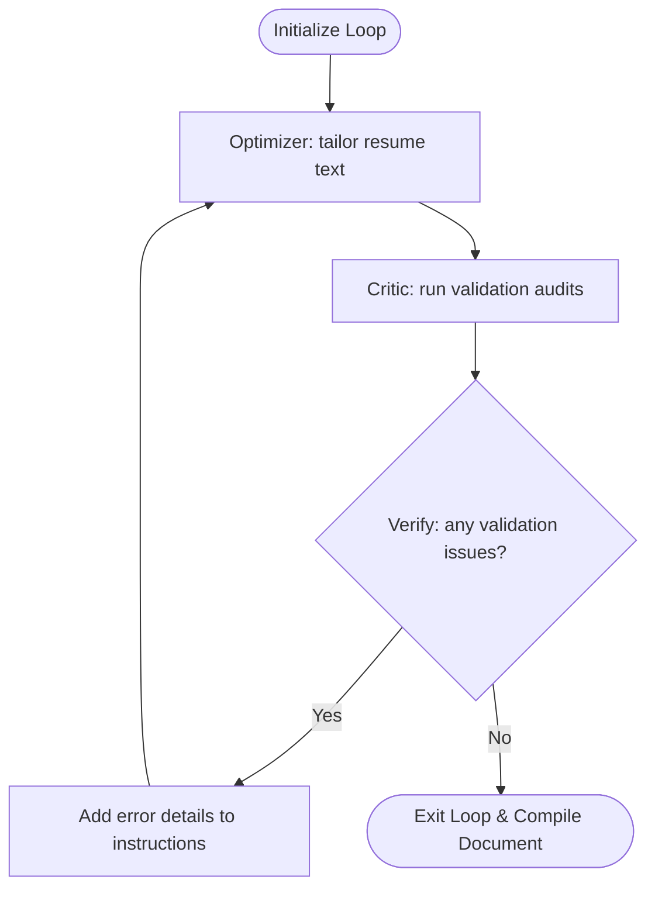
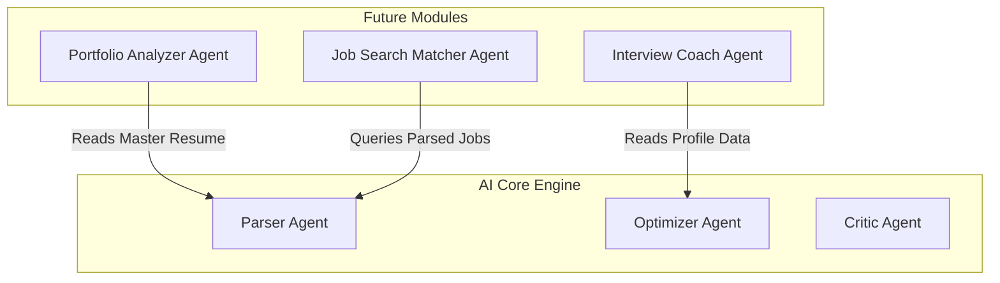

# AI System Design & Agent Architecture Document
## Project Name: AI Job Copilot
### Document Version: 1.0.0 (Phase 6 – AI System Design)
### Date: 2026-08-04

---

## 1. AI System Overview

The core intelligence of **AI Job Copilot** is designed as a **multi-agent orchestration system** managed by **LangGraph**. This design replaces monolithic, single-prompt AI workflows with a network of single-purpose agents that coordinate tasks, validate outputs, and enforce business constraints.

### 1.1 Why Separate AI into Modules?
Single-prompt architectures often struggle with complex, multi-step tasks. Asking a single LLM call to parse a job, compare it against a resume, optimize bullet points, draft an email, and format the output in JSON often leads to formatting errors and inaccurate results (hallucinations). 

Separating these operations into specialized modules provides several key advantages:
*   **Reduced Complexity**: Each agent focuses on a single task, improving accuracy and reducing formatting errors.
*   **Targeted Optimization**: Prompts and parameters (such as temperature and token limits) can be optimized for each specific step.
*   **Independent Testing**: Developers can isolate, test, and debug individual agents without running the entire pipeline.
*   **Ease of Extensibility**: New agents (e.g. an interview prep generator) can be integrated into the workflow with minimal changes.

### 1.2 Multi-Agent Component Diagram



---

## 2. AI Design Principles

The AI platform is built around several core design principles:

*   **Modular AI**: Tasks are handled by specialized, single-purpose agents rather than a single large prompt.
*   **Deterministic Outputs**: All agents use structured JSON formats (enforced via LLM JSON mode and Pydantic schemas) to ensure outputs are predictable and easy for the system to process.
*   **Structured Responses**: Data payloads (such as skills lists, match scores, and rephrased bullet points) conform to defined schemas.
*   **Human Approval**: The system operates on a "Human-in-the-Loop" model; the AI never submits applications or sends emails automatically.
*   **Prompt Versioning**: Prompts are stored and versioned independently of the application code, allowing updates without redeploying the backend.
*   **Validation First**: Outputs are validated against target schemas at each step of the pipeline.
*   **Explainability**: The system explains matching scores by highlighting specific skill alignments and document gaps.
*   **Hallucination Prevention**: The system enforces strict rules to ensure tailored resumes only use verified experience from the master profile.

---

## 3. The End-to-End AI Workflow

The AI engine coordinates tasks step-by-step to parse job postings, evaluate candidates, optimize profiles, and draft outreach messages:



---

## 4. AI Agent Architecture

This section details the roles, inputs/outputs, and failure recovery flows for each AI agent.

### 4.1 Input Detection Agent
*   **Purpose**: Identify the input format (URL, screenshot, email, text block) and route it to the correct extraction engine.
*   **Responsibilities**: Analyze raw user inputs to identify format types.
*   **Inputs**: Raw text blocks or binary files.
*   **Outputs**: Identified format string (`url`, `text`, `pdf`, `image`, `email`, `whatsapp`).
*   **Failure Handling**: Defaults to `text` if the format cannot be identified.

### 4.2 Content Extraction Agent
*   **Responsibilities**: Extract plain text from incoming files or URLs.
*   **Supported Inputs**: Scrapes web pages using Playwright, extracts text from PDF documents using `pdfplumber`, or runs OCR on screenshots.
*   **Outputs**: Sanitized UTF-8 text strings.

### 4.3 Job Understanding Agent
*   **Responsibilities**: Parse raw job posting text into structured JSON containing title, company, requirements, and required skills.
*   **Expected JSON Output**:
    ```json
    {
      "company_name": "Google",
      "job_title": "Senior AI Engineer",
      "location": "Mountain View, CA",
      "required_skills": ["Python", "System Design"],
      "preferred_skills": ["Kubernetes"],
      "recruiter_email": "hiring@google.com"
    }
    ```
*   **Validation**: Verifies that the company name, job title, and required skills are not empty.

### 4.4 Resume Matching Agent
*   **Responsibilities**: Evaluate the candidate's master profile against the job description to calculate a match score and list missing skills.
*   **Validation Rules**: Verifies the match score is an integer between 0 and 100.
*   **Fabrication Guardrails**: Focuses strictly on identifying matching skills and experience gaps, with no permission to generate text.

### 4.5 Resume Optimization Agent
*   **Responsibilities**: Rephrase summary sections, group technical skills, and adjust bullet points to align with job keywords.
*   **Rules**:
    - Summary sections must remain under 3 sentences.
    - Rephrase experience bullet points to highlight skills matching the job description.
    - Technical skills must be grouped to match the required tools listed in the job description.
*   **Preserve Layouts**: The optimization engine modifies text content without altering the original DOCX layout structure.

### 4.6 Resume Evaluation Agent (Critic)
*   **Responsibilities**: Audit the tailored resume against the master profile to ensure all details are accurate and no information was fabricated.
*   **Audit Metrics**: Technical keywords matching, grammar checks, formatting limits, and readability index.
*   **Self-Correction Loop**: If the critic detects fabricated skills or projects, it rejects the draft and returns details to the optimizer for correction.

### 4.7 Email Generation Agent
*   **Responsibilities**: Draft a personalized outreach email based on the company details, job title, and recruiter contact information.
*   **Constraints**:
    - Outreach messages must remain under 150 words.
    - Focus the pitch on 2-3 matching achievements from the tailored resume.
    - Avoid generic templates or placeholder text.

### 4.8 Output Validation Agent
*   **Responsibilities**: Verify that final JSON payloads match structural schemas before document compilation.
*   **Validation Scope**: Validates structural schemas (e.g., checks list formats, date configurations, and contact fields).
*   **Data Integrity Check**: Ensures all required fields are present and correctly formatted.

---

## 5. LangGraph Workflow Orchestration

The platform coordinates tasks using a stateful LangGraph workflow engine. This design allows the system to manage complex multi-step processes, implement quality gates, and handle human-in-the-loop validation checkpoints.



### 5.1 LangGraph Components
*   **Nodes**: Define the execution steps of individual agents (e.g. `parse_job_node`, `optimize_resume_node`).
*   **Edges**: Map the execution path from one node to the next.
*   **Conditional Branches**: Route the workflow based on state variables (e.g. routing a resume back to the optimizer if the Critic validation check fails).
*   **Retry Logic**: Implements retry handlers for API connection issues.
*   **Termination Conditions**: The pipeline completes once the final validation check passes and the user confirms approval in the UI.

---

## 6. Prompt Architecture

To ensure consistency and ease of updates, prompts are managed using a structured layout:

```
[System Instructions] + [Variables (Resume JSON, Job JSON)] + [Output Constraints (JSON Schema)]
```

*   **Prompt Templates**: Pre-defined prompt files containing variables mapped at runtime.
*   **System Prompts**: Define the role and constraints of the agent (e.g. "You are a strict data validation agent. Compare the following files...").
*   **User Prompts**: Contain the dynamic data variables (e.g. the master resume and target job description JSON).
*   **Output Constraints**: Enforce specific JSON formats, structural layouts, and formatting rules.
*   **Prompt Registry**: Prompts are stored in a centralized directory (`/backend/app/ai/prompts/`), allowing updates and versioning (e.g. `optimizer_v1.txt`, `optimizer_v2.txt`) independently of the application code.

---

## 7. Structured Output Design

All agents return responses conforming to Pydantic schemas, ensuring outputs are predictable and easy for the system to process:

### 7.1 Job Parser Output Schema
```json
{
  "company_name": "Google",
  "job_title": "Senior AI Engineer",
  "required_skills": ["Python", "System Design"],
  "preferred_skills": ["Kubernetes"],
  "recruiter_email": "hiring@google.com"
}
```

### 7.2 Resume Matching Output Schema
```json
{
  "fit_score": 85,
  "matching_skills": ["Python", "FastAPI"],
  "missing_skills": ["Kubernetes"],
  "gap_analysis": "The candidate has strong backend experience but lacks Kubernetes expertise."
}
```

### 7.3 Resume Evaluation Output Schema
```json
{
  "approved": false,
  "validation_errors": [
    {
      "field": "experience[0].bullets[2]",
      "issue": "Mentions experience with Kubernetes, which is not present in the master resume."
    }
  ]
}
```

---

## 8. AI Validation & Self-Correction Strategy

The system validates data at each stage of the pipeline to identify and correct errors:

```
[Agent Output] ──> Run Validation Checks ──> Valid?
                                              │
                                   +----------+----------+
                                   |                     |
                                   v                     v
                                Yes (Proceed)         No (Re-run with feedback)
```

*   **Execution Validation**: Verifies that LLM outputs match the target JSON schema, retrying the request with formatting instructions if validation fails.
*   **Constraint Checking**: The Critic Agent verifies that the optimized resume does not contain tools, certifications, or projects not present in the master profile.
*   **Formatting Checks**: The document compiler validates text length limits to prevent page overflows and formatting shifts.
*   **Self-Correction**: If validation checks fail, the system automatically runs the agent again with details of the failure, enabling the system to correct errors before displaying outputs to the user.

---

## 9. Hallucination Prevention

To ensure the tailored resume remains authentic, the platform implements several safety measures:

*   **Context Constraints**: System instructions explicitly prohibit the AI from adding achievements, certifications, or projects not present in the master resume.
*   **Identity Locks**: Name, email, companies, job titles, and dates are treated as read-only fields that the AI cannot modify.
*   **Validation Audits**: The Critic Agent runs a strict comparison check, flagging any terms in the optimized resume that do not exist in the master profile.
*   **Confidence Scores**: The system calculates a confidence score for rephrased bullet points, flagging updates that drift too far from the original text for user review.

---

## 10. Loop Engineering Design

The optimization pipeline runs in a stateful loop to ensure tailored resumes pass validation checks:



The system implements a maximum limit of **3 iterations** for the optimization loop. If the resume fails validation checks after 3 attempts, the pipeline exits, alerts the user, and falls back to the original master resume text, preventing infinite loops and high API costs.

---

## 11. Error Handling & Fail-Safes

The system handles failures gracefully, ensuring that issues with external services do not crash the application:

*   **LLM Timeout**: If an LLM call times out, the system automatically retries the request using exponential backoff.
*   **JSON Parsing Failures**: If an agent returns invalid JSON formatting, the system retries the request with structured schema formatting instructions.
*   **Rate Limits**: If LLM API rate limits are reached, the system pauses execution and retries the request after a delay.
*   **OCR Failures**: If OCR fails to parse an image, the system returns a warning and prompts the user to paste the text manually.
*   **Incomplete Job Descriptions**: If the job description is too short to optimize (e.g. under 100 characters), the system alerts the user and falls back to a basic keyword alignment check.

---

## 12. Multi-LLM Strategy

The platform uses abstract interfaces to ensure it can support multiple LLM providers:

```
[Application Use Case] ──> [LLM Service Adapter Interface]
                                      │
              +-----------------------+-----------------------+
              |                       |                       |
              v                       v                       v
      [Gemini Client]          [OpenAI Client]        [Anthropic Client]
```

*   **Service Interface**: The application layer accesses LLM services through an abstract client interface.
*   **Concrete Adapters**: Concrete client wrappers implement the interface for specific API providers (e.g. Gemini, OpenAI, Anthropic).
*   **Model Routing**: Model routing is managed via configurations (`LLM_PROVIDER`), allowing the system to switch providers or fall back to alternative models without requiring code modifications.

---

## 13. Performance Optimization

To improve responsiveness and manage token costs, the platform implements several optimizations:

*   **Cache Lookups**: Caches scraped job descriptions and match analysis results to reduce API calls to third-party services.
*   **Prompt Compaction**: Minimizes prompt sizes by removing unnecessary whitespace and corporate jargon before sending requests to the LLM.
*   **JSON Schema Targets**: Enforces JSON mode on LLM calls to reduce parsing errors and ensure predictable output structures.
*   **Cost Management**: Uses lightweight, cost-effective models (such as Gemini 1.5 Flash) for parsing and validation tasks, reserving larger models (such as Gemini 1.5 Pro) for complex optimization steps.

---

## 14. AI Security & Guardrails

The platform implements several security measures to protect user data and secure API endpoints:

*   **Prompt Injection Protection**: Validates and sanitizes inputs to strip out executable script tags and prevent prompt injection attacks.
*   **PII Masking**: Mask personal identifiers (such as phone numbers and street addresses) before sending data to third-party LLM APIs.
*   **Secure Prompt Management**: Prompts are stored in secure, read-only system files, never exposed in client-facing code or configurations.
*   **Safe Output Validations**: Output validation checks verify that generated texts contain no executable code before rendering.

---

## 15. Future AI Roadmap

The modular agent design allows adding new AI capabilities in the future without refactoring core system workflows:



*   **AI Interview Coach**: Can be integrated by adding an Interview Agent that reads the tailored resume and job details to generate custom mock Q&A sessions.
*   **AI Career Coach**: Can be built by adding a coaching agent to analyze application histories and suggest relevant certifications or skills.
*   **Automated Cover Letter Generator**: Can be integrated by adding a Cover Letter Agent to the email generation pipeline.
*   **Job Matching Engine**: Can be built by adding a matcher agent to automatically score incoming job boards against the user's master profile.
