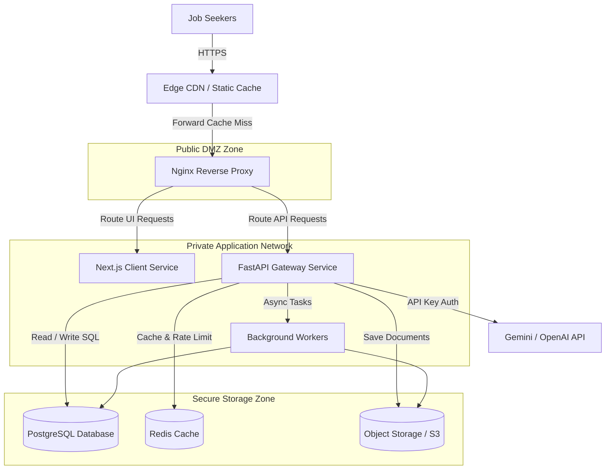
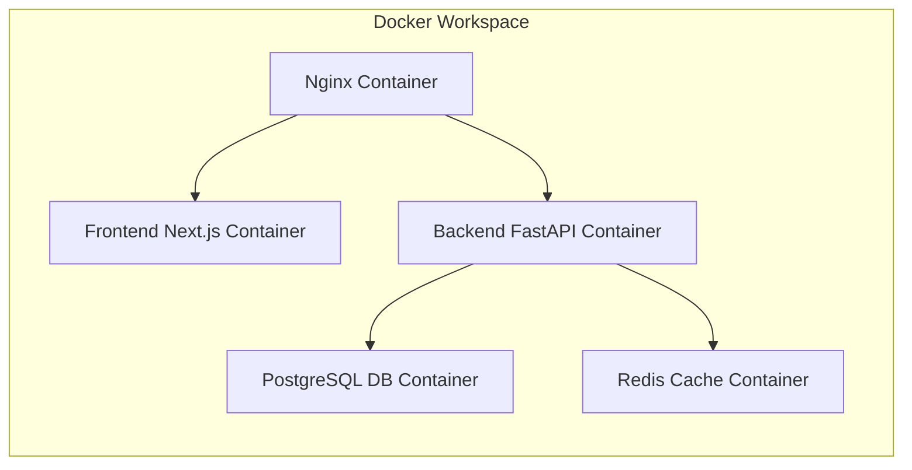
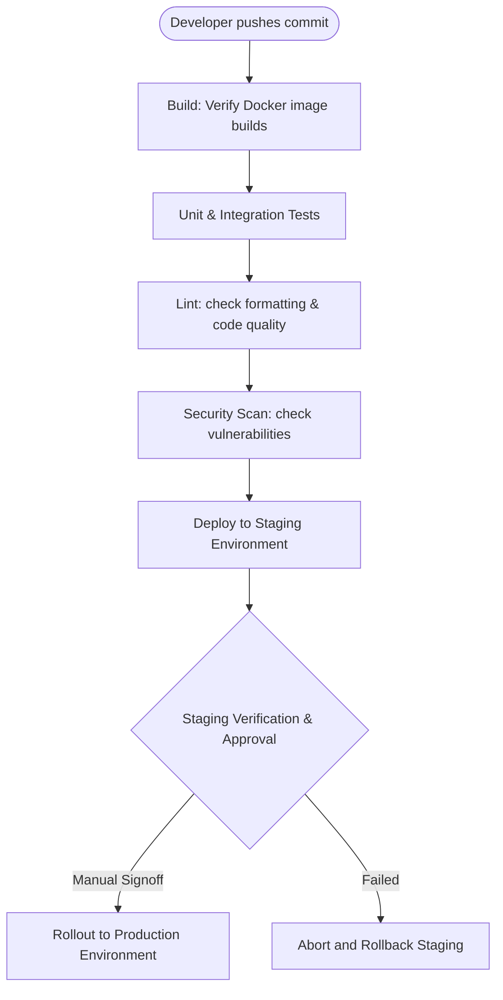

# DevOps, Infrastructure & Deployment Architecture Document
## Project Name: AI Job Copilot
### Document Version: 1.0.0 (Phase 8 – DevOps, Infrastructure & Deployment Architecture)
### Date: 2026-08-04

---

## 1. Infrastructure Vision

The deployment architecture for **AI Job Copilot** is built on a **cloud-ready, automated, and secure** infrastructure. This design ensures that the platform, starting as a single-instance MVP, can scale into a multi-tenant SaaS application without requiring structural modifications.

### 1.1 Infrastructure Philosophy
*   **Monolith-First with Microservice Readiness**: Run as a containerized monolith to minimize operational costs for the MVP, while using clear boundaries to allow separating modules (e.g. scrapers, document compilers) into microservices as traffic increases.
*   **Infrastructure as Code (IaC)**: Manage all infrastructure configurations (e.g. networks, database resources, load balancers) using declarative code patterns, ensuring consistency across environments.
*   **Stateless Services**: Ensure application servers are stateless to support horizontal scaling behind load balancers.

### 1.2 Operational Goals
*   **Scalability**: Support scaling from a single user to thousands of active applicants through containerization and caching.
*   **Availability**: Target 99.9% uptime by using load balancers, multi-region database backups, and health checks.
*   **Cost Management**: Optimize operational costs by using lightweight container runtimes and caching scraped data to reduce external API fees.

---

## 2. Production Infrastructure Architecture

The production deployment architecture separates components into distinct security and operational zones:



---

## 3. Deployment Strategy

The deployment pipeline uses isolated environments to ensure updates are verified before they are pushed to production:

```
[Development Workspace] ──> [Testing / QA] ──> [Staging (Prod-Like)] ──> [Production Launch]
```

*   **Development Environment**: A local, containerized space used by developers to write and test code.
*   **Testing / QA Environment**: An automated environment triggered by code changes to run integration tests and security scans.
*   **Staging Environment**: A replica of the production environment, including database clones, used to verify deployments before final launch.
*   **Production Environment**: The live platform, secured behind firewalls and monitored by alert systems.
*   **Environment Isolation**: Each environment uses distinct networks, API keys, and database configurations to prevent data leaks.

---

## 4. Container Strategy

The platform uses containerization to ensure development environments match production and simplify deployment:



### 4.1 Container Responsibilities
*   **Next.js Frontend Container**: Builds and serves the static React application.
*   **FastAPI Backend Container**: Runs the API server and processes asynchronous task queues.
*   **PostgreSQL Database Container**: Manages database storage.
*   **Redis Caching Container**: Caches session values and rate-limiting metrics.
*   **Nginx Container**: Acts as the reverse proxy, terminating SSL certificates and routing traffic.

### 4.2 Future Container Orchestration
For the MVP, containers are managed using **Docker Compose** to run on a single host. As traffic scales, the platform will migrate to **Kubernetes** to manage containers across clusters, automate scaling, and support rolling updates.

---

## 5. Reverse Proxy Design

**Nginx** acts as the front gateway for the platform, managing incoming traffic before it reaches the application containers.

### 5.1 Nginx Responsibilities
*   **Request Routing**: Routes client requests based on paths, directing API calls (e.g. `/api/v1/*`) to the backend container and webpage requests to the frontend service.
*   **SSL Termination**: Manages SSL certificate negotiations, securing incoming connections and relieving application containers of encryption tasks.
*   **Response Compression**: Compresses HTML, CSS, and JSON payloads (using Gzip or Brotli) to reduce page load times.
*   **Static Asset Caching**: Caches static assets (images, stylesheets, JavaScript files) directly on Nginx, reducing requests to application containers.
*   **Security Header Injection**: Adds security headers (e.g. `X-Frame-Options`, `Content-Security-Policy`) to responses to protect users from browser-based attacks.

---

## 6. Storage Strategy

Physical files are stored on disk or in object storage, while metadata is logged in the database to prevent database bloat.

### 6.1 Storage Lifecycle

```
[DOCX/PDF files] ──> Physical Storage (/storage/applications/)
                             │
                             v
      [Database Records] ──> Save file paths (resume_versions.file_path)
```

*   **Local Storage (MVP)**: Stores files on a persistent local disk, using relative file paths in the database.
*   **Object Storage (Future)**: As the platform grows, storage will be migrated to S3-compatible cloud storage (such as AWS S3 or MinIO) to support high availability.
*   **Retention Policies**: Tailored resumes are stored indefinitely, while temporary scratch files are deleted automatically after compilation.
*   **Backup Strategy**: Database records and physical files are backed up daily to offsite storage locations to prevent data loss.

---

## 7. Database Operations

To maintain database performance and prevent data loss, the platform implements several database management policies:

*   **Connection Pooling**: Uses connection pool managers (such as pgBouncer or SQLAlchemy pools) to optimize database connections.
*   **Backup Policy**: Performs full database dumps daily and keeps transaction logs (Write-Ahead Logging) to support Point-in-Time Recovery (PITR).
*   **Migration Strategy**: Database updates are managed using declarative schema migration tools (like Alembic) to ensure migrations are run consistently across environments.
*   **Scale-Out Path**: Database performance scales from a single write server to primary-replica replication topologies, routing read queries to replicas to reduce write database load.

---

## 8. Caching Strategy

The system uses **Redis** to improve performance, reduce database queries, and protect API endpoints:

*   **API Response Caching**: Caches scraped job descriptions and match analysis results in Redis to reduce redundant API calls to third-party services.
*   **AI Cache**: Stores LLM matching queries to prevent redundant optimizations, saving API fees.
*   **Rate Limiting**: Stores client request counts in Redis, limiting calls to prevent abuse.
*   **Cache Invalidation**: Cached values are invalidated automatically after defined expiration times (e.g. 24 hours) or when application records are updated.

---

## 9. Security Architecture

The platform implements several security measures to protect user data and secure API endpoints:

*   **Encryption**: Secures data in transit using TLS 1.3, hashes passwords using `bcrypt`, and encrypts Google OAuth tokens using `AES-GCM-256` before storage.
*   **Token Authentication**: Secures API routes using stateless JWT access tokens, with refresh tokens saved in HTTP-only, secure, same-site cookies to prevent token theft.
*   **Least Privilege Access**: Restricts database permissions for application users, ensuring the backend only has access to required tables.
*   **Input Sanitization**: Web scraping inputs and text boxes are sanitized to strip out executable script tags.
*   **Prompt Injection Protection**: Validates and sanitizes inputs to prevent prompt injection attacks.
*   **Rate Limiting**: Limits API calls (e.g. optimization requests) to prevent service abuse.

---

## 10. CI/CD Pipeline Strategy

The CI/CD pipeline automates testing, security scans, and staging deployments before updates are pushed to production:



### 10.1 Production Rollout & Rollbacks
Production deployments use **Blue/Green** or rolling update patterns. If the staging verification check fails, the pipeline automatically rolls back updates to the previous stable version, preventing service interruptions.

---

## 11. Monitoring & Observability

To simplify troubleshooting and track platform performance, the system implements several observability policies:

*   **Application Logs**: Logs system events (e.g. user logins, API routing tasks) using the `INFO` severity level.
*   **AI Engine Logs**: Logs prompt versions, token counts, matching metrics, and response times using the `DEBUG` level.
*   **Health Checks**: Implements health check endpoints (e.g. `/health`) to monitor container and database connection statuses.
*   **Error Reporting**: Uses error tracking tools (such as Sentry) to log exceptions and alert developers.
*   **Metric Dashboards**: Future updates will integrate dashboards (such as Prometheus and Grafana) to track server performance, memory usage, and API response times.

---

## 12. Scalability Strategy

The platform is designed to scale as usage grows:

```
[Single Host Monolith] -> [Stateless Multi-Instance] -> [Distributed Task Queues] -> [Kubernetes Clusters]
```

*   **Vertical Scaling**: Upgrades memory and CPU resources on a single host for initial user growth.
*   **Horizontal Scaling**: Deploys stateless application servers behind load balancers to distribute traffic.
*   **Background Workers**: Offloads long-running tasks (such as PDF generation, web scraping, and LLM calls) to background worker queues.
*   **Kubernetes Migration**: Deploys the containerized application to Kubernetes clusters to automate scaling and container management.

---

## 13. High Availability & Failover

The platform implements redundancy and recovery policies to prevent service interruptions:

*   **Service Redundancy**: Runs multiple stateless application containers behind load balancers to ensure service availability if a container fails.
*   **Database Failover**: Connects to primary-replica database configurations, routing traffic to a replica if the primary database fails.
*   **Graceful Degradation**: If third-party AI services are unavailable, the platform disables resume optimization while allowing users to access their dashboard and download previously compiled files.
*   **Automatic Restarts**: Container runtimes are configured to restart failed containers automatically, resolving temporary service crashes.

---

## 14. Performance Optimization

To improve responsiveness and reduce load times, the platform implements several optimizations:

*   **Edge CDN**: Uses Content Delivery Networks (CDNs) to cache and serve static assets close to users.
*   **Gzip Compression**: Compresses API response bodies, reducing data transfer times.
*   **Connection Pooling**: Maintains a pool of active database connections, reducing the overhead of establishing new connections for each query.
*   **Asynchronous Database Drivers**: Uses async database drivers to prevent database operations from blocking the single-threaded event loop.

---

## 15. Cost Optimization

The platform optimizes infrastructure costs using several strategies:

*   **Resource Allocation**: Uses small, cost-effective container resources for local parsing and validation tasks.
*   **S3 Storage Tiers**: Moves old resume versions to long-term archive storage (e.g. S3 Glacier) to reduce active storage costs.
*   **Redis Caching**: Caches scraped job descriptions and match analysis results to reduce API calls to third-party services and save API fees.
*   **LLM Cost Optimization**: Uses lightweight, cost-effective models (such as Gemini 1.5 Flash) for parsing tasks, reserving larger models (such as Gemini 1.5 Pro) for complex optimization steps.

---

## 16. Disaster Recovery (DR)

The disaster recovery plan defines backup policies and recovery metrics to ensure the system can recover from failures:

*   **Recovery Point Objective (RPO)**: Target data loss limit of 1 hour, supported by automated WAL backups.
*   **Recovery Time Objective (RTO)**: Target service restoration limit of 4 hours.
*   **Data Restoration**: Full database dumps and physical files are restored to backup servers if a system crash occurs.
*   **Infrastructure Recovery**: Re-deploys the platform using Docker Compose or Kubernetes configurations, allowing rapid environment rebuilds.

---

## 17. Network Security & Gateway Shields

The platform implements several network security policies to protect endpoints and prevent unauthorized access:

*   **Virtual Private Network (VPC)**: Application servers and database engines run inside a private network, isolated from direct internet access.
*   **Nginx Proxy Shield**: Nginx acts as the single entry point, protecting application containers from direct exposure to internet traffic.
*   **API Firewall**: Implements rate limiting and IP filtering to protect API endpoints from brute-force and Denial-of-Service (DoS) attacks.
*   **Database Isolation**: Database engines are configured to accept connections only from verified application container IPs.

---

## 18. Future Infrastructure Roadmap

The infrastructure is designed to support future platforms and SaaS capabilities:

*   **Multi-Tenant SaaS Workspaces**: Can be integrated by adding tenant workspace databases and configuring route namespaces to separate company logs.
*   **Multi-Region Routing**: Deploys application instances across multiple cloud regions, using geo-routing DNS to direct users to the nearest server.
*   **Mobile and Browser Backends**: API endpoints can scale to support incoming requests from browser extensions and mobile clients.
*   **Multi-LLM Integrations**: The model abstraction layer allows routing requests to alternative API providers or private hosting centers.

---

## 19. DevOps Best Practices

To ensure deployment consistency and system reliability, the platform follows several operational best practices:

*   **Immutable Deployments**: Containers are built once and deployed across environments without modification, preventing configuration drift.
*   **Configuration Decoupling**: API keys, database strings, and credentials are saved in environment variables, never committed to code repositories.
*   **Blue/Green Deployments**: Deploys updates to a secondary environment before routing live traffic, ensuring zero-downtime rollouts.
*   **Automated Verification**: Integrates automated tests and security scanners into CI/CD pipelines.

---

## 20. DevOps Architectural Decisions & Trade-offs

This section records key infrastructure choices, detailing the trade-offs, advantages, and limitations of each:

### 20.1 Docker Compose vs. Kubernetes
*   **Considered Alternative**: Kubernetes (EKS/GKE).
*   **Selected Path**: Docker Compose.
*   **Rationale**: For the MVP, Docker Compose minimizes deployment complexity and hosting costs, while keeping the application containerized and ready for Kubernetes in production.
*   **Trade-off**: Requires manual intervention to handle container auto-scaling and node failovers.

### 20.2 Local Storage vs. Immediate Object Storage (S3)
*   **Considered Alternative**: Immediate S3 storage integration.
*   **Selected Path**: Local Storage.
*   **Rationale**: Local filesystem storage keeps development simple and reduces hosting costs for the MVP, while using relative file paths in the database to support cloud storage migrations in the future.
*   **Trade-off**: Restricts horizontal scaling to a single host until object storage is integrated.

### 20.3 Nginx vs. Traefik
*   **Considered Alternative**: Traefik.
*   **Selected Path**: Nginx.
*   **Rationale**: Nginx provides high-performance reverse proxying, robust configuration options, and efficient static asset caching.
*   **Trade-off**: Lacks Traefik's dynamic auto-discovery configurations.
