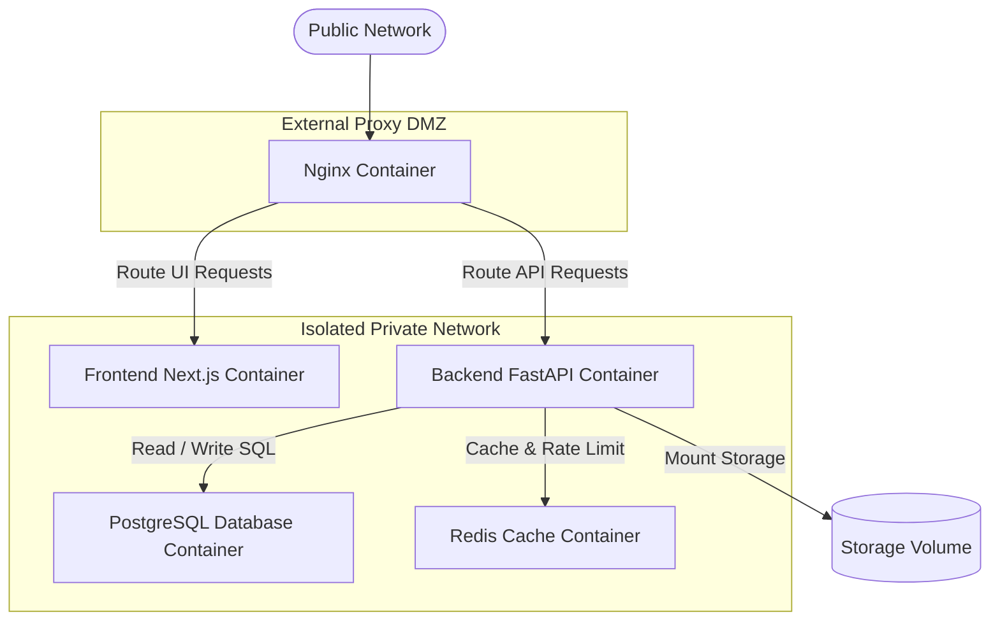

# Project Foundation & Initial Codebase Setup
## Project Name: AI Job Copilot
### Document Version: 1.0.0 (Phase 11 – Project Foundation & Initial Codebase Setup)
### Date: 2026-08-04

---

## 1. Complete Project Folder Structure

To support parallel development, test isolation, and clean deployments, the project root uses a structured folder layout:

```
jobcopilot_ai/                    # Root project directory
├── .github/                      # CI/CD Workflows & issue templates
├── backend/                      # FastAPI Application Root
├── frontend/                     # Next.js Application Root
├── database/                     # DB schemas, seed scripts, migrations
├── docker/                       # Dockerfiles, Compose scripts, Nginx configs
├── docs/                         # Engineering and architecture documentation
├── storage/                      # Persistent local storage volume
├── tests/                        # E2E & system integration test suites
├── scripts/                      # Setup, db-seeding, and build helper scripts
├── .gitignore                    # Global git ignore filters
├── pyproject.toml                # Poetry / Tool settings
├── package.json                  # Root npm workspace configuration (optional)
└── README.md                     # General project overview
```

### 1.1 Folder Responsibilities

*   **`.github/`**: Exposes GitHub Actions workflows for automated quality gates (testing, linting, security scans) and contains templates for bug reports.
*   **`backend/`**: Hosts the complete FastAPI backend service, containing core logic, use cases, domain rules, and external integrations.
*   **`frontend/`**: Hosts the Next.js frontend client, containing React pages, component libraries, state management stores, and styling sheets.
*   **`database/`**: Stores raw database schemas, seeding scripts, and Alembic database migration files.
*   **`docker/`**: Houses environment container configurations, Dockerfiles, Docker Compose scripts, and Nginx proxy settings.
*   **`docs/`**: Centralized index of project documentation (SRS, HLD, LLD, Database, Backend, and AI designs).
*   **`storage/`**: Local storage volume for master templates, compiled resumes, and temporary files.
*   **`tests/`**: Hosts end-to-end (E2E) integration test suites that simulate complete user journeys.
*   **`scripts/`**: Hosts automation utilities for environment setups, database seed configurations, and build tasks.

---

## 2. Backend Folder Structure

The backend application implements Clean Architecture and Domain-Driven Design (DDD), organizing code into self-contained business modules (bounded contexts):

```
backend/
├── app/
│   ├── auth/                     # Authentication Module
│   ├── users/                    # User Context Module
│   ├── resume/                   # Resume Customization Module
│   ├── jobs/                     # Job Ingestion Module
│   ├── email/                    # Recruiter Outreach Module
│   ├── dashboard/                # Analytics & History Module
│   ├── ai/                       # AI Engine Adapter Module
│   ├── shared/                   # Common core types, entities, exceptions
│   ├── database/                 # Database engine sessions
│   ├── core/                     # Central settings and configurations
│   └── main.py                   # FastAPI entrance point
├── pyproject.toml                # Poetry backend dependency manifest
└── README.md                     # Backend developer guide
```

### 2.1 Domain-Driven Design Bounded Contexts

Inside each business module (e.g. `resume/`), files are organized to separate core business rules from infrastructure details:

*   **`api/`**: Declares FastAPI routes and handles HTTP request parsing.
*   **`services/`**: Application services that orchestrate workflows and manage transactions.
*   **`domain/`**: Core business entities, value objects, and repository interfaces.
*   **`repository/`**: Database access implementations using SQLAlchemy.
*   **`schemas/`**: Pydantic models for validation and serialization.
*   **`models/`**: SQLAlchemy database declarations.
*   **`prompts/`**: LLM prompts and output schema configurations.
*   **`tests/`**: Unit tests verifying services, repositories, and domain entities.

---

## 3. Frontend Folder Structure

The frontend application uses a modular Next.js App Router structure:

```
frontend/
├── src/
│   ├── app/                      # Next.js App Router (Layouts & Pages)
│   ├── components/               # Global stateless UI elements (buttons, inputs)
│   ├── features/                 # Modular feature-specific workspaces
│   │   ├── auth/                 # Login & Registration views
│   │   ├── dashboard/            # CRM metrics and search lists
│   │   ├── resume/               # Uploaders & document preview components
│   │   └── outreach/             # Email editors & recruiter forms
│   ├── hooks/                    # Reusable custom React hooks
│   ├── lib/                      # Client adapters (Axios, React Query configurations)
│   ├── services/                 # API endpoint request functions
│   ├── store/                    # Global state stores (Zustand)
│   ├── types/                    # Shared TypeScript interfaces
│   ├── utils/                    # Common formatting and helper utilities
│   └── styles/                   # CSS layout styling (Tailwind CSS)
├── package.json                  # NPM dependencies manifest
└── tsconfig.json                 # TypeScript compilation settings
```

---

## 4. Environment Configuration

The platform uses environment variables to manage settings across Development, Testing, and Production environments.

### 4.1 Configurable Variables Template (`.env.example`)
```bash
# ==============================================================================
# AI Job Copilot - Environment Configuration Template
# Copy this file to '.env' and populate with local credentials. Do not commit.
# ==============================================================================

# Core Application Settings
ENV=development
SECRET_KEY=generate-a-secure-random-secret-key-for-jwt-signing
ACCESS_TOKEN_EXPIRE_MINUTES=1440
ALLOWED_ORIGINS=http://localhost:3000,http://127.0.0.1:3000

# Database Configuration
DATABASE_URL=postgresql+asyncpg://postgres:postgres@db:5432/jobcopilot_db
DB_POOL_SIZE=20
DB_MAX_OVERFLOW=10

# Caching Configuration
REDIS_URL=redis://cache:6379/0

# Storage Settings
STORAGE_TYPE=local
STORAGE_PATH=/storage
S3_BUCKET_NAME=

# Third-Party AI Integrations
LLM_PROVIDER=gemini
GEMINI_API_KEY=
OPENAI_API_KEY=

# Recruiter Outreach Integrations
GMAIL_CLIENT_ID=
GMAIL_CLIENT_SECRET=
GMAIL_REDIRECT_URI=http://localhost:8000/api/v1/emails/oauth/callback

# System Logging
LOG_LEVEL=INFO
LOG_FORMAT=json
```

---

## 5. Dependency Management

Dependencies are managed using standard package manifests, separating application dependencies from development and testing tools.

### 5.1 Backend Dependencies

*   `fastapi`: Exposes REST endpoints and manages routing.
*   `uvicorn`: ASGI web server to run the FastAPI application.
*   `pydantic[email]`: Handles request validation and serialization, with email validation support.
*   `sqlalchemy[asyncio]`: ORM for database transactions, with asynchronous connection support.
*   `asyncpg`: Asynchronous PostgreSQL database driver.
*   `alembic`: Manages database migrations.
*   `redis`: Client for caching and rate-limiting.
*   `pyjwt[crypto]`: Generates and validates secure JWT session tokens.
*   `bcrypt`: Hashes user passwords.
*   `python-multipart`: Parses incoming file uploads.
*   `pdfplumber`: Extracts text from PDF files.
*   `python-docx`: Parses and compiles DOCX documents.
*   `langgraph`: Stateful workflow engine for AI agents.

### 5.2 Frontend Dependencies

*   `next`: React framework for page routing and server-side rendering.
*   `react` / `react-dom`: UI rendering engine.
*   `typescript`: Adds type safety to frontend components.
*   `tailwindcss`: Utility-first CSS framework for layout styling.
*   `@tanstack/react-query`: Caches server responses and manages network requests.
*   `zustand`: State store for global client configurations (e.g. user sessions).
*   `react-hook-form`: Manages form validation client-side.
*   `zod`: Enforces validation schemas for form inputs.

### 5.3 Development & Testing Dependencies

*   `pytest`: Running backend unit and integration tests.
*   `pytest-asyncio`: Enables async testing support in Pytest.
*   `httpx`: HTTP client to run integration tests against API gateways.
*   `black` / `flake8`: Enforces Python style conventions.
*   `eslint` / `prettier`: Enforces JavaScript/TypeScript style conventions.
*   `playwright`: Automates browser tests.

---

## 6. Docker Container Architecture

For the MVP, containers are managed using **Docker Compose** to run on a single host. Networks isolate database resources from direct internet access.



*   **Nginx Container**: Acts as the single entry point, terminating SSL certificates and routing traffic.
*   **Frontend Container**: Builds and serves the static Next.js React application.
*   **Backend Container**: Runs the API server and processes document compilation and API requests.
*   **PostgreSQL Container**: Manages database storage, isolated within the private network.
*   **Redis Container**: Caches session values and rate-limiting metrics.
*   **Persistent Storage Volume**: Persists uploaded files (master resumes and tailored outputs) across container restarts.

---

## 7. Logging Architecture

The platform uses structured logging to simplify troubleshooting and track system health:

*   **Unified Logging Format**: Logs use structured JSON layouts to simplify log searches.
*   **Application Logs**: Logs system events (e.g. user logins, API routing tasks) using the `INFO` severity level.
*   **AI Engine Logs**: Logs prompt versions, token counts, matching metrics, and response times using the `DEBUG` level.
*   **Database Logs**: Logs slow-running queries and transaction errors to help optimize database performance.
*   **Outreach Delivery Logs**: Logs email draft generations, OAuth credentials refreshes, and delivery confirmations.
*   **System Error Logs**: Logs stack traces and exceptions using the `ERROR` or `CRITICAL` severity levels.
*   **Audit Logs**: Logs sensitive events (e.g. password resets, security access changes, file downloads) to track compliance.

---

## 8. Centralized Configuration System

The backend configuration is managed by a centralized settings class using **Pydantic Settings**. This ensures configurations are validated on startup and prevents the application from running with missing environment variables.

```python
# backend/app/core/config.py
# Centralized settings schema and validation system

from pydantic_settings import BaseSettings, SettingsConfigDict
from pydantic import EmailStr, PostgresDsn, RedisDsn
from typing import List, Literal

class Settings(BaseSettings):
    # App Settings
    ENV: Literal["development", "testing", "production"] = "development"
    SECRET_KEY: str
    ACCESS_TOKEN_EXPIRE_MINUTES: int = 1440
    ALLOWED_ORIGINS: List[str] = ["http://localhost:3000"]
    
    # DB Connections
    DATABASE_URL: PostgresDsn
    DB_POOL_SIZE: int = 20
    DB_MAX_OVERFLOW: int = 10
    
    # Caches
    REDIS_URL: RedisDsn
    
    # Storage Configurations
    STORAGE_TYPE: Literal["local", "s3"] = "local"
    STORAGE_PATH: str = "/storage"
    S3_BUCKET_NAME: str | None = None
    
    # AI Engine Settings
    LLM_PROVIDER: Literal["gemini", "openai"] = "gemini"
    GEMINI_API_KEY: str | None = None
    OPENAI_API_KEY: str | None = None
    
    # Email Settings
    GMAIL_CLIENT_ID: str | None = None
    GMAIL_CLIENT_SECRET: str | None = None
    GMAIL_REDIRECT_URI: str | None = None
    
    # System Logging
    LOG_LEVEL: Literal["DEBUG", "INFO", "WARNING", "ERROR", "CRITICAL"] = "INFO"

    model_config = SettingsConfigDict(
        env_file=".env",
        env_file_encoding="utf-8",
        case_sensitive=True,
        extra="ignore"
    )

# Instantiate settings singleton to validate variables on startup
settings = Settings()
```

---

## 9. Exception Handling Strategy

The platform translates system errors into standard JSON payloads, ensuring the client application receives clear error responses:

### 9.1 Exception Categories & Class Mappings

```
                    +------------------------------------+
                    |        BaseAppException            |
                    +------------------------------------+
                                      |
         +----------------------------+----------------------------+
         |                            |                            |
         v                            v                            v
+------------------+         +------------------+         +------------------+
|  ValidationErr   |         |   BusinessErr    |         |  Infrastructure  |
|  - Invalid DTOs  |         |   - Quota checks |         |  - Connection drop|
|  - File bounds   |         |   - Logic limits |         |  - Disk space    |
+------------------+         +------------------+         +------------------+
```

*   **`BaseAppException`**: The parent exception class for all custom application errors.
*   **`ValidationException`**: Raised when input data is malformed, returning a list of invalid fields to the client.
*   **`BusinessRuleException`**: Raised when actions violate business rules (e.g. exceeding optimization quotas).
*   **`DatabaseException`**: Raised during database errors, preventing raw SQL errors from leaking to the client.
*   **`AIException`**: Raised when LLM connections fail or outputs violate target schemas.
*   **`InfrastructureException`**: Raised during file storage, mail delivery, or network errors.

---

## 10. Health Check System

The platform exposes dedicated endpoints to monitor system status:

*   **`/health/api`**: Verifies that the API gateway is active.
*   **`/health/db`**: Verifies database connection pool status, returning database query response times.
*   **`/health/redis`**: Verifies Redis caching read-write status.
*   **`/health/storage`**: Verifies local directory write permissions and free disk space.
*   **`/health/ai`**: Verifies Gemini and OpenAI connection statuses.

### 10.1 Unified Health Check Response Schema
```json
{
  "status": "healthy",
  "timestamp": "2026-08-04T16:01:12Z",
  "services": {
    "api": "healthy",
    "database": {
      "status": "healthy",
      "latency_ms": 12
    },
    "redis": "healthy",
    "storage": {
      "status": "healthy",
      "free_space_gb": 42.5
    },
    "ai_provider": "healthy"
  }
}
```

---

## 11. Coding Standards & Commit Messages

To ensure codebase consistency, the development team follows standard style guides and commit conventions:

### 11.1 Coding Style Guides
*   **Python**: Enforces PEP 8 styling conventions, using formatters (like Black) and linters (like Flake8) to check code quality.
*   **TypeScript & React**: Enforces ESLint and Prettier formatting rules.
*   **SQL (PostgreSQL)**: Recommends using uppercase for all SQL keywords (SELECT, INSERT, UPDATE, DELETE) and lowercase for table and column names.

### 11.2 Naming Conventions
*   **Python Variables & Functions**: `snake_case` (e.g. `get_master_resume`).
*   **Python Classes**: `PascalCase` (e.g. `ResumeRepository`).
*   **TypeScript Files & Components**: `PascalCase` (e.g. `ReviewDashboard.tsx`).
*   **TypeScript Variables & Functions**: `camelCase` (e.g. `fetchApplicationDetails`).

### 11.3 Import Rules
*   **Python**: Imports are grouped into three categories separated by empty lines: Standard Library imports, third-party library imports, and local application imports.
*   **TypeScript**: Absolute paths (e.g. `@/components/*`) are preferred over relative imports.

### 11.4 Commit Messages
Commits must use semantic naming conventions, specifying changes clearly:
*   `feat(resume): add docx template parser`
*   `fix(auth): update jwt expiration time`
*   `test(jobs): add greenhouse scraper integration tests`
*   `chore(deps): upgrade fastapi package version`

---

## 12. Development Workflow

This section outlines the workflow for setting up and working with the application.

### 12.1 Project Setup
1.  **Clone the Repository**:
    ```bash
    git clone https://github.com/org/jobcopilot_ai.git
    cd jobcopilot_ai
    ```
2.  **Configure Environment Variables**:
    ```bash
    cp backend/.env.example backend/.env
    # Populate backend/.env with your API keys and credentials
    ```
3.  **Start the Platform Containers**:
    ```bash
    docker-compose -f docker/docker-compose.yml up -d --build
    ```

### 12.2 Adding New Modules
1.  **Create Module Directory**: Add a new folder in `backend/app/` (e.g. `backend/app/interview/`).
2.  **Establish Subfolders**: Create the standard DDD subfolders: `api/`, `services/`, `domain/`, `repository/`, `schemas/`, `models/`, and `tests/`.
3.  **Register Router**: Import the module router and register it in `backend/app/main.py`.
4.  **Run Database Migrations**: If the module includes new database models:
    ```bash
    docker-compose -f docker/docker-compose.yml exec backend alembic revision --autogenerate -m "add interview tables"
    docker-compose -f docker/docker-compose.yml exec backend alembic upgrade head
    ```

### 12.3 Testing, Linting & Formatting
*   **Run Backend Tests**:
    ```bash
    docker-compose -f docker/docker-compose.yml exec backend pytest
    ```
*   **Run Backend Formatting**:
    ```bash
    docker-compose -f docker/docker-compose.yml exec backend black app/
    ```
*   **Run Frontend Formatting**:
    ```bash
    cd frontend && npm run format
    ```

---

## 13. Project Foundation Readiness Checklist

Before proceeding to implement business features, the project setup must meet the following baseline requirements:

- [x] **Folder Structure**: Backend, frontend, database, and docker directory structures match design specifications.
- [x] **Centralized Configurations**: settings variables are validated using Pydantic on startup.
- [x] **Database Engine**: SQLAlchemy async engine connections are configured.
- [x] **Caching Engine**: Redis connection pool is configured.
- [x] **Structured Logging**: JSON format logging is active.
- [x] **Docker Architecture**: Compose files, network bridges, and volumes are configured.
- [x] **Global Exception Handlers**: Core exceptions and gateway handlers are defined.
- [x] **Health Check System**: API, DB, and Redis health check routes are registered.
- [x] **Coding Style Standards**: Python and TypeScript formatters are active.
