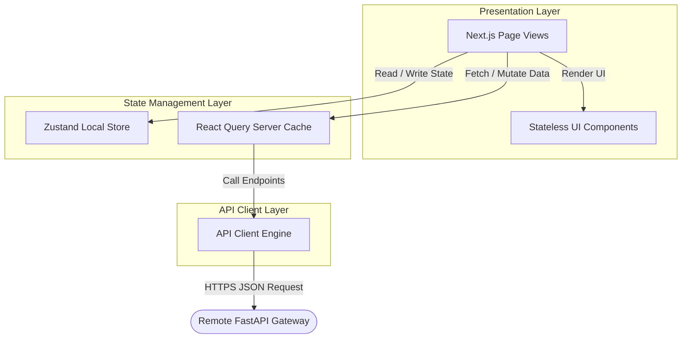
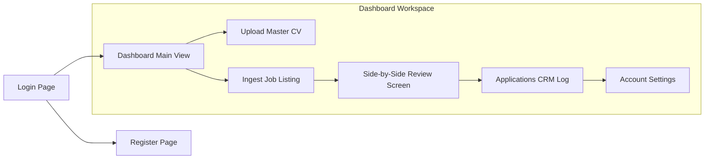
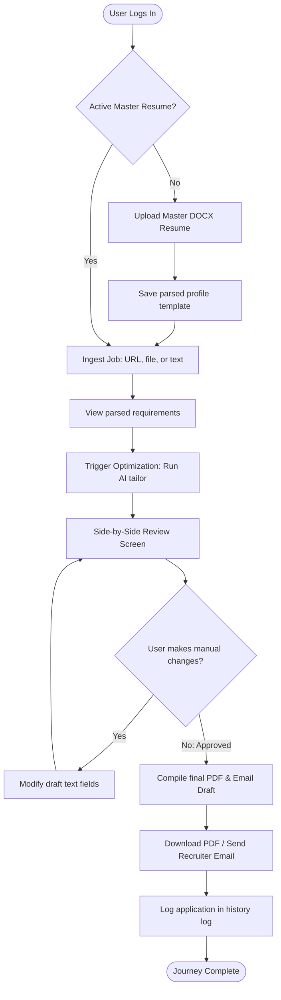

# Frontend Architecture & UI/UX Design Document
## Project Name: AI Job Copilot
### Document Version: 1.0.0 (Phase 7 – Frontend Architecture & UI/UX Design)
### Date: 2026-08-04

---

## 1. Frontend Vision

The frontend design for **AI Job Copilot** focuses on three primary goals: **speed**, **clarity**, and **control**. Applying for jobs is often a stressful process, and the user interface is designed to reduce complexity and minimize cognitive load.

### 1.1 User Experience Philosophy
*   **Simplicity**: The UI only displays relevant information at each stage of the application workflow. Secondary settings and historical records are hidden behind simple navigation paths to keep the user focused on the active task.
*   **Efficiency**: The workspace uses a side-by-side layout that allows users to review, edit, and approve resumes and outreach emails on a single screen, eliminating the need to toggle between multiple tabs.
*   **Candidate Control (Human-in-the-Loop)**: The interface highlights all AI-generated updates and suggestions. This design ensures users remain in full control and can easily review and edit draft content before submitting applications.

```
       +--------------------------------------------------------+
       |                  UI Design Principles                  |
       +--------------------------------------------------------+
                                   |
         +-------------------------+-------------------------+
         |                                                   |
         v                                                   v
  [Clarity First]                                    [Frictionless Flow]
  - Highlight AI updates                             - Single-screen workspaces
  - Clear structural sections                        - Clear progress indicators
  - Intuitive navigation controls                    - Centralized action triggers
```

---

## 2. Frontend Architecture

The client application is built as a single-page application (SPA) using **Next.js** and **TypeScript**, organized into four distinct layers:

```
[Presentation Layer (React Component Library)]
                    │
                    v
[State Management Layer (Zustand + React Query)]
                    │
                    v
[API Client Layer (Axios / Fetch Wrappers)]
                    │
                    v
[Backend REST Gateway (/api/v1/)]
```

### 2.1 The Client Layers

*   **Presentation Layer**: Hosts the React component hierarchy (Layouts, Views, and Common UI Elements). Components are stateless and retrieve their data and event handlers through custom hooks.
*   **State Management Layer**: Manages client-side states. **Zustand** stores client configurations and active user sessions, while **React Query** manages server state, caching API responses and handling network requests.
*   **API Client Layer**: Wraps Axios/Fetch clients, managing HTTP request headers, adding JWT bearer tokens to requests, and parsing JSON payloads.
*   **Backend REST Gateway**: The remote server hosting application APIs, databases, and LLM orchestration services.

### 2.2 System Component Flow Diagram



---

## 3. Application Navigation

The platform navigation is designed to help users complete tasks efficiently, using a primary sidebar layout to manage views:

### 3.1 Primary Navigation Flow



### 3.2 Layout & Navigation Specifications
*   **Primary Sidebar**: A persistent navigation sidebar on desktop views that provides links to the *Dashboard*, *Resume Templates*, *Applications History*, and *Settings*.
*   **Header Bar**: Displays the active page title, notifications status, and a profile dropdown menu containing sign-out options.
*   **Future Extension Slots**: The navigation sidebar is designed to support future modules (such as the *Interview Coach* or *Analytics Panels*) as new menu entries without requiring layout refactoring.

---

## 4. Screen Design Specifications

This section details the layout, components, and user actions for each core screen of the platform.

### 4.1 Login Screen
*   **Purpose**: Authenticate returning users and initialize application sessions.
*   **Components**: Email input, password input, sign-in button, Google OAuth link, and sign-up redirect option.
*   **User Actions**: Log in using credentials, authenticate via Google OAuth, or navigate to the registration screen.
*   **Success States**: Redirects the user to the Dashboard and stores the JWT session token.
*   **Error States**: Displays inline warnings for invalid credentials or incorrect email formats.

### 4.2 Registration Screen
*   **Purpose**: Register new user accounts.
*   **Components**: Name fields, email input, password inputs (with validation checklist), registration button, and sign-in redirect option.
*   **User Actions**: Register an account using credentials or authenticate via Google OAuth.
*   **Success States**: Logs in the user and redirects them to the Dashboard.
*   **Error States**: Displays inline validation errors (e.g. password too short, duplicate email).

### 4.3 Dashboard Screen
*   **Purpose**: The central command center, displaying application metrics and recent activity logs.
*   **Components**: Quota tracking card, recent activity timeline, application search bar, and direct ingestion panel.
*   **User Actions**: Search past applications, download tailored resumes, or paste a new job description to begin a new application.
*   **Success States**: Displays application summaries and statistics.

### 4.4 Resume Upload Screen
*   **Purpose**: Ingest and store the user's master resume template.
*   **Components**: File drag-and-drop zone, file details card, and parse confirmation modal.
*   **User Actions**: Drag-and-drop a DOCX file, view upload status, and confirm parsed profile details.
*   **Success States**: Saves the master template and displays the parsed profile.
*   **Error States**: Displays errors if the file is too large (>10MB) or uses an unsupported format.

### 4.5 Ingest Job Screen
*   **Purpose**: Ingest job descriptions from multiple sources (URLs, PDFs, screenshots, text blocks).
*   **Components**: Tabbed ingestion workspace (URL scraper, PDF uploader, screenshot OCR uploader, raw text area) and progress loader.
*   **User Actions**: Submit job postings, view parsing status, and verify extracted requirements.
*   **Success States**: Opens the Side-by-Side Review Screen.
*   **Error States**: Displays errors if scraping fails or OCR returns low-confidence text.

### 4.6 Side-by-Side Review Screen
*   **Purpose**: The core workspace, allowing users to review and edit tailored documents and outreach drafts on a single screen.
*   **Components**: Side-by-side split pane, tailored resume editor (with editable text fields), outreach email editor, and compilation controls.
*   **User Actions**: Edit resume text, modify outreach email templates, compile final PDFs, and send messages via Gmail.
*   **Success States**: Displays compilation confirmations and enables download options.
*   **Error States**: Highlights layout overflows or validation warnings.

---

## 5. End-to-End User Journey

The flowchart below traces the complete user journey from initial login to final application submission:



---

## 6. Component Architecture

The platform UI is built using a library of reusable, composable components to maintain design consistency and speed up development:

```
                  +--------------------------------+
                  |       Base UI Components       |
                  |  - Buttons, Inputs, Cards      |
                  +--------------------------------+
                                  |
                                  v
                  +--------------------------------+
                  |     Composite Components       |
                  |  - Form Groups, Modal Windows  |
                  +--------------------------------+
                                  |
                                  v
                  +--------------------------------+
                  |         Page Layouts           |
                  |  - Sidebar Grid, Workspaces    |
                  +--------------------------------+
```

### 6.1 Component Catalog

*   **Base UI Components**: Standard inputs, buttons, badges, status indicators, and loaders.
*   **Composite Components**: File drag-and-drop zones, paginated data tables, side-by-side review panels, and modal dialogs.
*   **Navigation Components**: Navigation sidebar, header toolbar, and user account dropdown menus.
*   **Notification Components**: Toast messages and inline alert banners to display status updates and error details.

---

## 7. Client State Management

The application separates state management into three categories:

*   **Global Client State (Zustand)**: Stores long-lived user configurations, theme choices, active user sessions, and JWT tokens across pages.
*   **Server State (React Query)**: Manages network requests, caches API responses, and handles optimistic UI updates, reducing database queries.
*   **Local UI State (React `useState`)**: Stores temporary component states, such as form input text, modal visibility, and drop-down menu active states.

---

## 8. Form Design & Validation

All user input forms are built using **React Hook Form** and validated client-side using **Zod** schema constraints.

*   **Login Form**: Validates email formatting and checks that the password input is not empty before sending requests.
*   **Registration Form**: Enforces password strength rules, email syntax formatting, and checks that passwords match before registration.
*   **Email Preview Form**: Scans drafts for placeholder tokens and validates email addresses before sending.
*   **Accessibility (a11y)**: Forms use standard semantic tags (e.g. `<label>`, `<input>`), associate warnings using `aria-describedby`, and highlight active input borders with clear focus rings.

---

## 9. Dashboard Layout

The main dashboard is designed to help users track and manage their applications, using a responsive three-column grid layout:

*   **Statistics Panel**: Displays key metrics (e.g. Total Applications, Active Drafts, Outreach rate).
*   **Ingestion Panel**: A quick-paste block allowing users to submit new job description URLs or texts directly from the home view.
*   **Applications List Table**: A paginated, searchable list displaying previous applications, roles, dates, and status badges, with quick download links for tailored PDFs.

---

## 10. Document Preview Component

The Side-by-Side Review Screen displays resume previews using a dual-tabbed workspace:

*   **Side-by-Side Comparison Workspace**: Displays the original resume bullets alongside the AI's tailored suggestions, highlighting rephrased sections and keyword updates.
*   **Document Preview Canvas**: Renders the generated PDF using HTML5 canvas components, allowing the user to review document layouts, margins, and page counts.
*   **Manual Edit Mode**: Users can click directly on tailored bullet points to make adjustments before final compilation.

---

## 11. Outreach Email Workspace

The email workspace allows users to review and edit recruiter outreach messages before delivery:

```
+---------------------------------------------------------------------------------+
| Recruiter Outreach Workspace                                                    |
+---------------------------------------------------------------------------------+
| Recipient: [ recruiter@company.com                                           ]  |
| Subject:   [ Application: Senior AI Engineer - Surya Charan                  ]  |
+---------------------------------------------------------------------------------+
| Body:                                                                           |
| [ Dear Recruiter,                                                            ]  |
| [ I hope this email finds you well. I am writing to express my interest...   ]  |
| [                                                                            ]  |
+---------------------------------------------------------------------------------+
| Attachment: [ SuryaC_AIEngineer_Google_2026-08-04.pdf                  ] (PDF)  |
+---------------------------------------------------------------------------------+
|                                                [ Edit Draft ]   [ Send Email ]  |
+---------------------------------------------------------------------------------+
```

*   **Metadata Input Fields**: Editable input fields for recipient address, email subject, and signature.
*   **Dynamic Attachment Previews**: Displays details and paths for the tailored PDF file to be attached to the message.
*   **Approval Controls**: A single action button to trigger delivery via the Gmail API, requiring user approval before sending.

---

## 12. Responsive Design Grid

The layout grid uses Tailwind CSS breakpoints to adapt the interface for different screen sizes, prioritizing a desktop-first design for document editing:

*   **Desktop View ($\ge$ 1024px)**: Displays the side-by-side workspace split-pane layout to support document review and editing.
*   **Tablet View (768px – 1023px)**: Displays navigation bars and stacks workspaces vertically, formatting tables into card lists.
*   **Mobile View (< 768px)**: Stacks dashboard cards and tables vertically, hiding complex editing tools and directing users to a desktop screen for tailoring tasks.

---

## 13. Design System

The platform design system uses clean typography, structured spacing, and a modern color palette to create a premium SaaS experience:

### 13.1 Spacing & Grid System
The layout utilizes a strict 4px grid system:
*   `px-1` (4px), `px-2` (8px), `px-4` (16px), `px-6` (24px), `px-8` (32px).
*   All layouts, margins, and paddings are defined using spacing variables to maintain visual consistency.

### 13.2 SaaS Design Specifications

| Token Class | Variable Options | Usage Guidelines |
| :--- | :--- | :--- |
| **Typography** | `font-sans`: Inter, System-UI | Primary clean font for body text and navigation labels. |
| **Typography** | `font-mono`: JetBrains Mono | Used for technical skills, code elements, and metadata. |
| **Theme Colors** | Dark Slate Primary (`#0F172A`) | Dark mode background. |
| **Theme Colors** | Border Gray (`#334155`) | Borders, grid lines, and dividers. |
| **Theme Colors** | Forest Emerald (`#10B981`) | Success status badges (e.g. `sent`, `approved`). |
| **Theme Colors** | Alert Amber (`#F59E0B`) | Pending notifications, warning status badges. |
| **Theme Colors** | Accent Violet (`#6366F1`) | Interactive buttons, select highlight lines. |

---

## 14. Error Management & Feedback

The client application captures and displays errors to help users resolve issues:

*   **Connection Banners**: Displays a top banner if network connections are lost, caching mutations to retry once online.
*   **Inline Form Warnings**: Highlights invalid inputs (e.g. incorrect emails or empty fields) directly below target fields.
*   **Toast Notifications**: Displays pop-up notifications to report quick status updates (e.g. "Resume optimized successfully").
*   **Failure Screen Layouts**: Displays illustrative instructions and manual workarounds if critical features (such as job scrapers or document compilers) fail.

---

## 15. Client Security

The frontend implements several measures to secure sessions and protect user data:

*   **JWT Storage**: Stores JWT tokens in short-lived memory, with refresh tokens saved in HTTP-only, secure, same-site cookies to prevent XSS-based token theft.
*   **Route Guards**: Next.js middleware blocks unauthenticated users from accessing dashboard pages, redirecting them to the login screen.
*   **Sanitization Filters**: Parses user text inputs to strip out executable code and script tags before rendering.

---

## 16. Client Performance Strategy

To maintain a fast, responsive user experience, the frontend implements several optimization strategies:

*   **Bundle Code Splitting**: Uses Next.js lazy loading to load complex modules (such as PDF render engines or canvas tools) only when requested.
*   **Query Caching**: Uses React Query to cache API responses, reducing redundant database queries.
*   **Asset Compression**: Automatically optimizes image and SVG sizes, using system fonts to eliminate layout shifts.
*   **Render Memoization**: Uses React `useMemo` and `useCallback` hooks on complex components (such as side-by-side lists) to prevent unnecessary re-renders.

---

## 17. Accessibility (a11y)

The interface is built to meet WCAG 2.1 AA accessibility standards:

*   **Keyboard Navigation**: Ensures all buttons, links, and forms can be focused and triggered using standard keyboard shortcuts.
*   **Aria Tags & Screen Readers**: Uses ARIA labels to describe icons and loading animations.
*   **Color Contrast**: The design system color palette is selected to ensure text contrast ratios meet AA requirements.
*   **Focus Ring Indicators**: Focus ring indicators are visible on all interactive elements.

---

## 18. Future UI Expansion

The modular component architecture allows the user interface to expand without requiring layout refactorings:

*   **Browser Extension Popup**: The popup popup UI can import the existing login forms and ingestion components from the client component library.
*   **AI Coach Sidebar**: A slide-over panel can be added to the dashboard to show coaching tips, with no changes needed to core workspaces.
*   **Multi-tenant Organization View**: Team workspace views can be added as a separate dashboard layout, with access scopes managed via current route configuration structures.

---

## 19. Frontend Design Decisions & Trade-offs

This section records key frontend decisions, detailing the trade-offs, advantages, and limitations of each:

### 19.1 React + Next.js (App Router) vs. Vite Single Page Application
*   **Considered Alternative**: Vite SPA.
*   **Selected Path**: React + Next.js.
*   **Rationale**: Next.js provides built-in routing, API folder mapping, and server-side rendering for optimal speed.
*   **Trade-off**: Requires strict separation of client-side and server-side component declarations.

### 19.2 Tailwind CSS vs. Styled Components
*   **Considered Alternative**: Styled Components (CSS-in-JS).
*   **Selected Path**: Tailwind CSS.
*   **Rationale**: Utility-first CSS class names keep bundle sizes small and render layouts quickly, avoiding runtime styling calculations.
*   **Trade-off**: Can result in long class name lists in markup, requiring utilities like `tailwind-merge` to manage styles cleanly.

### 19.3 Zustand vs. Redux Toolkit
*   **Considered Alternative**: Redux Toolkit.
*   **Selected Path**: Zustand.
*   **Rationale**: Zustand provides a lightweight state management solution with minimal boilerplate, perfect for managing active sessions.
*   **Trade-off**: Lacks some of Redux's advanced developer tools out-of-the-box.
