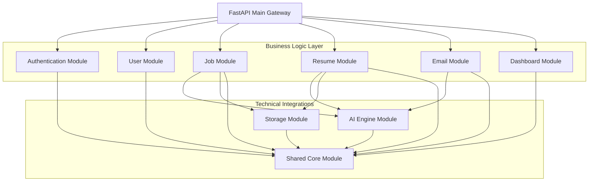
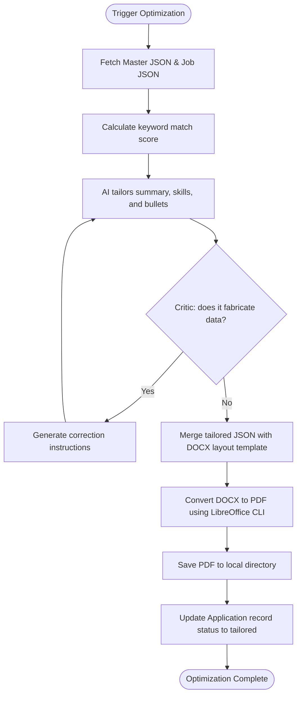
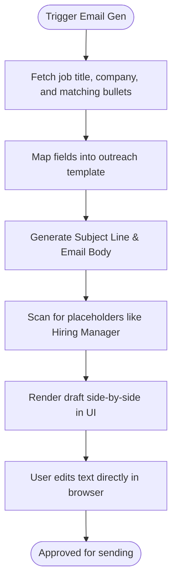
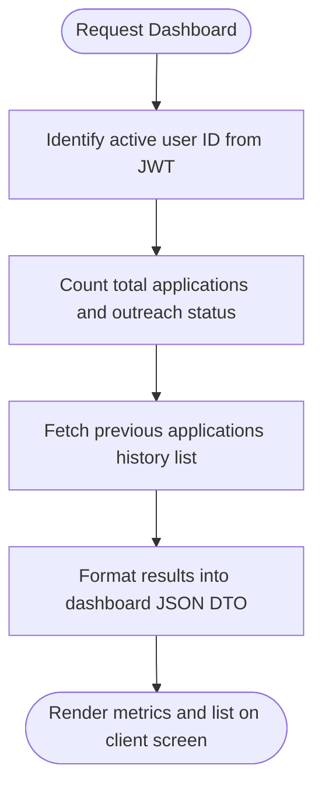
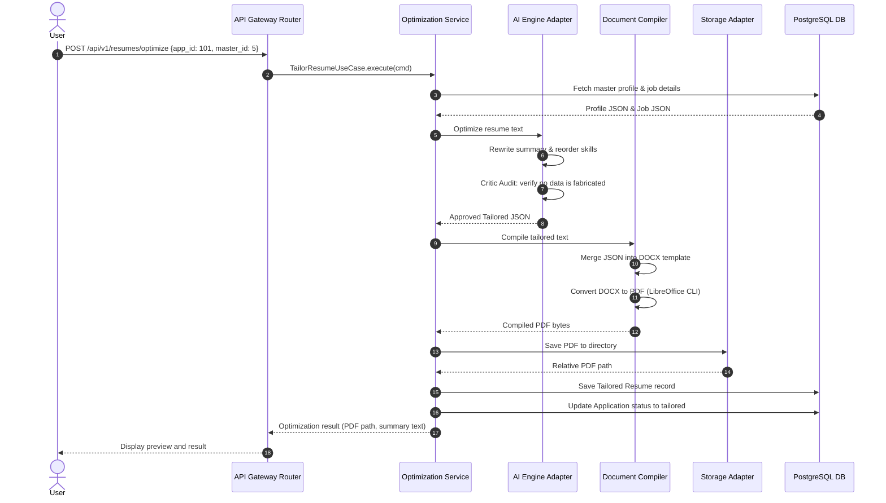
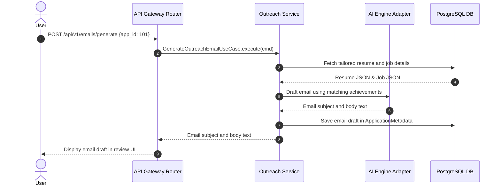

# Low-Level Design (LLD) Document
## Project Name: AI Job Copilot
### Document Version: 1.0.0 (Phase 3 – Low-Level Design)
### Date: 2026-08-04

---

## 1. Module Breakdown

The system is divided into several business modules, each responsible for a specific bounded context:

```
+-----------------------------------------------------------------------------------+
|                              Backend Modular Layout                               |
+-----------------------------------------------------------------------------------+
|  [Auth]      --> JWT validation, password hashing, and user authentication.        |
|  [User]      --> User profiles, settings, and subscription/quota states.          |
|  [Job]       --> Job URL scraping, document parsing, and requirements analysis.  |
|  [Resume]    --> Profile storage, template compiling, and resume tailoring.       |
|  [Email]     --> Outreach drafting and message delivery (Gmail API).              |
|  [AI]        --> Prompt management, LLM integrations, and schema validation.      |
|  [Storage]   --> Local file storage and S3-compatible cloud interfaces.           |
|  [Dashboard] --> Metrics aggregation and application history indexes.             |
|  [Shared]    --> Base classes, common schemas, exceptions, and utility tools.     |
+-----------------------------------------------------------------------------------+
```

*   **Authentication Module**: Manages password hashing, registration, login, and JWT validation.
*   **User Module**: Manages user profiles, configuration settings, and monthly quotas.
*   **Job Module**: Manages job scraping, PDF text extraction, OCR processing, and job metadata parsing.
*   **Resume Module**: Manages master resumes, tailored resumes, and the document compiler.
*   **Email Module**: Manages recruiter email extraction, outreach drafting, and email delivery.
*   **AI Module**: Manages prompt templates, system instructions, and LLM API connections.
*   **Storage Module**: Manages local directories, file paths, and cloud storage uploads.
*   **Dashboard Module**: Manages application records, search queries, and historical logs.
*   **Shared Module**: Hosts reusable value objects, database sessions, and custom exceptions.

---

## 2. Module Dependency Diagram

The diagram below shows the design dependencies between the system modules. High-level routers depend on core services, which interface with the database and AI adapters.



---

## 3. Internal Module Design

This section details the design of each module, specifying responsibilities, business rules, inputs/outputs, and validation schemas.

### 3.1 Authentication Module
*   **Purpose**: Manages password hashing, registration, login, and JWT validation.
*   **Responsibilities**:
    - Hash passwords using the `bcrypt` algorithm.
    - Generate and verify JWT access tokens.
    - Handle Google OAuth login callbacks.
*   **Business Rules**: Passwords must be at least 8 characters long, and JWT tokens must expire after 24 hours.
*   **Inputs**: Registration forms (email, password, names) and login credentials.
*   **Outputs**: User profiles, JWT tokens, and login success responses.
*   **Dependencies**: Database session, Shared module exceptions.
*   **Validation Rules**: Email syntax validation and secure password constraints.
*   **Error Handling**: Returns `401 Unauthorized` for invalid credentials and `409 Conflict` for duplicate registrations.
*   **Communication**: Provides authentication middleware for other modules.
*   **Expected Future Extensions**: Multi-factor authentication (MFA) and SAML SSO support.

### 3.2 User Module
*   **Purpose**: Manages user profiles, configuration settings, and monthly quotas.
*   **Responsibilities**:
    - Retrieve and update user profiles.
    - Track active application usage and monthly limits.
*   **Business Rules**: Non-premium accounts are limited to 5 tailored resumes per day.
*   **Inputs**: User IDs and profile edit details.
*   **Outputs**: Profile objects and active quota metrics.
*   **Dependencies**: Database session, Shared module.
*   **Validation Rules**: Limits name edits to 100 characters.
*   **Error Handling**: Returns `403 Forbidden` if a user exceeds their daily application quota.
*   **Communication**: Called by the Gateway to retrieve user profiles.
*   **Expected Future Extensions**: Premium team workspaces and usage analytics.

### 3.3 Job Module
*   **Purpose**: Manages job scraping, PDF text extraction, OCR processing, and job metadata parsing.
*   **Responsibilities**:
    - Scrape job listings from Greenhouse, Lever, and LinkedIn.
    - Extract text from PDF job descriptions.
    - Run OCR on uploaded screenshot files.
*   **Business Rules**: Scraper tasks must timeout after 5 seconds to prevent performance bottlenecks.
*   **Inputs**: URL strings, PDF bytes, or image files.
*   **Outputs**: Structured JSON containing company, title, requirements, and keywords.
*   **Dependencies**: AI Engine, Storage module, Database session.
*   **Validation Rules**: URL pattern matching and file size limitations.
*   **Error Handling**: Falls back to copy-paste text input if scrapers fail.
*   **Communication**: Sends parsed job details to the Resume module.
*   **Expected Future Extensions**: Direct integration with job board APIs.

### 3.4 Resume Module
*   **Purpose**: Manages master resumes, tailored resumes, and the document compiler.
*   **Responsibilities**:
    - Store and parse master resumes.
    - Tailor resumes using the AI Engine.
    - Compile tailored text into PDF documents using the original layout.
*   **Business Rules**: Master resumes cannot be modified, and tailored output must match the template layout.
*   **Inputs**: Master resume DOCX files and tailored text schemas.
*   **Outputs**: Structured resume JSON, compiled DOCX, and PDF files.
*   **Dependencies**: AI Engine, Storage module, Database session.
*   **Validation Rules**: DOCX file verification and constraint checks on tailored text (e.g. experience bullet counts).
*   **Error Handling**: Automatically restarts the optimization process if layout validation fails.
*   **Communication**: Connects with the Storage module to write files and the Dashboard module to log applications.
*   **Expected Future Extensions**: Support for multiple resume layouts and custom templates.

### 3.5 Email Module
*   **Purpose**: Manages recruiter email extraction, outreach drafting, and email delivery.
*   **Responsibilities**:
    - Identify recruiter emails in job postings.
    - Draft outreach emails based on resume achievements.
    - Send emails via the Gmail API.
*   **Business Rules**: Emails cannot be sent without user review and approval.
*   **Inputs**: Application metadata and user-edited email text.
*   **Outputs**: Outreach subject lines, body drafts, and delivery receipts.
*   **Dependencies**: Authentication module, AI Engine, Database session.
*   **Validation Rules**: Email syntax validation.
*   **Error Handling**: If sending via the Gmail API fails, the system provides SMTP credentials as a backup.
*   **Communication**: Retrieves tailored PDFs from the Resume module to attach to outreach emails.
*   **Expected Future Extensions**: Multi-channel outreach (e.g. LinkedIn InMail).

### 3.6 AI Module
*   **Purpose**: Manages prompt templates, system instructions, and LLM API connections.
*   **Responsibilities**:
    - Manage prompt templates and instructions.
    - Connect to LLM APIs (Gemini/OpenAI) and handle connection issues.
    - Validate that LLM outputs conform to target schemas.
*   **Business Rules**: All prompts must use structured JSON mode with a temperature setting of 0.0.
*   **Inputs**: Context strings, variables, and schema models.
*   **Outputs**: Structured JSON payloads.
*   **Dependencies**: Shared module constants.
*   **Validation Rules**: Verify that outputs match the target JSON schemas.
*   **Error Handling**: Implements exponential backoff for rate limits and connection issues.
*   **Communication**: Used by the Job, Resume, and Email modules to execute AI operations.
*   **Expected Future Extensions**: Integration with local models.

### 3.7 Storage Module
*   **Purpose**: Manages local directories, file paths, and cloud storage uploads.
*   **Responsibilities**:
    - Save files in structured directories.
    - Generate unique filenames based on application metadata.
    - Clean up temporary files.
*   **Business Rules**: Store files securely, ensuring users can only access their own documents.
*   **Inputs**: File bytes, naming variables, and target directories.
*   **Outputs**: Absolute storage paths.
*   **Dependencies**: Shared module constants.
*   **Validation Rules**: Check file size limits and verify storage directory paths.
*   **Error Handling**: Swaps storage locations if the primary disk is full.
*   **Communication**: Used by the Resume and Job modules to write and read files.
*   **Expected Future Extensions**: Cloud storage adapters (e.g. AWS S3, MinIO).

### 3.8 Dashboard Module
*   **Purpose**: Manages application records, search queries, and historical logs.
*   **Responsibilities**:
    - Log application metadata in the database.
    - Fetch metrics and history indexes for the user dashboard.
    - Search history by company, role, or date.
*   **Business Rules**: Restrict search results to the logged-in user's records.
*   **Inputs**: User IDs, search filters, and application data payloads.
*   **Outputs**: Application lists and metrics counts.
*   **Dependencies**: Database session, Shared module.
*   **Validation Rules**: Validate search query parameters.
*   **Error Handling**: Returns empty lists if search queries match no records.
*   **Communication**: Queries the database using user IDs to compile lists.
*   **Expected Future Extensions**: Exporting application history as CSV reports.

---

## 4. Domain Models

This section details the primary domain entities, defining attributes, relationships, lifecycles, and business rules.

```
       +---------------------------------------------+
       |                  User                       |
       |  - id, email, first_name, last_name         |
       +---------------------------------------------+
              |                               |
              | (uploads)                     | (creates)
              v                               v
       +--------------------+          +--------------------+
       |    ResumeFile      |          |    Application     |
       |  - is_master: true |          |  - company, role   |
       +--------------------+          +--------------------+
                                              |
                                              | (associated file)
                                              v
                                       +--------------------+
                                       |    ResumeFile      |
                                       |  - is_master: false|
                                       +--------------------+
```

### 4.1 Domain Model Specifications

#### 1. User
*   **Purpose**: Represents a user profile on the platform.
*   **Attributes**: `id` (int), `email` (string), `hashed_password` (string), `first_name` (string), `last_name` (string), `created_at` (timestamp).
*   **Relationships**: Has a one-to-many relationship with `ResumeFile` and `Application` entities.
*   **Lifecycle**: Active upon registration; deleted if the user profile is removed.
*   **Business Rules**: Emails must be unique, and passwords must be encrypted using `bcrypt` before storage.

#### 2. ResumeFile
*   **Purpose**: Represents a physical resume file (master or tailored) stored in the system.
*   **Attributes**: `id` (int), `user_id` (int), `file_type` (string), `file_path` (string), `parsed_json_content` (jsonb), `is_master` (boolean), `created_at` (timestamp).
*   **Relationships**: Belongs to a `User` entity; associated with one or more `Application` entities.
*   **Lifecycle**: Initialized as a master resume when uploaded, or as a tailored version when compiled.
*   **Business Rules**: The `parsed_json_content` must match the resume structure schema, and the file path must resolve to a valid file on disk.

#### 3. JobPost
*   **Purpose**: Represents a target job posting parsed by the system.
*   **Attributes**: `id` (int), `company_name` (string), `job_title` (string), `job_url` (string), `raw_description` (text), `skills` (list), `recruiter_email` (string).
*   **Relationships**: Associated with a specific `Application` entity.
*   **Lifecycle**: Extracted and parsed when ingested, deleted if the associated application is removed.
*   **Business Rules**: Must contain a company name and job title to be valid.

#### 4. Application
*   **Purpose**: Tracks a specific job application record and its matching metadata.
*   **Attributes**: `id` (int), `user_id` (int), `tailored_resume_id` (int), `company_name` (string), `role_title` (string), `job_url` (string), `status` (string), `application_date` (timestamp).
*   **Relationships**: Belongs to a `User` entity; references a tailored `ResumeFile` and `ApplicationMetadata` record.
*   **Lifecycle**: Progresses through states: `ingested` $\rightarrow$ `tailored` $\rightarrow$ `sent` $\rightarrow$ `archived`.
*   **Business Rules**: The status must conform to defined application states.

#### 5. ApplicationMetadata
*   **Purpose**: Stores secondary metadata for an application, including email drafts and match metrics.
*   **Attributes**: `id` (int), `application_id` (int), `recruiter_name` (string), `recruiter_email` (string), `outreach_email_body` (text), `match_analytics` (jsonb).
*   **Relationships**: Belongs to an `Application` entity.
*   **Lifecycle**: Created alongside the parent `Application` entity.
*   **Business Rules**: The match analytics JSON must contain a match score and list of missing skills.

---

## 5. Use Case Design

This section details the primary use cases of the platform, outlining actors, flows, and business rules.

### 5.1 Use Case Specifications

#### 1. Ingest Job Posting
*   **Actor**: Job Seeker.
*   **Preconditions**: User is authenticated, and provides a valid URL or text posting.
*   **Main Flow**:
    1. User inputs a job posting URL or text block.
    2. API gateway validates input syntax.
    3. Job module scrapes details and extracts text.
    4. AI Engine parses the text into a structured job description schema.
    5. Database logs a temporary application record (Status: `ingested`).
    6. System displays the parsed job requirements.
*   **Alternative Flow**: If the user provides a screenshot, the system runs OCR to extract the text.
*   **Failure Flow**: If scraping or OCR fails, the system prompts the user to copy-paste the text manually.
*   **Postconditions**: A temporary application record is created, and the parsed job requirements are available for tailoring.
*   **Business Rules**: The job record must contain a company name and title.

#### 2. Optimize Resume
*   **Actor**: Job Seeker.
*   **Preconditions**: User has uploaded a master resume, and has an active application in the `ingested` state.
*   **Main Flow**:
    1. User triggers optimization for an application.
    2. AI Engine fetches the master resume and job requirements.
    3. AI Engine rewrites the summary, reorders skills, and aligns bullet points.
    4. Critic Agent audits the tailored resume against the master profile.
    5. Document compiler merges the tailored JSON into the DOCX template and converts it to PDF.
    6. System displays the tailored resume preview and outreach draft.
*   **Alternative Flow**: If the Critic Agent flags a validation error, the system automatically runs the optimizer again with feedback.
*   **Failure Flow**: If AI processing times out, the system alerts the user and falls back to a basic keyword match summary.
*   **Postconditions**: The application status changes to `tailored`, and the compiled PDF path is saved.
*   **Business Rules**: Zero fabrication: no credentials, titles, or dates can be modified.

#### 3. Send Outreach Email
*   **Actor**: Job Seeker.
*   **Preconditions**: User has approved the tailored resume, and provides a valid recruiter email.
*   **Main Flow**:
    1. User reviews the email draft and clicks "Send Email".
    2. Email module builds a MIME message, attaching the tailored PDF.
    3. Email module sends the message via the Gmail API.
    4. Database updates the application status to `sent`.
    5. System displays a success message.
*   **Alternative Flow**: If the user has not connected Gmail, the system prompts for SMTP settings.
*   **Failure Flow**: If the email fails to send, the system alerts the user and flags the application status as `tailored`.
*   **Postconditions**: The email is sent, and the application status is updated.
*   **Business Rules**: Emails cannot be sent without user review and approval.

---

## 6. Business Workflow Design

This section details the internal workflows for core operations, using flowcharts and step-by-step logic.

### 6.1 Resume Optimization Workflow



### 6.2 Email Generation Workflow



### 6.3 Dashboard Loading Workflow



---

## 7. Resume Optimization Design

The optimization engine tailors the candidate's resume to match job requirements without altering their core professional background.

```
       +---------------------------------------------+
       |          Original Word Document             |
       |  - Absolute Truth                           |
       |  - Contains layout formatting tokens        |
       +---------------------------------------------+
                              |
                              v
       +---------------------------------------------+
       |             Tailoring Engine                |
       |  - Optimizes summary statement              |
       |  - Reorders technical skill groupings       |
       |  - Adjusts bullet points for keywords       |
       +---------------------------------------------+
                              |
                              v
       +---------------------------------------------+
       |           Document Compiler                 |
       |  - Merges tailored text into XML structures |
       |  - Converts populated DOCX to PDF           |
       +---------------------------------------------+
```

### 7.1 Text Tailoring Phase
The system compares the job requirements with the candidate's master resume, rewriting the professional summary and technical skills list to match, while rephrasing experience bullet points using action verbs to emphasize matching skills.

### 7.2 Safety Constraints (Zero Fabrication)
The optimization engine operates within strict security boundaries:
*   **Employment Metadata**: Company names, job titles, and employment dates are treated as read-only and cannot be modified.
*   **Education History**: Degrees, universities, and graduation dates are read-only and cannot be modified.
*   **Experience & Projects**: The system cannot add accomplishments, certifications, or projects not present in the master resume.
*   **Bullet Point Alignment**: The system only rephrases existing bullet points to align with job keywords (e.g. rephrasing "managed database backups" to "monitored database reliability to support system operations" if database reliability is emphasized).

### 7.3 Document Compilation
To maintain formatting consistency:
1.  The master resume is uploaded as a styled DOCX template containing merge fields (e.g. `{{summary}}`, `{{bullets}}`).
2.  The document compiler maps the tailored JSON keys to the template merge fields.
3.  The compiler outputs a populated DOCX file, which is converted to PDF using the LibreOffice command-line utility. This process keeps margins, fonts, and spacing intact.

---

## 8. AI Engine Operation Design

This section details the design of individual AI operations, specifying inputs, outputs, and validation rules.

### 8.1 Component Specifications

#### 1. Input Detection
*   **Purpose**: Identify the input format and route it to the correct parser.
*   **Input**: Raw input string.
*   **Output**: Input type string (`url`, `text`, `email`, `whatsapp`).
*   **Failure Handling**: Defaults to `text` if the input format cannot be identified.
*   **Retry Strategy**: Single check.

#### 2. Content Extraction
*   **Purpose**: Extract raw text from files or URLs.
*   **Input**: File bytes or URL string.
*   **Output**: Extracted text string.
*   **Failure Handling**: Returns an error if the URL is unreachable or document parsing fails.
*   **Retry Strategy**: 3 attempts with a 2-second delay.

#### 3. Job Understanding
*   **Purpose**: Parse raw text into structured job requirements.
*   **Input**: Extracted text string.
*   **Output**: Structured Job Description JSON.
*   **Failure Handling**: Falls back to general keyword parsing if structured extraction fails.
*   **Retry Strategy**: Retry with a temperature adjustment if JSON validation fails.

#### 4. Resume Matching
*   **Purpose**: Compare the master resume against job requirements to calculate a match score.
*   **Input**: Master Resume JSON and Job Description JSON.
*   **Output**: Match Score (0–100) and gap analysis.
*   **Failure Handling**: Falls back to standard keyword overlap matching if processing fails.
*   **Retry Strategy**: Single attempt.

#### 5. Resume Optimization
*   **Purpose**: Tailor the resume summary and bullet points to match the job requirements.
*   **Input**: Master Resume JSON and Job Description JSON.
*   **Output**: Tailored Resume JSON.
*   **Failure Handling**: Reverts to the master resume text if optimization fails.
*   **Retry Strategy**: Re-run the optimization step if validation checks fail.

#### 6. Resume Evaluation (Critic)
*   **Purpose**: Audit the tailored resume against the master profile to prevent data fabrication.
*   **Input**: Master Resume JSON and Tailored Resume JSON.
*   **Output**: Boolean approval status with a list of corrections.
*   **Failure Handling**: Rejects the tailored resume and returns a correction report.
*   **Retry Strategy**: Automatically routes corrections back to the Resume Optimizer for a rewrite.

#### 7. Email Generation
*   **Purpose**: Draft a personalized outreach email based on the job requirements and tailored resume.
*   **Input**: Tailored Resume JSON and Job Description JSON.
*   **Output**: Subject line and email body.
*   **Failure Handling**: Falls back to a standard outreach template if generation fails.
*   **Retry Strategy**: Single attempt.

#### 8. Output Validation
*   **Purpose**: Ensure the final JSON payload matches the structure required by the document compiler.
*   **Input**: JSON payload.
*   **Output**: Verified JSON payload matching the target schema.
*   **Failure Handling**: Attempts to parse the JSON manually and throws an exception if formatting cannot be repaired.
*   **Retry Strategy**: Retry with structured schema formatting instructions.

---

## 9. File Management Design

All files are stored in a structured directory layout, using standard names and automated cleanup steps to keep storage organized.

### 9.1 Storage Folder Structure
```
storage/
├── master_resumes/
│   ├── master_user_1.docx
│   └── master_user_1_parsed.json
└── applications/
    ├── app_101_google/
    │   ├── SuryaC_AIEngineer_Google_2026-08-04.docx
    │   └── SuryaC_AIEngineer_Google_2026-08-04.pdf
    └── app_102_netflix/
        ├── SuryaC_SeniorSoftwareEngineer_Netflix_2026-08-05.docx
        └── SuryaC_SeniorSoftwareEngineer_Netflix_2026-08-05.pdf
```

### 9.2 File Naming Convention
Generated files use a standard naming pattern containing user and application details:
`[UserName]_[Role]_[Company]_[Date].[ext]`

*   *Example*: `SuryaC_AIEngineer_Google_2026-08-04.pdf`

This standard convention provides several benefits:
*   The user instantly knows the contents of the file when reviewing downloaded files.
*   Recruiters receive a clearly labeled document instead of `Resume_Version_Final.pdf`.
*   System storage avoids filename conflicts.

### 9.3 Cleanup Strategy
To keep the storage volume organized, temporary files (such as raw text buffers, intermediate DOCX files, and OCR output caches) are saved in a temporary folder (`/storage/tmp/`) and deleted automatically after the application record is successfully saved.

---

## 10. Validation Strategy

The platform validates all inputs and outputs to ensure data integrity and system stability:

*   **Job URL Validation**: Verifies that input URLs use HTTPS, correspond to supported domains, and match standard URL patterns before scraping.
*   **Resume Validation**: Verifies that uploaded master resumes are in DOCX format, do not exceed 10MB, and contain readable text.
*   **Email Validation**: Scans generated outreach emails for brackets (e.g. `[Hiring Manager]`) and validates email syntax using regex patterns.
*   **PDF Validation**: Verifies that generated PDF files are readable and match standard page layout sizes before saving.
*   **Image Validation**: Restricts screenshot uploads to supported formats (`.png`, `.jpg`, `.jpeg`, `.webp`), limits file size to 8MB, and checks resolution quality before running OCR.
*   **Generated JSON Validation**: Runs all LLM JSON outputs through Pydantic schema checks to verify that keys, array types, and string parameters match target schemas.

---

## 11. Error Handling Design

The system is designed to handle failures gracefully, ensuring that issues with external services do not crash the application:

*   **Missing Resume**: If a user tries to optimize a resume without uploading a master file, the system returns a `428 Precondition Required` error, directing them to the upload screen.
*   **Invalid URL**: If a job board scraper fails (e.g. due to paywalls or network blocks), the system returns a warning, pre-populating a text area to let the user copy and paste the job description text manually.
*   **OCR Failure**: If OCR fails to read an image, the system returns a `422 Unprocessable Entity` error, asking the user to upload a clear screenshot or paste the text manually.
*   **LLM Failures**: If an LLM call times out or returns invalid JSON, the system automatically retries the request with a temperature adjustment. If the retry fails, it falls back to a local string comparison.
*   **Email Delivery Failure**: If sending an email via the Gmail API fails, the system logs the failure, updates the application status to `tailored`, and prompts the user to download the PDF and send the email manually.
*   **Storage Failures**: If writing a file fails (e.g. due to full storage disks), the system attempts to save the file to a backup directory and flags an administrator alert.

---

## 12. Logging Strategy

The platform maintains logs organized by domain, using standard severity levels to simplify troubleshooting:

*   **Application Logs**: Logs system events (e.g. user logins, API routing tasks) using the `INFO` severity level.
*   **AI Engine Logs**: Logs prompt versions, token counts, matching metrics, and response times using the `DEBUG` level.
*   **Document Compiler Logs**: Logs layout mapping processes, temporary file allocations, and PDF compilation status.
*   **Outreach Delivery Logs**: Logs email draft generations, OAuth credentials refreshes, and delivery confirmations.
*   **System Error Logs**: Logs stack traces and exceptions using the `ERROR` or `CRITICAL` severity levels.
*   **Audit Logs**: Logs sensitive events (e.g. password resets, security access changes, file downloads) to track compliance.

---

## 13. Configuration Management

Platform settings and credentials are managed using environment variables, ensuring that configurations remain secure and independent of the source code.

*   `LLM_PROVIDER`: Defines the active LLM provider (e.g. `gemini`, `openai`).
*   `GEMINI_API_KEY` / `OPENAI_API_KEY`: API access keys for LLM services.
*   `MASTER_TEMPLATE_DIR`: Local filesystem directory path for master templates.
*   `STORAGE_BUCKET_NAME`: Object storage destination path (for cloud storage integrations).
*   `GMAIL_CLIENT_ID` / `GMAIL_CLIENT_SECRET`: Google OAuth app credentials.
*   `DATABASE_URL`: PostgreSQL connection string.
*   `REDIS_URL`: Redis connection string.
*   `OCR_ENGINE`: Configures the active OCR engine (e.g. `tesseract`, `gemini-vision`).

---

## 14. Low-Level System Sequence Diagrams

This section details how system components interact during core operations.

### 14.1 Resume Optimization and Compilation Flow


### 14.2 Recruiter Email Generation Flow


---

## 15. Component Interaction Design

The API Gateway manages the request lifecycle, validating inputs and forwarding them to the Application Layer for processing:

```
[Client Request] --> [Gateway Router] --> [Validation Schema] --> [Application Use Case] --> [Domain Rules] --> [Infrastructure Adapters]
```

*   **Inputs & Validation**: Raw HTTP requests are parsed and validated using Pydantic schemas before they are forwarded to the Application Layer.
*   **Dependency Injection**: Use cases request dependencies (e.g. database repositories, storage clients) via abstract interfaces, which are resolved using dependency injection at runtime.
*   **Execution Isolation**: Databases are queried through repository interfaces, and external APIs are called through adapters. This isolation ensures that issues with external services do not impact the core application flow.

---

## 16. Extensibility Design

The platform uses abstract interfaces and modular boundaries to ensure new features can be added without modifying existing code:

*   **Adding Job Board Scrapers**: New scrapers can be added by implementing the base scraper interface, with no changes needed to the core Job Ingestion module.
*   **Adding Document Templates**: Support for new resume designs can be added by uploading new DOCX templates and updating the compilation field maps, with no changes needed to the tailoring engine.
*   **Adding LLM Providers**: New AI providers can be integrated by writing a client wrapper that implements the base LLM adapter interface.
*   **Adding Outlook Integration**: Outlook email support can be added by writing a mail client wrapper that implements the base email sender interface.

---

## 17. Design Decisions & Trade-offs

This section records structural decisions, detailing the trade-offs, advantages, and limitations of each:

### 17.1 Relational Storage (PostgreSQL) vs. Document Storage (NoSQL)
*   **Considered Alternative**: MongoDB.
*   **Selected Path**: PostgreSQL.
*   **Rationale**: PostgreSQL provides transaction guarantees for user profiles and applications, while natively supporting `JSONB` for storing flexible resume versions. This provides the advantages of NoSQL document stores with the consistency of relational databases.
*   **Trade-off**: Requires database performance tuning if JSON structures exceed several megabytes.

### 17.2 Document Layout Modification (DOCX Field Merging) vs. Direct PDF Editing
*   **Considered Alternative**: Direct PDF generation using ReportLab.
*   **Selected Path**: DOCX Field Merging.
*   **Rationale**: Direct PDF manipulation often breaks document flows and spacing. HTML-to-PDF converters can suffer from rendering issues and inconsistent page breaks. Modifying a base DOCX file with key-value placeholders preserves fonts, spacing, and grid configurations.
*   **Trade-off**: Requires running a LibreOffice helper process on the server to convert DOCX files to PDF.

### 17.3 Cyclic Critic Loop vs. Single-Pass Optimization
*   **Considered Alternative**: Single-pass LLM optimization.
*   **Selected Path**: Cyclic Critic Loop (LangGraph).
*   **Rationale**: Single-pass optimization can occasionally fabricate skills or experience when trying to match job descriptions. Introducing a Critic Agent that audits the output against the master profile prevents fake details from being added.
*   **Trade-off**: Increases processing time and token costs for LLM operations.
