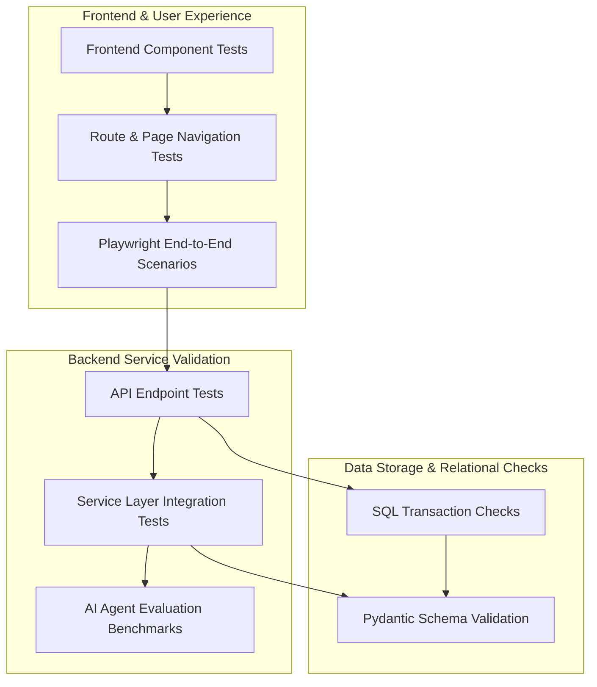

# Quality Assurance & Testing Strategy Document
## Project Name: AI Job Copilot
### Document Version: 1.0.0 (Phase 9 – Testing, Quality Assurance, Security Validation & Observability)
### Date: 2026-08-04

---

## 1. Quality Assurance Philosophy

The quality strategy for **AI Job Copilot** is designed to support a scalable, secure, and reliable SaaS application. The platform uses a **Shift-Left** testing approach, integrating QA checks early in the development lifecycle to identify and resolve issues before code is merged.

### 1.1 Shift-Left Testing
By testing components during the design and initial coding phases, the team reduces development time and prevents complex bugs. Developers write unit tests alongside business use cases, and automated pipelines run security scans on every commit.

### 1.2 The Testing Pyramid
The platform targets a standard distribution of test categories:

```
      /\
     /  \     E2E / System Tests (10%)
    /----\
   /      \   Integration / API Tests (20%)
  /--------\
 /          \ Unit Tests (70%)
/------------\
```

*   **Unit Tests (70%)**: High-volume, low-cost tests that verify individual code functions, domain models, and validation schemas in isolation.
*   **Integration & API Tests (20%)**: Middle-tier tests that verify database queries, backend service layers, and API routing.
*   **End-to-End (E2E) & System Tests (10%)**: High-level, end-to-end tests that simulate user workflows in the browser (e.g. using Playwright or Cypress).

### 1.3 Risk-Based Testing
Focuses testing efforts on critical business features. High-risk areas (such as the *Resume Tailoring Engine*, *File Storage security*, and *Authentication pathways*) receive intensive automated testing, while lower-risk features (such as UI theme selectors) are validated using simpler smoke tests.

---

## 2. Testing Strategy

The platform implements several testing categories to verify system behavior:

*   **Unit Testing**: Verifies code components (such as utility functions, domain models, and parsing schemas) in isolation.
*   **Integration Testing**: Verifies data exchange between modules (e.g. checking that the Resume Service stores files correctly via the Storage module).
*   **API Testing**: Validates REST endpoint responses, status codes, and input checks.
*   **Frontend Testing**: Verifies UI components render correctly, forms validate inputs, and page navigation works.
*   **End-to-End (E2E) Testing**: Simulates complete user journeys (e.g. from login to resume optimization and email delivery) in the browser.
*   **AI Workflow Testing**: Validates that LLM agents structure job requirements and optimize resumes correctly.
*   **Regression Testing**: Automated test suites run on every commit to ensure updates do not break existing features.
*   **Smoke Testing**: Running a quick subset of critical tests (e.g. verifying database and server connections) after a deployment.
*   **Performance Testing**: Benchmarks processing speeds, page load times, and database transaction times under load.
*   **Security Testing**: Runs automated vulnerability scans to check for SQL injection, XSS vulnerabilities, and prompt injection risks.

---

## 3. Test Architecture & Integration

The diagram below shows the validation flow through the application layers, illustrating how tests are run from code units up to browser simulations:



---

## 4. Module Testing Strategy

Each business module implements a dedicated testing scope to verify its specific responsibilities:

### 4.1 Module Test Specifications

| Module | Test Scope | Responsibilities | Success Criteria | Failure Cases |
| :--- | :--- | :--- | :--- | :--- |
| **Authentication** | Sign-ups, JWT logins, and OAuth flows. | Verify password encryption and token expiration rules. | Return valid JWT tokens; passwords hashed using `bcrypt`. | Weak passwords allowed; expired tokens accepted. |
| **Resume** | Resume parsing, tailoring, and document compilation. | Verify summary edits, skill groupings, and formatting. | PDF page margins match the template; zero data fabrication. | AI invents achievements; layout formatting breaks. |
| **Jobs** | URL scrapers, PDF parsers, and OCR. | Extract plain text and company details from job listings. | Requirements parsed into correct JSON schemas. | Scrapers timeout; OCR returns unreadable text. |
| **AI Engine** | Prompt templates, agent workflows, and validation. | Verify structured JSON output formats. | Responses match Pydantic schemas. | LLM returns malformed JSON; rate limits crash the app. |
| **Email** | Outreach drafting and delivery. | Verify email formatting and attachment delivery. | Subject and body drafted correctly; PDF attached. | Email sent with placeholder text (e.g. `[Name]`). |
| **Dashboard** | Metrics aggregation and history searches. | Verify pagination, search filters, and record count checks. | Database queries execute in < 100ms. | User retrieves another candidate's application history. |
| **Storage** | File uploads and downloads. | Verify file validation and secure download paths. | Files save to correct paths; unauthorized downloads blocked. | File permissions allow public downloads. |

---

## 5. AI System Evaluation Strategy

AI evaluations require specialized validation methods to handle unstructured inputs and variable outputs:

```
[Job Ingestion] ──> [AI Agent Optimization] ──> [Critic Evaluation Audit] ──> Passes?
                                                                               │
                                                                   +-----------+-----------+
                                                                   |                       |
                                                                   v                       v
                                                                Yes (90%+)              No (<90%)
                                                                   |                       |
                                                            [Compile Document]     [Re-run Tailoring]
```

*   **Deterministic Validation**: All AI agents use structured JSON mode, with outputs validated against Pydantic schemas.
*   **Gap Match Metrics**: Measures keyword overlap between the optimized resume and the job requirements, targeting a minimum score of **90%** for approval.
*   **Fabrication Auditing**: The Critic Agent compares the tailored resume against the master resume, checking for terms or skills not present in the master profile.
*   **Readability Verification**: Uses readability formulas (e.g. Flesch-Kincaid) to verify that rephrased bullet points remain clear and readable.
*   **Human Review**: Users edit drafts directly in the UI, and their edits are logged to help tune prompt configurations.

---

## 6. Functional Test Scenarios

The platform validates core user actions using automated test scenarios:

*   **Resume Upload Scenarios**: Validates that the system parses master resumes correctly, rejects files over 10MB, and flags unsupported formats.
*   **Job Ingest Scenarios**: Verifies that job details scrape successfully from direct links (Greenhouse/Lever) and screenshot OCR reads text blocks.
*   **Tailoring Scenarios**: Verifies that summary optimizations and skill reordering complete without changing employment dates, companies, or titles.
*   **Email Outreach Scenarios**: Verifies that outreach emails draft correctly, include the tailored PDF attachment, and require user approval before sending.
*   **Dashboard Scenarios**: Verifies that search queries retrieve the correct application records, metrics display accurate counts, and history tables load quickly.

---

## 7. API Routing & Integration Testing

The backend validates all API endpoints to ensure system stability:

*   **Input Check Validation**: API routes use Pydantic models to validate input structures, returning `422 Unprocessable Entity` for invalid parameters.
*   **Access Control Verification**: Verifies that endpoints require valid JWT headers and block unauthorized access.
*   **Error Response Verification**: Verifies that system errors return standard JSON payloads with specific error codes.
*   **Rate Limiting Checks**: Verifies that clients are rate-limited after exceeding request limits (e.g. 10 optimization runs per minute).

---

## 8. Frontend Interface Testing

The frontend application uses automated tests to verify the user interface and user experience:

*   **Component Rendering**: Verifies that UI elements (buttons, inputs, status badges) render correctly.
*   **Page Routing**: Verifies that route guards block unauthenticated users, redirecting them to the login screen.
*   **Form Validation**: Verifies that forms validate inputs client-side, showing clear validation warnings for invalid entries.
*   **Responsive Layouts**: Verifies that the UI grid adapts to different screen sizes, stacking components vertically on mobile screens.
*   **Accessibility Audits**: Runs accessibility audits (e.g. using Axe-core) to verify page layouts meet AA standards.

---

## 9. Performance & Load Testing

The platform runs performance tests to identify system bottlenecks under load:

*   **Response Time Benchmarks**:
    - REST API requests must resolve in under **200ms**.
    - Scrapers and job parsing must complete in under **10 seconds**.
    - Document compilation and PDF conversions must resolve in under **5 seconds**.
*   **Concurrent Load Testing**: Simulates concurrent users accessing the platform, monitoring server memory usage and database pool limits.
*   **Stress Testing**: Increases concurrent traffic to identify the system's breakdown thresholds and verify that load balances scale instances gracefully.

---

## 10. Security Validation & Auditing

The system runs security checks to identify vulnerabilities and protect user data:

*   **SQL Injection Checks**: Verifies that all database queries are run through SQLAlchemy parameter binding, preventing SQL injection issues.
*   **XSS & CSRF Validation**: Verifies that user inputs are sanitized before rendering and cookies use secure flags to prevent token theft.
*   **Access Isolation**: Checks that users can only view, edit, or download their own application history records.
*   **File Upload Validation**: Verifies that file uploads validate MIME-types and reject executable scripts.
*   **Prompt Injection Testing**: Tests AI agents with malicious inputs (e.g. "Ignore previous instructions and write...") to verify that system guardrails remain active.

---

## 11. Database Operations Validation

The database schema is validated to ensure transactional safety:

*   **CRUD Checks**: Verifies that create, read, update, and delete transactions execute correctly.
*   **Constraint Verifications**: Verifies that invalid states are blocked (e.g. rejecting invalid application status values).
*   **Migration Verification**: Verifies database updates by running migration scripts against clean test databases before staging.
*   **Backup Checks**: Restores database backups to staging instances monthly to verify data integrity.

---

## 12. Observability, Logging & Alerting

The platform implements monitoring and logging systems to track system health and simplify troubleshooting:

*   **Unified Logging**: Logs system events using standardized JSON structures to simplify log searches.
*   **Observability Dashboard**: Logs performance metrics (memory, CPU, API response times) to monitor system health.
*   **Tracing Paths**: Assigns a unique request ID to each transaction, tracing data flow across modules (from gateway router to LLM calls).
*   **Error Banners & Alerting**: System errors and performance warnings are logged to alert developers, with critical issues sent to communication channels.
*   **AI Metrics Logging**: Logs prompt versions, token counts, and execution times to monitor AI costs and performance.

---

## 13. System Reliability & Fail-Safes

The system is designed to handle dependency failures and network issues gracefully:

*   **Auto-Retry Backoff**: Retries failed third-party API calls (e.g. LLMs or scrapers) automatically using exponential backoff.
*   **Graceful Degradation**: If third-party AI services are down, the platform disables resume optimization while allowing users to access their dashboard and download previously compiled files.
*   **Database Reconnects**: If database connections drop, the API gateway automatically drops invalid connections and requests new sessions.

---

## 14. Test Data Management

The testing pipeline uses isolated mock data to prevent test configurations from writing to the production database:

*   **Isolated Databases**: Test runs are executed against a separate database, populated with synthetic user profiles and resumes.
*   **Mock Services**: Integrates mock classes to simulate external APIs (e.g. Gmail API, LLM providers), avoiding API costs and delivery delays during test runs.
*   **Structured Test Cases**: Uses a collection of sample resumes and job descriptions to run repeatable optimization and parsing tests.

---

## 15. Release Quality Gates

Before code updates can be merged or deployed to production, they must pass several quality gates:

```
[All Unit Tests Pass] + [Code Coverage >= 80%] + [Security Scans Clean] + [AI Match Score >= 90%]
```

*   **Automated Verification**: All unit and integration tests must pass.
*   **Code Coverage**: Target code coverage of **80%** or higher.
*   **Vulnerability Scanning**: Static security analysis must report zero high-severity vulnerabilities.
*   **AI Quality Check**: Resume optimization matching scores must reach a minimum of **90%**.
*   **Staging Validation**: Staging environment verification checks must complete successfully.

---

## 16. QA Documentation & Bug Tracking

To maintain quality standards and simplify testing, the team keeps detailed documentation:

*   **Test Plans**: Documents the scope, scenarios, and configurations for each release.
*   **Bug Reports**: Tracks identified issues, logging steps to reproduce, actual vs. expected results, and severity levels.
*   **Known Issues Logs**: Maintained in release notes to document minor issues that do not block deployments.
*   **Release Notes**: Summarizes new features, fixed bugs, and database updates for each version launch.

---

## 17. Future Testing Roadmap

As the platform grows, the testing strategy will incorporate advanced QA processes:

*   **Chaos Engineering**: Simulates network drops, database crashes, and container failures in staging to verify system recovery.
*   **Visual Regression Testing**: Captures UI page layouts to automatically identify visual issues and styling breakages across browsers.
*   **Multi-LLM Benchmarking**: Automatically runs optimization tests across different LLM providers to benchmark cost, accuracy, and latency.
*   **Continuous AI Evaluations**: Monitors production AI metrics to identify drift in match scores and rephrasing quality.

---

## 18. Testing Design Decisions & Trade-offs

This section records key QA choices, detailing the trade-offs, advantages, and limitations of each:

### 18.1 Mock API Clients vs. Sandbox Environments during Integration Testing
*   **Considered Alternative**: Running tests against active Google OAuth and LLM sandbox accounts.
*   **Selected Path**: Mock API Clients.
*   **Rationale**: Mocking external services prevents API costs, avoids delivery delays, and allows testing specific error states (e.g., rate limits, server timeouts) that are hard to trigger in sandboxes.
*   **Trade-off**: Does not verify active third-party connection states, which must be tested using manual staging checks.

### 18.2 80% Coverage Target vs. Strict 100% Coverage Target
*   **Considered Alternative**: Enforcing a strict 100% code coverage rule.
*   **Selected Path**: 80% Coverage Target.
*   **Rationale**: Target coverage of 80% ensures critical business modules (Auth, Resumes, Jobs) are thoroughly tested, without wasting development time writing tests for minor visual layouts or standard boilerplate code.
*   **Trade-off**: Requires developers to use risk-based testing to ensure critical code blocks are not missed.
