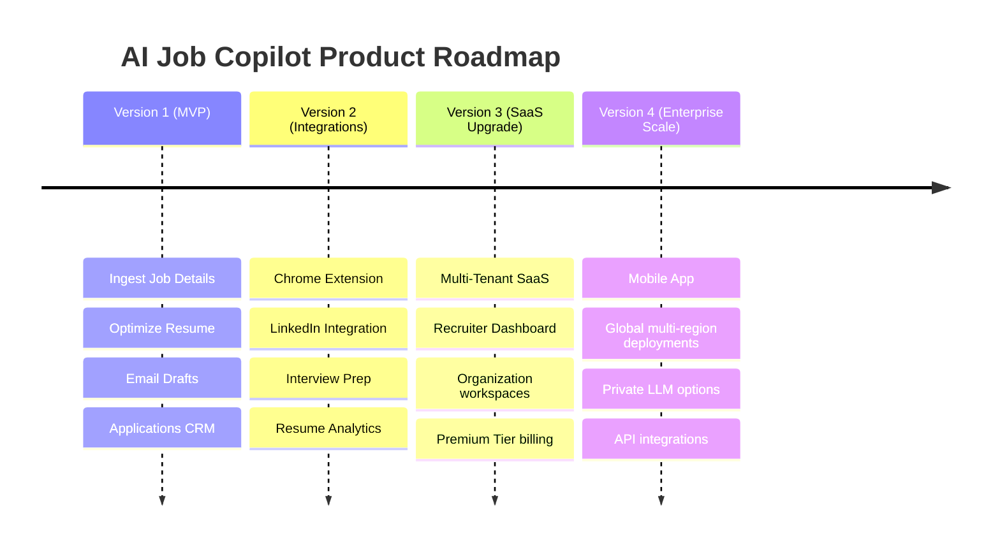

# Engineering Execution Plan & Sprint Roadmap
## Project Name: AI Job Copilot
### Document Version: 1.0.0 (Phase 10 – Implementation Roadmap, Sprint Planning & Release Strategy)
### Date: 2026-08-04

---

## 1. Development Philosophy

The development of **AI Job Copilot** follows an **MVP-first, iterative, and quality-driven** approach. This philosophy ensures that we deliver immediate value to users while maintaining a clean, scalable codebase.

```
       +--------------------------------------------------------+
       |               Development Principles                   |
       +--------------------------------------------------------+
                                   |
         +-------------------------+-------------------------+
         |                                                   |
         v                                                   v
  [MVP-First Scope]                                  [Clean Execution]
  - Core ingestion & parsing                         - Decoupled domain models
  - Reliable semantic optimization                   - Automated CI/CD checks
  - Basic application database                       - Mandatory review steps
```

### 1.1 MVP-First & Iterative Delivery
We prioritize core features (resume uploading, job ingestion, resume optimization, email generation, and history tracking) to validate the product concept quickly. Secondary features (such as Chrome extensions or multi-tenant billing) are postponed for subsequent releases.

### 1.2 Modular & Decoupled Code
To ensure long-term maintainability, the backend is organized into decoupled business contexts (Authentication, Resumes, Jobs, Outreach). Changes to one module (e.g. database schema migrations or scraper updates) do not impact the core tailoring engine or client views.

### 1.3 Continuous Quality Gates
Every code update must pass automated linting, test suites, and security scans before it can be merged, ensuring the platform remains stable as features are added.

---

## 2. Project Timeline & Milestones

The project timeline is organized into distinct milestones, leading to the launch of the public MVP in **12 weeks**:

```mermaid
gantt
    title AI Job Copilot Milestone Schedule
    dateFormat  YYYY-MM-DD
    section Milestones
    Milestone 1: Core Setup & Auth  :active, m1, 2026-08-04, 14d
    Milestone 2: Resume & Storage  :         m2, after m1, 14d
    Milestone 3: Job Ingest & Scrapers :      m3, after m2, 14d
    Milestone 4: AI Tailoring & Graph  :      m4, after m3, 14d
    Milestone 5: Email & Review UI     :      m5, after m4, 14d
    Milestone 6: Dashboard & Release   :      m6, after m5, 14d
```

### 2.1 Project Milestones Summary

| Milestone | Objective | Key Deliverables | Estimated Effort |
| :--- | :--- | :--- | :--- |
| **M1: Foundation** | Setup development workspace and authentication APIs. | FastAPI structure, PostgreSQL DDL schemas, JWT validation, and registration APIs. | Weeks 1–2 |
| **M2: Resume & Storage** | Implement resume uploads and file storage. | DOCX parser, storage directory configurations, and master resume upload APIs. | Weeks 3–4 |
| **M3: Job Ingest** | Build job board scrapers and OCR ingestion pipelines. | Playwright scraping utilities, Tesseract OCR integrations, and job parsing endpoints. | Weeks 5–6 |
| **M4: AI Engine** | Orchestrate the resume tailoring loop. | LangGraph state loops, match evaluations, and Critic verification agents. | Weeks 7–8 |
| **M5: Email & Review** | Build outreach engines and client review screens. | Email drafting, Gmail API integrations, and side-by-side review UI layouts. | Weeks 9–10 |
| **M6: CRM & Launch** | Build dashboard CRM features and launch the MVP. | Dashboard lists, search filters, Docker configurations, and Nginx proxy setups. | Weeks 11–12 |

---

## 3. Sprint Planning

The timeline is divided into six two-week sprints, defining specific goals, task lists, and acceptance criteria for each phase.

### Sprint 1: Workspace Setup & Authentication (Weeks 1–2)
*   **Objectives**: Setup backend development environments, database migration structures, registration, and login APIs.
*   **Tasks**:
    - Configure FastAPI gateways and connection pool templates.
    - Set up database migrations using Alembic.
    - Implement password encryption using the `bcrypt` algorithm.
    - Build login and JWT validation APIs.
*   **Dependencies**: Database host configured.
*   **Acceptance Criteria**: Running `/health` returns status OK, and users can register and login to retrieve a valid JWT token.
*   **Deliverables**: API Gateway setup, User database models, and Auth endpoints.
*   **Estimated Duration**: 14 Days.

### Sprint 2: Resume Ingestion & Storage Service (Weeks 3–4)
*   **Objectives**: Implement master resume uploads, text extraction, and storage directory configurations.
*   **Tasks**:
    - Configure upload directory paths (`/storage/master_resumes/`).
    - Build text extraction services using `pdfplumber` and `python-docx`.
    - Implement profile parsing templates to extract user details into JSON.
    - Build master resume upload API endpoints.
*   **Dependencies**: Sprint 1 complete.
*   **Acceptance Criteria**: Users can upload a master resume, and the parsed JSON profile is stored in the database.
*   **Deliverables**: Resume parser service, storage configurations, and Upload APIs.
*   **Estimated Duration**: 14 Days.

### Sprint 3: Job Ingestion & Scrapers (Weeks 5–6)
*   **Objectives**: Build web scrapers and OCR pipelines to ingest job postings.
*   **Tasks**:
    - Build Greenhouse and Lever web scraper utilities using Playwright.
    - Integrate OCR engines to process uploaded job posting screenshots.
    - Build job parsing endpoints to extract structured job requirements.
*   **Dependencies**: Sprint 2 complete.
*   **Acceptance Criteria**: Submitting a job posting URL or screenshot returns structured metadata (company, title, requirements).
*   **Deliverables**: Playwright scraping configurations, OCR extraction services, and Job APIs.
*   **Estimated Duration**: 14 Days.

### Sprint 4: AI Tailoring & Orchestration Graph (Weeks 7–8)
*   **Objectives**: Implement the LangGraph matching, optimization, and critique loops.
*   **Tasks**:
    - Configure the LangGraph state machine.
    - Implement the Resume Optimizer agent to rephrase bullet points.
    - Build the Critic Agent to verify that optimized resumes do not contain fabricated details.
    - Build resume tailoring API endpoints.
*   **Dependencies**: Sprint 3 complete.
*   **Acceptance Criteria**: Optimization completes without fabricating resume details, and passes the Critic validation check.
*   **Deliverables**: LangGraph state loops, Critic validation agents, and Resume APIs.
*   **Estimated Duration**: 14 Days.

### Sprint 5: Outreach Generation & Review Workspace (Weeks 9–10)
*   **Objectives**: Build email outreach tools, document compilers, and the review UI workspace.
*   **Tasks**:
    - Implement the Document Compiler to merge tailored text into DOCX templates.
    - Configure PDF exports using the LibreOffice command-line utility.
    - Build outreach email drafting tools.
    - Build Next.js side-by-side review workspace views.
*   **Dependencies**: Sprint 4 complete.
*   **Acceptance Criteria**: User can review the tailored resume and email draft side-by-side, edit details in the UI, and download the compiled PDF.
*   **Deliverables**: Document compiler services, email builders, and Next.js review views.
*   **Estimated Duration**: 14 Days.

### Sprint 6: Dashboard CRM & Production Deployment (Weeks 11–12)
*   **Objectives**: Build the central dashboard UI, history logs, and configure production environments.
*   **Tasks**:
    - Build the Next.js dashboard view.
    - Implement search and filter APIs.
    - Configure Docker images and Nginx reverse proxies.
    - Deploy the platform to staging for final verification.
*   **Dependencies**: Sprint 5 complete.
*   **Acceptance Criteria**: System starts correctly using Docker Compose, health checks pass, and all E2E tests run successfully.
*   **Deliverables**: Dashboard UI, Docker Compose files, and production deployment configurations.
*   **Estimated Duration**: 14 Days.

---

## 4. Development Order & Risk Mitigation

The development sequence is designed to reduce technical risk by addressing core dependencies first:

```
[M1: Database & Auth] ──> [M2: File Storage] ──> [M3: Scrapers] ──> [M4: AI Tailoring] ──> [M5: Review UI] ──> [M6: Deployment]
```

*   **Authentication & Database (M1)**: Establishes the user framework and database connection pools needed for downstream services.
*   **File Storage (M2)**: Establishes file storage paths and directory configurations before developing document parsing utilities.
*   **Job Ingestion (M3)**: Implements scrapers and parsers, ensuring structured job posting requirements are available before building the optimization engine.
*   **AI Engine (M4)**: Builds the resume optimization engine, matching logic, and Critic check loops, using the data parsed in Milestone 3.
*   **Review Workspace (M5)**: Builds document compilation features and Next.js review views to verify that the tailored resume and email outputs look correct in the browser.
*   **Production Deployment (M6)**: Containerizes the application and configures reverse proxies once the frontend and backend services are stable.

This sequence ensures that developers can test and verify core database write and file storage operations before building AI integrations and client interfaces, reducing the risk of integration issues late in the project.

---

## 5. Team Responsibilities

To ensure clear ownership, tasks and components are assigned to specific roles:

*   **Frontend Engineer**:
    - Owns the Next.js client layout and styling components (using Tailwind CSS).
    - Implements state management using Zustand and server caching using React Query.
    - Builds interactive forms and handles client-side input validations.
*   **Backend Engineer**:
    - Owns FastAPI gateways, routers, and application services.
    - Implements database repository patterns using SQLAlchemy.
    - Manages background tasks and file compilation workflows.
*   **AI Engineer**:
    - Owns prompt templates, agent structures, and LangGraph workflow states.
    - Implements schema validation checks and Critic verification rules.
    - Optimizes LLM performance and token costs.
*   **Database Engineer**:
    - Owns PostgreSQL database schemas, primary/foreign keys, and constraint checks.
    - Manages migration files (Alembic) and database optimization tasks (indexes, pools).
*   **DevOps Engineer**:
    - Owns Docker images, Docker Compose files, and Nginx configurations.
    - Configures CI/CD pipelines, secrets, and logging/monitoring dashboards.
*   **QA Engineer**:
    - Owns test plans, unit and integration test suites, and browser-based E2E scripts.
    - Verifies that deployments meet quality gates.
*   **Technical Lead**:
    - Resolves technical disputes, conducts code reviews, and coordinates migrations.
    - Ensures implementation matches high-level and low-level designs.

---

## 6. Git Workflow & Release Strategy

The development team uses a structured branching model based on **Git Flow** to manage updates and releases:

```
[feature/task-1] ──> [develop] ──> [release/v1.0.0] ──> [main (Production)]
                                          │
                                    (Hotfix Run)
                                          v
                                    [hotfix/patch]
```

*   **Branch Conventions**:
    - `main`: Production-ready code, always stable.
    - `develop`: Primary integration branch for upcoming releases.
    - `feature/[module]-[task]`: Feature branches created from `develop` for specific tasks (e.g. `feature/resume-parser`).
    - `release/v[version]`: Temporary branch used to prepare and test upcoming releases.
    - `hotfix/[description]`: Patch branch created directly from `main` to resolve critical bugs in production.
*   **Pull Request Workflow**: Feature branches must be merged into `develop` using Pull Requests. Merges require green status indicators from CI pipelines (tests, linting, security scans) and approval from at least one reviewer.
*   **Merge Strategy**: Uses squash-merges into `develop` to maintain a clean git history. Recommends fast-forward merges into `main` for release branches.

---

## 7. Coding Standards & Commit Messages

To ensure codebase consistency, the development team follows standard style guides and commit conventions:

*   **Python (Backend & AI)**: Enforces PEP 8 styling conventions, using formatters (like Black) and linters (like Flake8) to check code quality.
*   **TypeScript & React**: Enforces ESLint and Prettier formatting rules.
*   **SQL (PostgreSQL)**: Recommends using uppercase for all SQL keywords (SELECT, INSERT, UPDATE, DELETE) and lowercase for table and column names.
*   **Commit Messages**: Commits must use semantic naming conventions, specifying changes clearly (e.g. `feat(resume): add docx template parser`, `fix(auth): update jwt expiration time`).

---

## 8. Code Review Checklist

Reviewers verify code quality and compliance using a structured checklist before approving merges:

*   **Architecture Compliance**: Does the code match Clean Architecture boundaries? (e.g. verify no database or framework imports exist in the Domain Layer).
*   **Security Review**: Are inputs validated? Are database queries using parameter binding to prevent SQL injection? Are OAuth tokens handled securely?
*   **Performance check**: Are database queries optimized? Are connections released properly? Are API calls to third-party services cached?
*   **Testing Requirements**: Does the update include unit tests? Do all tests pass? Does it meet target code coverage rules?
*   **Documentation updates**: Are API schemas updated? Is there a need to update deployment or configuration guides?

---

## 9. Technical Risk Management

The table below outlines technical risks identified for the platform, specifying likelihood, impact, and mitigation strategies:

| Risk Description | Likelihood | Impact | Mitigation Plan | Fallback Strategy |
| :--- | :--- | :--- | :--- | :--- |
| **LLM Provider Failure** | Medium | High | Implement connection timeouts and automatic retries using exponential backoff. | Fall back to standard keyword overlap matching if processing fails. |
| **Formatting Breakage** | Medium | Medium | Merge tailored text into original DOCX templates, keeping spacing and margins intact. | Alert the user and allow them to download the un-compiled raw text. |
| **Prompt Injection** | Low | High | Validate and sanitize inputs, and configure system prompts with strict constraints. | Run safety filters on AI outputs to block suspicious content. |
| **Email Token Expiry** | High | Low | Implement OAuth2 refresh tokens and encrypt credentials before storage. | Alert the user and prompt them to download the PDF to send the email manually. |
| **Database Migrations** | Low | High | Test database migrations against staging clones before deploying updates. | Keep daily database backups to support rolling back changes if data corruption occurs. |
| **API Rate Limits** | Medium | Medium | Cache scraped postings and match results in Redis to reduce redundant API calls. | Pause execution and retry the request after a delay. |

---

## 10. Platform Release Phases

The platform rollout progresses through five distinct stages to gather feedback and verify stability:

```
[Internal Alpha] ──> [Developer Beta] ──> [Private Beta] ──> [Public MVP (v1.0.0)] ──> [Enterprise SaaS]
```

*   **Internal Alpha**: Deployed to the internal team to verify deployment configurations and run basic test scenarios.
*   **Developer Beta**: Shared with select developers to verify API integrations, scrapers, and the resume parser.
*   **Private Beta**: Shared with a closed group of active job seekers to gather feedback on tailoring accuracy and UI usability.
*   **Public MVP**: The official launch of Version 1, offering core optimization and application tracking features to all users.
*   **Production Releases**: Incremental version updates (such as SemVer patch and minor updates) to fix bugs and add minor features.

---

## 11. Maintenance & Versioning Strategy

To support the platform post-launch, the team follows standard versioning and maintenance guidelines:

*   **Semantic Versioning (SemVer)**: Updates follow a strict three-number format: `MAJOR.MINOR.PATCH` (e.g. `1.2.1`). Major versions represent breaking changes, minor versions add backwards-compatible features, and patch versions include bug fixes.
*   **Bug Fixes**: Critical bugs in production are patched immediately using hotfix branches, while minor issues are batched into upcoming sprint releases.
*   **Technical Debt**: Allocates **20%** of resources during each sprint to address technical debt, refactor code modules, and optimize database queries.

---

## 12. Documentation Strategy

To simplify onboarding and support operations, documentation is organized into clear guides:

*   **Developer Setup Guide**: Instructions for setting up development environments using Docker Compose.
*   **API Reference (OpenAPI)**: Real-time Swagger and Redoc interactive endpoints descriptions.
*   **Deployment Guide**: Instructions for container configurations, proxy setups, and database migrations.
*   **User Guides**: Step-by-step instructions for uploading resumes, ingesting job listings, and connecting Gmail.
*   **Troubleshooting Guide**: Common errors (e.g. expired tokens, scraper blocks) and resolutions.
*   **Release Notes**: Logs listing fixed bugs, new features, and database migrations for each version launch.

---

## 13. System Success Metrics (KPIs)

The performance and health of the platform will be evaluated against the following criteria:

*   **Application Prep Speed**: Average application preparation time must remain under **3 minutes** (compared to the manual average of 20+ minutes).
*   **Resume Optimization Speed**: Resume tailoring and PDF conversion must resolve in under **30 seconds**.
*   **API Response Times**: API endpoints must resolve in under **200ms**.
*   **Platform Availability**: Target monthly uptime of **99.9%** or higher.
*   **Email Success Rate**: Outreach email delivery success rate of **98%** or higher.
*   **AI Quality Checks**: Optimizer outputs must achieve a minimum of **90%** approval during Critic audits.
*   **System Bug Rate**: Average bug count should remain below 2 critical bugs reported per release.

---

## 14. Long-Term Product Roadmap

The diagram below shows how the platform can evolve from the MVP into a multi-user SaaS system:



*   **Version 2 (Integrations)**: Adds Chrome extensions, LinkedIn messaging automation, resume performance analytics, and interview coaching modules.
*   **Version 3 (SaaS Upgrade)**: Upgrades the platform to support multi-tenant workspaces, team billing tiers, organization dashboards, and collaborative review queues.
*   **Version 4 (Enterprise Scale)**: Deploys mobile applications, supports geo-routing across cloud regions, integrates private LLMs, and exposes client API integrations.

---

## 15. Final Pre-Production Readiness Checklist

Before launching the platform to production, the team must verify that all items on the readiness checklist are complete:

- [ ] **Architecture**: Code complies with Clean Architecture boundaries, and domain rules are independent of frameworks.
- [ ] **Database**: PostgreSQL tables, indexes, and constraints are defined, and Alembic migrations run successfully.
- [ ] **Backend**: REST API endpoints, Pydantic schemas, and validation rules are configured.
- [ ] **Frontend**: Next.js client pages, Zustand stores, and Tailwind styles are built and tested.
- [ ] **AI Engine**: LangGraph state loops, Critic validation agents, and prompt libraries are verified.
- [ ] **Testing**: Unit, integration, and E2E test suites pass successfully, meeting target coverage rules.
- [ ] **Security**: Password hashing, token authorization, CORS settings, and SSL certificate termination are active.
- [ ] **Monitoring**: Health check endpoints, JSON logging, and error tracking tools (Sentry) are active.
- [ ] **Deployment**: Docker containers, Compose scripts, and Nginx reverse proxies start and run successfully in staging.
- [ ] **Documentation**: Developer setup, deployment guides, user manuals, and API document pages are complete.
- [ ] **Launch Signoff**: Stakeholders approve deployment configurations for the production launch.

---

## 16. Platform Design Recap & Architectural Trade-offs

The development of **AI Job Copilot** is guided by a commitment to **modularity, quality, and candidate control**:

*   **Modularity**: Using a modular monolith architecture (with DDD boundaries) simplifies development for the MVP, while keeping components ready for microservice deployments in the future.
*   **Quality Assurance**: Applying Clean Architecture keeps the core application decoupled from external frameworks and APIs, making code modules easy to test and update.
*   **Candidate Control**: The system uses a stateful optimization graph managed by LangGraph to run Critic verification checks, protecting the candidate's professional integrity by preventing data fabrication.

By prioritizing clear layer separation and solid software engineering principles, the platform establishes a scalable foundation that can grow from a personal tool into a robust, enterprise-ready SaaS application.
