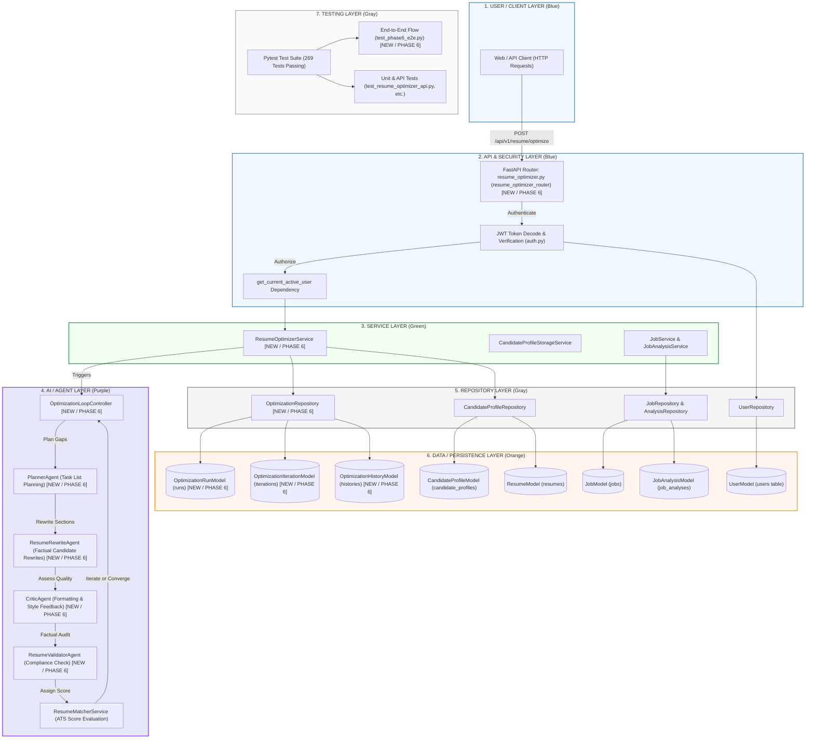

# JobCopilot AI — Current System Architecture

## AI Resume Optimization — End-to-End Data & Agent Flow

This document details the architectural design and structural layers implemented in the **JobCopilot AI** project, verified against the active classes, files, and relationships in the codebase.

