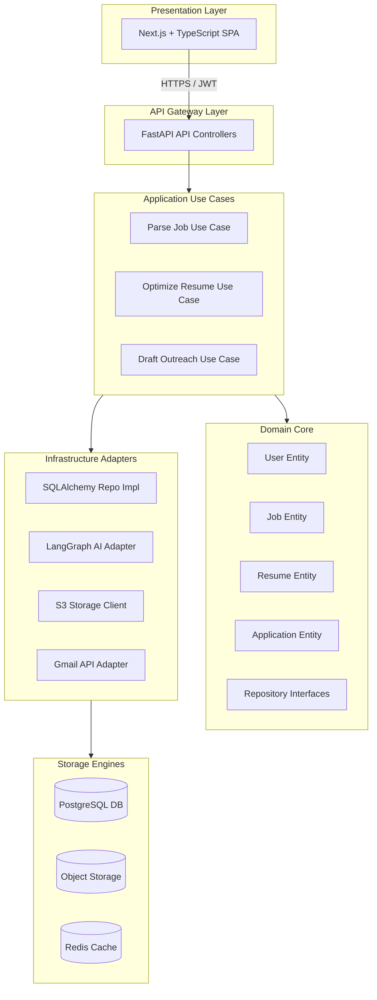
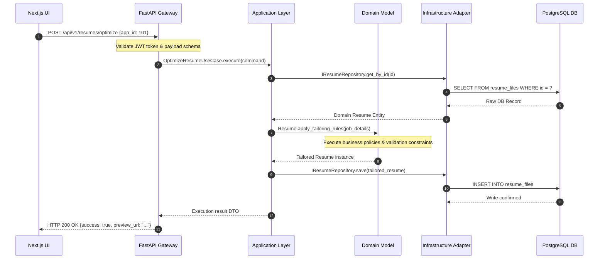
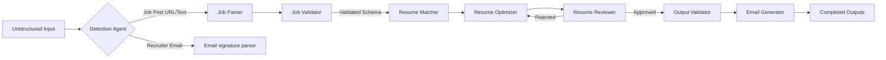
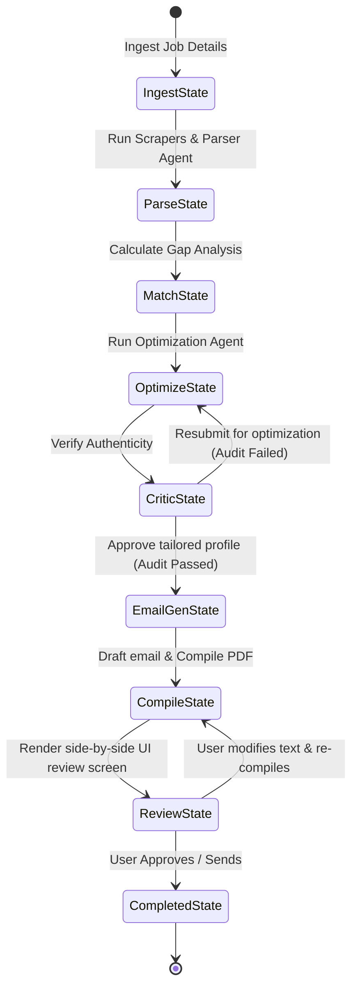
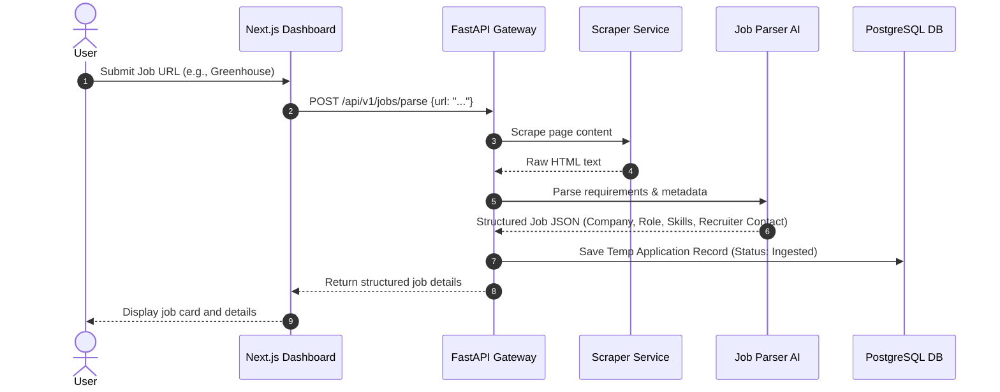
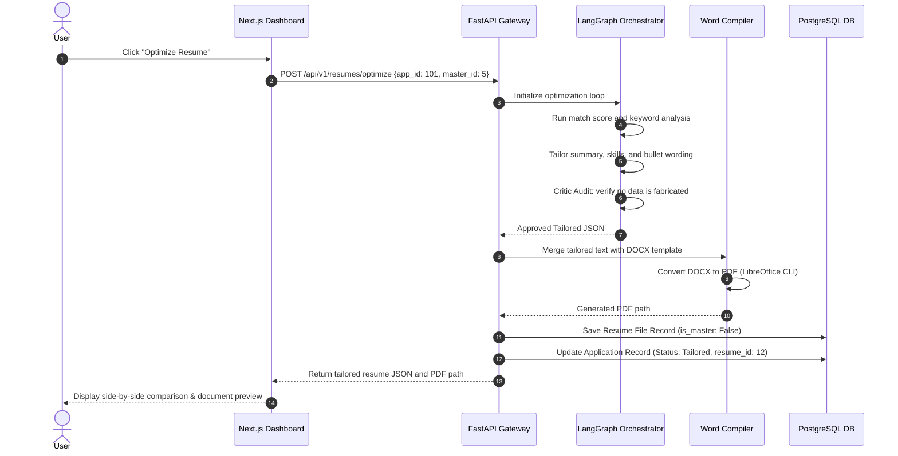
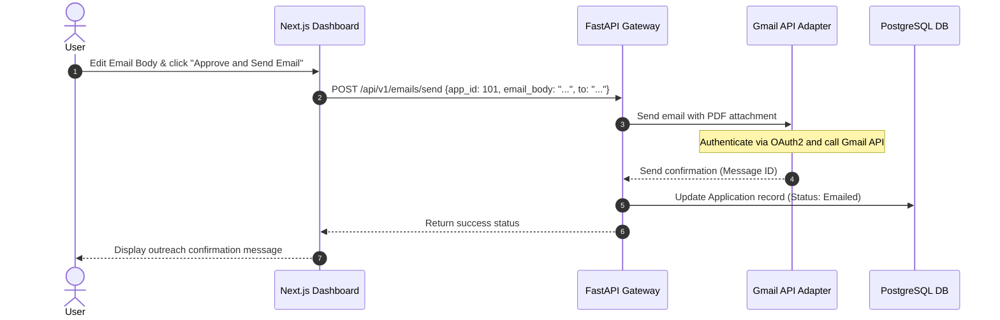
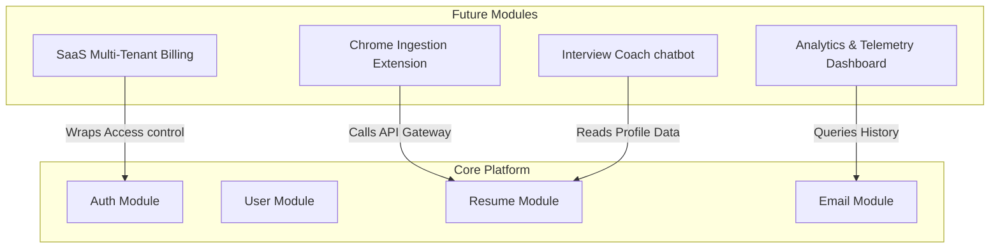

# High-Level Design (HLD) Document
## Project Name: AI Job Copilot
### Document Version: 1.0.0 (Phase 2 – High-Level Design)
### Date: 2026-08-04

---

## 1. High-Level Architecture Overview

The system design for **AI Job Copilot** is structured as a **modular monolith** that implements **Clean Architecture** and **Domain-Driven Design (DDD)**. This architectural choice balances development speed for the MVP (Version 1) with the flexibility needed to scale into a multi-user SaaS platform in the future.

### 1.1 Architecture Philosophy
The platform separates core business rules from external technologies (such as databases, UI frameworks, and LLM APIs). This decoupling ensures that the core application remains stable when third-party components change. The codebase is organized around business capabilities (domains) rather than technical roles (such as controllers or repositories), ensuring that features can be developed and updated independently.

### 1.2 Modular Monolith vs. Microservices
For the MVP, a modular monolith minimizes deployment complexity, latency, and operational overhead. However, because the system is partitioned into clear business contexts (Authentication, Jobs, Resumes, Outreach), individual modules can be transitioned into independent microservices as the platform grows.

### 1.3 High-Level System Architecture



---

## 2. System Architecture & Communication

The system is organized into a clean, layered architecture where dependency rules point inward:

```
[Presentation Layer] -> [API Gateway] -> [Application Layer] -> [Domain Layer] <- [Infrastructure Layer]
```

### 2.1 Layer Descriptions & Communication

*   **Presentation Layer (Next.js)**: Displays data and handles user interactions. It communicates with the API Gateway using standard JSON payloads over HTTPS. Stateless JSON Web Tokens (JWT) are included in the request headers to handle authentication.
*   **API Gateway Layer (FastAPI)**: Serves as the entrance for all client requests, managing request validation, authorization, and rate limiting. It translates raw HTTP requests into structured Data Transfer Objects (DTOs) and forwards them to the Application Layer.
*   **Application Layer (Use Cases)**: Directs workflow operations by translating API requests into actions that execute core domain logic. It coordinates transactions, dispatches background tasks, and manages data transformations.
*   **Domain Layer (Core Rules)**: Represents the core business concepts, rules, and logic of the platform. It defines the aggregate entities, values, validation policies, and repository interfaces. The domain layer is independent of external databases, frameworks, or libraries.
*   **Infrastructure Layer (Adapters)**: Implements the interfaces defined by the Domain and Application layers to connect with external databases, APIs, and file systems. It uses Dependency Injection (DI) to provide concrete adapter instances at runtime.
*   **Database & Storage Layer**: Stores physical files (DOCX/PDF) on disk or in object storage, caches transient scraper data in Redis, and persists relational data in PostgreSQL.



---

## 3. Architectural Principles

The system relies on several core engineering principles to maintain code quality and support future scalability:

### 3.1 Clean Architecture
Ensures that the core application logic is decoupled from external tools, frameworks, and databases. This separation makes the application highly testable and allows changing individual components (e.g. database engines or email providers) without rewriting business logic.

### 3.2 SOLID Principles
*   **Single Responsibility Principle (SRP)**: Each component has a single purpose. For example, database queries are managed by Repository classes, while business workflows are handled by Service classes.
*   **Open/Closed Principle (OCP)**: Interfaces are used to define contracts, allowing new features (e.g., a new job board scraper) to be added without modifying existing code.
*   **Liskov Substitution Principle (LSP)**: Subclasses match base interfaces exactly, avoiding side effects when switching implementations.
*   **Interface Segregation Principle (ISP)**: Clients depend only on the methods they use, keeping interfaces focused and clean.
*   **Dependency Inversion Principle (DIP)**: High-level business rules do not depend on low-level technical infrastructure; instead, both depend on abstract interfaces.

### 3.3 Domain-Driven Design (DDD)
Groups code around business capabilities (domains) instead of technical roles. DDD patterns like Bounded Contexts, Aggregates, and Entities ensure the codebase remains maintainable as the product grows.

### 3.4 Separation of Concerns
Each layer has a defined role. The presentation layer displays data, the application layer directs workflows, the domain layer enforces business rules, and the infrastructure layer handles external connections.

### 3.5 Dependency Injection (DI)
Infrastructure dependencies are injected into service instances at runtime, simplifying testing and making components reusable across different contexts.

### 3.6 Repository Pattern
Decouples domain logic from database engines, managing database operations through repository interfaces.

### 3.7 Service Layer Pattern
Business logic is encapsulated within service classes, ensuring transactions are executed cleanly and workflow logic is kept out of controllers.

---

## 4. Presentation Layer

The Presentation Layer is built as a single-page web application optimized for desktop browsers.

*   **Purpose**: Renders the user interface, manages browser states, and displays analytics data.
*   **Responsibilities**:
    - Manage state updates (e.g. upload progress, side-by-side editing previews).
    - Handle page routing and client-side access control.
    - Format and display resume documents.
    - Validate inputs before sending requests to the API.
*   **Components**: Next.js App Router Pages, Tailwind Layout Grid, File Drag-and-Drop modules, Resume previewers, and HTTP client managers.
*   **Communication**: Communicates with the API gateway using HTTPS, sending JSON payloads and JWT authorization tokens.
*   **Technologies**: React, Next.js, TypeScript, Tailwind CSS, HTML5 Canvas (for document previews).
*   **User Interactions**:
    - Drag-and-drop resume uploading.
    - Copy-pasting job description texts or URLs.
    - In-app text editing during document reviews.
    - Triggering PDF generation and downloading files.
*   **Isolation of Concerns**: No business rules (e.g., resume optimization constraints, email formatting patterns) exist in this layer. The client application strictly presents data returned by the backend, ensuring that validation rules and business logic remain centralized on the server.

---

## 5. Application Layer

The Application Layer orchestrates the flow of data throughout the platform, serving as the link between the API Gateway and the core domain logic.

*   **Purpose**: Translates API requests into actions that execute core domain workflows.
*   **Responsibilities**:
    - Direct use case execution flows.
    - Coordinate database transactions.
    - Schedule and dispatch background tasks (e.g. file generation, scraping runs).
    - Transform domain models into client-facing data transfer objects.
*   **Use Cases**:
    - `ParseJobUseCase`: Receives job postings (URLs, screenshots, text) and coordinates parsing tasks.
    - `TailorResumeUseCase`: Fetches the master profile, executes AI optimization rules, and generates the tailored resume.
    - `DraftOutreachUseCase`: Extracts recruiter details and generates draft outreach emails.
    - `RegisterUserUseCase`: Coordinates sign-ups and hashes credentials.
*   **Workflow Coordination**: Resolves dependencies at runtime, checks authorization scopes, manages database transactions, and coordinates asynchronous processing tasks.
*   **Business Processes**: Ensures that execution steps (e.g. running the Critic agent, compiling files, saving records) complete successfully before updating the application state.

---

## 6. Domain Layer

The Domain Layer represents the core business logic of the platform, encapsulating the rules and constraints of the job search workflow.

*   **Purpose**: Enforce business rules and manage application states.
*   **Core Business Entities**:
    - `User`: Manages user profiles, credentials, and configuration settings.
    - `Resume`: Represents the user's master resume structure (education, projects, work history).
    - `Application`: Tracks specific job application records, matching scores, and outreach details.
*   **Business Rules**:
    - *Zero Fabrication*: The system cannot generate resume entries, certifications, or projects not present in the master resume.
    - *Metadata Preservation*: Optimization steps must preserve employment dates, job titles, and company names.
    - *Manual Approval*: Recruiter emails cannot be sent without user approval.
*   **Domain Services**:
    - `ResumeTailoringService`: Rephrases resume bullet points to align with job description keywords.
    - `MatchValidationService`: Audits tailored resumes against the master profile to ensure no information was fabricated.
*   **Value Objects**:
    - `EmailAddress`: Validates email strings.
    - `ATSScore`: Restricts match ratings to integers between 0 and 100.
    - `JobRequirements`: Represents parsed job descriptions and required skills.
*   **Framework Independence**: The domain layer is written in pure Python and has no dependencies on database ORMs (e.g. SQLAlchemy annotations) or third-party API clients. This ensures core business rules remain stable and are easy to test.

---

## 7. Infrastructure Layer

The Infrastructure Layer implements the interfaces defined by the Domain and Application layers to connect with external databases, APIs, and file systems.

*   **Purpose**: Provide concrete implementations for abstract interfaces, isolating core business logic from external systems.
*   **External Services**: Coordinates external calls to LLMs, email providers, and web scrapers.
*   **LLM Integration**: Wraps OpenAI and Gemini client connections, handling token usage, prompt templates, and retry logic.
*   **Gmail Integration**: Manages OAuth2 authorization, refreshes credentials, and sends outreach emails via the Google API.
*   **OCR Engine**: Integrates with image-parsing libraries to extract text from job posting screenshots.
*   **Storage**: Manages file storage, saving PDF and DOCX files to local disk paths (for the MVP) or S3-compatible cloud storage (for production).
*   **Database**: Implements database repositories using SQLAlchemy, mapping SQL transactions to domain entities.
*   **Caching**: Uses Redis to store transient scraper data and session values.
*   **Infrastructure Replaceability**: All adapters implement interfaces defined by the domain layer. This allows replacing underlying tools (e.g. swapping local file storage for S3 object storage or Tesseract OCR for Gemini Vision) without modifying the core application code.

---

## 8. Major System Modules

The backend is partitioned into independent business modules, minimizing coupling and simplifying development:

```
+-----------------------------------------------------------------------------------+
|                              Major System Modules                                 |
+-----------------------------------------------------------------------------------+
|  [Auth]      --> Manage credentials, generate tokens, coordinate OAuth logins.     |
|  [User]      --> Handle profile metadata, manage billing tiers and usage quotas.  |
|  [Job]       --> Scrape job postings, parse text details, validate metadata.     |
|  [Resume]    --> Parse master resumes, optimize bullet points, compile documents. |
|  [Email]     --> Extract contact info, draft outreach, send messages.             |
|  [AI]        --> Run agent workflows, validate schemas, format prompts.           |
|  [Storage]   --> Write documents to storage paths, manage file lifecycles.         |
|  [Dashboard] --> Fetch metrics, coordinate search filters.                        |
|  [Shared]    --> Host common entities, handle exceptions, package utility tools. |
+-----------------------------------------------------------------------------------+
```

### 8.1 Module Specifications

| Module | Purpose | Core Dependencies | Inputs | Outputs | External Interaction |
| :--- | :--- | :--- | :--- | :--- | :--- |
| **Authentication** | Manages registrations, sign-ins, and tokens. | User Module, DB | Credentials, OAuth callbacks | Access tokens, user IDs | Auth Gateway, Client |
| **User** | Manages user profiles and usage limits. | DB | User IDs, registration forms | Profile objects, quota states | Client UI, Auth |
| **Job** | Scrapes and parses job postings. | AI, Storage, DB | URLs, PDFs, screenshots | Parsed job JSON | Web scrapers, Client |
| **Resume** | Manages, optimizes, and compiles resumes. | AI, Storage, DB | Master resume files, job details | Optimized resumes, PDFs | Document compilers, Client |
| **Email** | Drafts and sends outreach emails. | Auth, Resume, DB | Recruiter details, application metadata | Email drafts, delivery reports | Google API, Client |
| **AI** | Orchestrates agent workflows and prompt management. | None (Standalone) | Raw text inputs, context profiles | Structured JSON responses | LLM API providers |
| **Storage** | Handles document storage and file metadata. | DB | Physical files, byte streams | Storage paths, file metadata | File System, S3 |
| **Dashboard** | Compiles metrics and handles search. | DB | User IDs, search filters | Application counts, search results | Client UI |
| **Shared** | Provides common models, values, and utilities. | None | N/A | Core classes, value objects | Used by all modules |

---

## 9. AI Engine Architecture

The AI Engine processes unstructured text and optimizes resumes using dedicated, single-purpose components rather than a single large prompt.



### 9.1 AI Component Specifications

*   **Input Detection**: Analyzes incoming text to identify the input type (e.g. job board URL, plain text description, email thread, or chat message) and route it to the appropriate parsing agent.
*   **Content Extraction**: Scrapes web pages using Playwright, extracts text from PDF documents using `pdfplumber`, or runs OCR on screenshots.
*   **Job Understanding**: Parses job posting text into structured JSON containing title, company, requirements, and required skills.
*   **Resume Matching**: Compares the parsed job requirements against the candidate's master profile to calculate a match score and list missing skills.
*   **Resume Optimization**: Aligns resume summaries, groups technical skills, and rephrases bullet points to highlight experiences that match the job description.
*   **Resume Reviewer (Critic)**: Compares the optimized resume against the master resume to ensure all details are accurate and no information was fabricated.
*   **Email Generation**: Drafts personalized outreach messages based on the company details, job title, and recruiter contact information.
*   **Prompt Manager**: Stores and updates prompt templates and variables, maintaining version control for system instructions.
*   **Output Validator**: Verifies that LLM outputs conform to required Pydantic JSON schemas, retrying requests if parsing errors occur.

---

## 10. Workflow Orchestration

The platform coordinates tasks using a stateful LangGraph workflow engine. This design allows the system to manage complex multi-step processes, implement quality gates, and handle human-in-the-loop validation checkpoints.



### 10.1 Steps in the Orchestration Pipeline
1.  **Ingestion**: Receives the raw job input and adds it to the workflow state.
2.  **Detection**: Identifies the input source format and selects the appropriate parser.
3.  **Extraction**: Scrapes URLs, processes PDFs, or runs OCR to extract plain text.
4.  **Understanding**: Structures the raw text into a standard job requirements schema.
5.  **Matching**: Evaluates the candidate's master profile against the job requirements.
6.  **Optimization**: Rephrases summaries and bullet points to align with job keywords.
7.  **Evaluation (Critic Loop)**: Audits the optimized resume against the master profile. If the critic detects fabricated skills or projects, it returns the resume to the optimizer for re-drafting.
8.  **Email Generation**: Drafts a personalized recruiter outreach email.
9.  **Compilation**: Populates the tailored text back into the original DOCX layout and converts it to PDF.
10. **Manual Review**: Displays the generated document and email side-by-side in the UI, allowing the user to make manual edits.
11. **Delivery**: Sends the outreach email via the Gmail API once approved by the user.

### 10.2 Rationale for Using an Orchestration Engine
Stateful orchestration engines like LangGraph are preferred over linear script executions because:
*   **Self-Correction**: Allow the system to automatically correct invalid LLM outputs using feedback loops (e.g. the Critic audit loop).
*   **State Management**: Maintain a clear history of execution steps, making it easy to recover from failures.
*   **Human Intervention**: Can pause execution to request user feedback before proceeding with irreversible actions (such as sending emails or compiling final documents).

---

## 11. External Integrations

To support core operations, the platform connects with several external services and infrastructure components:

*   **Gmail API**: Integrates via OAuth2 to send outreach messages directly from the user's Gmail account, adding tailored resumes as attachments.
*   **LLM Provider (Gemini/OpenAI)**: Runs job parsing, resume optimization, gap analysis, and email drafting.
*   **OCR Engine**: Processes uploaded screenshots to extract job description text.
*   **Web Scraper**: Simulates browser sessions to bypass paywalls and scrape job postings from sites like LinkedIn, Greenhouse, and Lever.
*   **Local Storage (MVP)**: Stores physical files (DOCX/PDF) in structured local directories. It is designed to scale to cloud-based object storage (such as AWS S3 or MinIO) in the future.
*   **PostgreSQL**: Serves as the primary relational database, storing user records, applications, file paths, and metadata logs.
*   **Redis**: Caches API responses and stores temporary scraper and session data.

---

## 12. System Data Flows

This section details how data moves through the system during core user actions.

### 12.1 Job Ingestion and Parsing Flow


### 12.2 Resume Optimization and Compilation Flow


### 12.3 Recruiter Email Outreach Flow


---

## 13. Scalability Strategy

The platform is designed to scale from a single-user tool to a multi-tenant SaaS application:

```
[Single User Monolith] -> [Stateless Multi-Instance] -> [Distributed Background Tasks] -> [Microservice Architecture]
```

### 13.1 Horizontal Scaling
All API gateway and application service instances are stateless, allowing the application to scale horizontally behind a load balancer (such as Nginx or AWS ALB) as traffic increases.

### 13.2 Distributed Background Workers
For the MVP, asynchronous tasks run directly on the API server. For production, long-running tasks (like PDF conversion, web scraping, and LLM calls) are offloaded to distributed background workers (such as Celery or RQ) managed via a Redis message broker.

### 13.3 Caching
Redis caches scraped job descriptions, LLM responses, and database queries. This reduces the number of API calls to third-party services and improves page load times for returning users.

### 13.4 Microservices Migration
If specific components experience high load (e.g. the Scraping service or the Document Compiler), they can be decoupled from the monolith and deployed as independent services without modifying core application workflows.

---

## 14. Security Overview

To protect candidate information and secure system endpoints, the platform enforces several security policies:

*   **Authentication & Session Management**: API endpoints are secured using stateless JWT tokens, and passwords are encrypted using the `bcrypt` hashing algorithm.
*   **Role-Based Authorization**: Data access is restricted to verified owners. The system ensures that users can only view, edit, or download their own resumes and application history records.
*   **Pydantic Input Validation**: All API inputs are validated using Pydantic schemas to prevent SQL injection and cross-site scripting (XSS) attacks.
*   **Secure File Uploads**: Resume uploads are limited to 10MB and validated against supported MIME-types (`application/pdf`, `application/vnd.openxmlformats-officedocument.wordprocessingml.document`).
*   **Secure Email Sending**: Recruiter emails are never sent automatically. The system requires manual review and approval before calling the Gmail API.
*   **Secrets Management**: API credentials, database strings, and OAuth tokens are stored in environment variables, never committed to the source repository.
*   **Input Sanitization**: Web scraping inputs and copy-pasted texts are sanitized using parser libraries (e.g. `BeautifulSoup`) to strip out executable code and script tags.

---

## 15. Error Handling & Resilience Strategy

The system handles failures gracefully, ensuring that issues with external services do not crash the application:

*   **Invalid Job URL**: If the scraping service fails to parse a link (e.g. due to paywalls or login requirements), the system prompts the user to copy and paste the job description text manually.
*   **OCR Failure**: If OCR fails to read a screenshot (e.g., due to low resolution or blur), the system alerts the user and pre-populates a text box for manual corrections.
*   **LLM Failures**: If an LLM call times out or returns an invalid JSON format, the system automatically retries the request using exponential backoff.
*   **Email Authentication Failure**: If Gmail OAuth tokens expire, the system alerts the user and redirects them to the Google login screen to re-authenticate.
*   **Storage Failures**: If the local file storage disk is full, the compiler writes documents to a temporary partition and flags an alert, preventing data loss.

---

## 16. Architectural Decisions & Tech Stack Rationale

This section details the tech stack choices, outlining the alternatives and trade-offs considered for each:

### 16.1 React + Next.js (Frontend)
*   **Alternative**: Vue.js or standard HTML/Vanilla JavaScript.
*   **Selected Path**: React + Next.js.
*   **Rationale**: React's component-based design simplifies state management for complex views (like the side-by-side review screen), and Next.js provides built-in routing and server-side rendering for optimal performance.
*   **Trade-off**: Increases initial client bundling size compared to vanilla JavaScript.

### 16.2 FastAPI (Backend)
*   **Alternative**: Django or Express.js (Node.js).
*   **Selected Path**: FastAPI.
*   **Rationale**: FastAPI offers excellent performance, built-in async support, automatic OpenAPI docs generation, and seamless integration with Python's AI libraries.
*   **Trade-off**: Requires setting up database migrations (Alembic) and admin views manually, unlike Django.

### 16.3 LangGraph (AI Orchestration)
*   **Alternative**: LangChain Expression Language (LCEL) or custom Python control flow loops.
*   **Selected Path**: LangGraph.
*   **Rationale**: LangGraph is designed for stateful, cyclic agent workflows, making it ideal for managing the optimizer-critic feedback loop.
*   **Trade-off**: Steeper learning curve compared to standard linear pipelines.

### 16.4 PostgreSQL (Database)
*   **Alternative**: MongoDB or DynamoDB.
*   **Selected Path**: PostgreSQL.
*   **Rationale**: PostgreSQL provides transactional consistency for user profiles and applications, while natively supporting `JSONB` for storing flexible resume versions.
*   **Trade-off**: Schema updates require structured migrations.

### 16.5 Docker + Nginx (Deployment)
*   **Alternative**: Bare-metal script deployments.
*   **Selected Path**: Docker + Nginx.
*   **Rationale**: Docker ensures development matches production environments, and Nginx provides high-performance reverse proxying, SSL termination, and rate-limiting.
*   **Trade-off**: Requires configuration and container orchestration management.

---

## 17. Future Extensibility

The modular monolith architecture allows adding new features without major changes to the core system:



*   **Chrome Extension**: Can be added as a separate client application that connects to the existing `/api/v1/jobs/parse` gateway endpoint.
*   **LinkedIn Integration**: Can be implemented by adding a LinkedIn API adapter to the Infrastructure Layer, with no changes needed to core resume tailoring logic.
*   **Interview Coach**: Can be built as a separate module that reads the tailored resume and job details from the database and runs a dedicated mock interview agent.
*   **Analytics**: Metrics dashboards can query application logs in the database, with no changes needed to the ingestion or compilation pipelines.
*   **SaaS Multi-Tenant Billing**: Can be integrated by adding billing middleware to the API Gateway to manage user access levels and monthly quotas.
