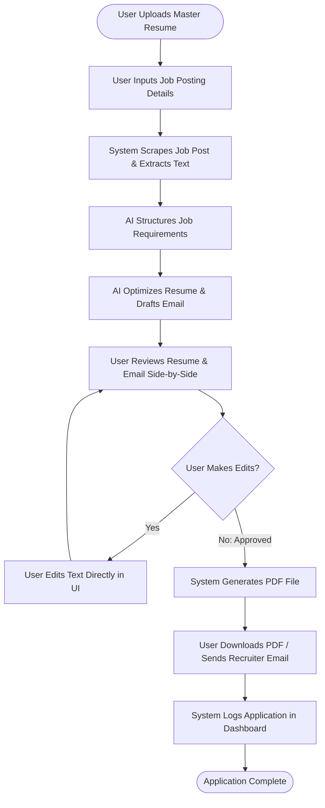

# Software Requirements Specification (SRS)
## Project Name: AI Job Copilot
### Document Version: 1.0.0 (Phase 1: Project Foundation & Requirements Specification)
### Date: 2026-08-04

---

## 1. Executive Summary

Applying for jobs in the modern labor market is an asymmetric challenge. Employers deploy advanced Applicant Tracking Systems (ATS), automated keyword parsers, and machine learning screeners to filter and discard up to 95% of incoming resumes in seconds. To stay competitive, job seekers must customize their professional profile and outreach message for every single role they apply to.

Currently, this tailoring process is manual, repetitive, and time-consuming, taking between 20 and 45 minutes per application. Consequently, job seekers face a difficult choice: apply with a single generic resume (yielding low conversion rates) or spend hours customizing each application (limiting the size of their application pipeline).

**AI Job Copilot** is a personal AI-powered platform designed to automate these repetitive application tasks. The platform allows users to ingest job details from multiple sources (URLs, PDFs, screenshot images, emails, text blocks), parse requirements, align their master resume keywords and summaries without fabricating history, and draft personalized outreach messages in under three minutes.

```
       +--------------------------------------------------------+
       |                  AI Job Copilot Platform               |
       +--------------------------------------------------------+
                                   |
         +-------------------------+-------------------------+
         |                                                   |
         v                                                   v
  [User-Facing Front]                               [AI-Powered Core]
  - Simple Dashboard CRM                            - Multi-source job ingestion
  - Side-by-Side Review Screen                      - Safe semantic optimization
  - Document Compiler (DOCX -> PDF)                 - Dynamic recruiter outreach
```

This Software Requirements Specification (SRS) details the business objectives, user requirements, functional scope, and operational constraints of the AI Job Copilot platform. It provides a blueprint for the product's foundation (Phase 1) and guides developers, designers, and product stakeholders on the platform's core mechanics before technical implementation starts.

---

## 2. Project Vision

The long-term vision of **AI Job Copilot** is to build a comprehensive, candidate-side career assistant platform.

While the initial version (MVP) focuses on simplifying resume tailoring and recruiter outreach for individual applications, the underlying system is designed to support a wider range of career services over time. As the platform data footprints grow with user interaction histories, the platform will evolve into a complete career guidance engine.

```
                  +--------------------------------+
                  |    Long-Term Platform Vision   |
                  +--------------------------------+
                                  |
         +------------------------+------------------------+
         |                                                 |
         v                                                 v
  [Phase 1: Application Tooling]                    [Phase 2+: Career Guidance]
  - Multi-source job ingestion                      - Long-term career coach
  - Safe semantic resume optimization              - Automatic skills gap analysis
  - Custom recruiter email generation               - Active mock interview prep
  - Application history index                       - Dynamic market salary analysis
```

Rather than acting as a simple resume editor, the platform establishes a structured data foundation (the user's master profile and application logs) to support long-term, AI-guided career growth. Future iterations will support automated skill gap analyses, mock interview engines, proactive career path coaching, and market-wide salary research tools.

---

## 3. Problem Statement

Applying for jobs in the modern market is a highly repetitive and time-consuming process. Job seekers face several specific challenges:

### 3.1 Manual Resume Customization
To pass initial keyword filters, candidates must customize their resume for every application. Manually editing bullet points, updating technical tool listings, and adjusting summary paragraphs for multiple applications each day is tedious and prone to errors.

### 3.2 ATS Keyword Matching
Many organizations use Applicant Tracking Systems (ATS) to scan and rank resumes based on keyword matching. If a candidate uses a synonym (e.g., "RESTful API Development") instead of the exact phrase in the job description (e.g., "API Integration"), the system may filter them out, regardless of their actual qualifications.

### 3.3 Writing Outreach Emails
Once a job is identified, writing a personalized cold outreach email or cover letter to a recruiter is time-consuming. Candidates often rely on generic templates that yield low response rates.

### 3.4 Finding Recruiter Contacts
Finding contact information for the hiring team or recruiter within a job post or related email thread requires manual searching, slowing down the outreach process.

### 3.5 Managing Multiple Document Versions
As candidates tailor their resumes, they quickly accumulate numerous versions (e.g., `Resume_Google.pdf`, `Resume_Stripe_V2.pdf`). Without a structured storage system, it is difficult to keep track of these files and organize them effectively.

### 3.6 Tracking Application History
Candidates often apply to dozens of jobs across multiple platforms (LinkedIn, Indeed, company portals) without a single system of record. When a recruiter schedules a follow-up call, the candidate may struggle to recall which resume version or job description was associated with that specific application.

### 3.7 Human Errors Under Stress
Repeating these manual steps dozens of times causes fatigue. Candidates frequently leave placeholders (e.g. `Dear [Insert Recruiter Name]`), attach incorrect resume files, or copy wrong details into application forms.

---

## 4. Existing Manual Workflow

The table below outlines the current manual process, highlighting typical time requirements, repetitive tasks, and potential inefficiencies.

| Stage | Manual Actions | Typical Duration | Repetitive Task? | Inefficiencies / Risk of Errors |
| :--- | :--- | :--- | :--- | :--- |
| **1. Job Discovery** | Browsing job boards, copying posting text, and saving job URLs to a spreadsheet. | 5–15 mins | Yes | Losing track of active application links; saving incomplete job descriptions. |
| **2. Requirements Analysis**| Reviewing the text to manually identify key skills, qualifications, and tools. | 5–10 mins | Yes | Missing critical qualifications; misinterpreting key responsibilities. |
| **3. Resume Customization** | Opening a master Word document, rephrasing bullet points, reordering skills, and exporting to PDF. | 15–30 mins | Yes | Accidental formatting shifts; spelling errors; forgetting to update date ranges. |
| **4. Outreach Preparation** | Writing cover letters, looking for contact details, and drafting emails. | 10–15 mins | Yes | Leaving placeholder text (e.g., `[Insert Company Name]`); dry or generic outreach. |
| **5. File Versioning** | Naming and saving files locally (e.g., `CV_Design_Final_Stripe.pdf`). | 2 mins | Yes | Filename confusion; sending the wrong resume version to a recruiter. |
| **6. Submission & Logging** | Uploading documents, filling web forms, and updating tracker spreadsheets. | 5–10 mins | Yes | Forgetting to update tracking spreadsheets, leading to disorganized records. |

In total, preparing a single high-quality, tailored job application takes between **42 and 82 minutes**. This high manual workload limits candidates to preparing only 2 to 4 tailored applications per day.

---

## 5. Proposed Solution

**AI Job Copilot** improves the job application process by replacing repetitive manual tasks with structured automation. The platform allows users to ingest job details, optimize their resume, and draft recruiter outreach messages in under three minutes, while keeping them in full control of their applications:

```
+--------------------------------------------------------------------------+
|                     Manual vs. AI-Assisted Workflow                      |
+--------------------------------------------------------------------------+
|  Manual Process (42-82 Mins)                                             |
|  - Manual parsing -> Manual tailoring -> Copy-pasting -> Manual tracker  |
+--------------------------------------------------------------------------+
|  AI Job Copilot Process (< 2 Mins)                                       |
|  - Ingest URL/Doc -> AI parsing & tailoring -> User review -> Auto save  |
+--------------------------------------------------------------------------+
```

* **Automated Ingestion**: The system extracts job details from URLs, text blocks, document uploads, or screenshot images.
* **Semantic Resume Alignment**: An AI engine rephrases resume summary sections and bullet points to match the target job description's terminology, preserving the candidate's actual work history.
* **Automated Version Control**: The platform generates and saves tailored documents automatically, matching them 1-to-1 with specific job applications.
* **Recruiter Outreach Drafts**: The system creates context-specific email drafts that highlight the candidate's matching skills.
* **Centralized Tracking Dashboard**: A single dashboard tracks all application records, saved job details, and resume versions.

---

## 6. Business Objectives

The business goals of the platform are to:

* **Reduce Application Prep Time**: Cut the time required to customize a resume and draft outreach messages from 45 minutes to under 3 minutes.
* **Minimize Repetitive Work**: Automate text parsing, keyword matching, and document versioning to reduce user effort.
* **Enforce Tailoring Integrity**: Improve keyword alignment and application quality without fabricating resume data.
* **Provide an Organized Application CRM**: Save every optimized resume alongside key application details in a central database to eliminate manual tracking.
* **Increase Conversion Rates**: Help users pass initial automated filters to secure more interview callbacks.

---

## 7. Target Audience

The platform is designed to support candidates at different stages of their careers:

* **Students & Recent Graduates**: Need to map academic coursework and personal projects to entry-level job descriptions.
* **Experienced Developers**: Have broad technical experience and need to emphasize the specific tools, languages, and frameworks requested in a job posting.
* **Software/Data/AI Engineers**: Need to align their technical skills with specialized roles (e.g. machine learning, database management, backend development) without losing document structure.
* **Career Switchers**: Need to identify and rephrase transferable skills from their past industry to match the requirements of their target field.

---

## 8. User Personas

The three personas below represent typical users of the AI Job Copilot platform:

### 8.1 Persona 1: The Transitioning Graduate

* **Name**: Emily Chen
* **Background**: Emily recently graduated with a Bachelor's degree in Computer Science. She has completed several group projects and academic assignments but has limited professional work experience.
* **Goals**:
  - Secure an entry-level Software Engineer position.
  - Properly highlight academic work and internships on her resume.
  - Tailor her resume to match different frontend and backend technologies.
* **Frustrations**:
  - Receives automated rejections from entry-level roles due to lack of experience.
  - Struggles to write resumes that capture recruiter attention.
  - Spends hours trying to rephrase her school projects to sound professional.
* **Daily Workflow**: Browses job boards, copies job requirements, tries to rewrite her resume sections, and applies to 3-4 roles per day before burning out.
* **Expected Benefits**: Instantly rewrite and format project descriptions, helping her resume pass entry-level filters.

### 8.2 Persona 2: The Experienced Developer

* **Name**: Marcus Miller
* **Background**: Marcus is a senior backend developer with ten years of experience across multiple databases, clouds, and languages (Java, Go, Python, SQL).
* **Goals**:
  - Apply to senior roles that use specific backend technology stacks.
  - Keep his resume concise while focusing on the technologies requested in the job description.
  - Reach out to hiring managers directly with personalized emails.
* **Frustrations**:
  - His comprehensive resume is too broad to match specialized job postings.
  - Spends significant time manually rewriting bullet points for different roles.
  - Struggles to organize resume versions for different target companies.
* **Daily Workflow**: Targets high-quality positions on LinkedIn, analyzes their technical requirements, edits his resume templates, and drafts personalized emails to hiring managers.
* **Expected Benefits**: Quickly reorder technical skills and align bullet point terminology for specific technology stacks, while saving all versions in a central CRM.

### 8.3 Persona 3: The Career Switcher

* **Name**: Sarah Jenkins
* **Background**: Sarah managed a retail store for five years. She recently completed a UX Design bootcamp and wants to transition into her first design role.
* **Goals**:
  - Reframe her retail management experience (collaboration, leadership, customer feedback) as transferable skills for UX design.
  - Apply to associate UX Design roles.
  - Focus outreach on how her background in retail operations adds value to design teams.
* **Frustrations**:
  - Recruiters reject her resume immediately due to her retail background.
  - Struggles to write about retail operations in a way that highlights design-relevant soft skills.
  - Finds UX cover letters difficult to write from scratch.
* **Daily Workflow**: Applies to junior design roles, writes custom cover letters for each, and tries to highlight relevant projects from her bootcamp.
* **Expected Benefits**: Rephrase management bullet points to highlight transferable design-adjacent skills (e.g. user empathy, prioritization) without fabricating technical UX experience.

---

## 9. User Pain Points

Applying for jobs manually introduces several distinct pain points:

* **Manual Review Fatigue**: Manually reading long job postings to identify key requirements causes fatigue, leading candidates to miss important details.
* **Formatting Breakage**: Modifying PDF documents manually often breaks page margins and text alignment, requiring tedious formatting corrections.
* **Keyword Matching Challenges**: Identifying the correct synonyms and terms to match applicant tracking filters is difficult without automated tools.
* **Outreach Bottlenecks**: Writing personalized cover letters and recruiter outreach emails for each application requires significant time and creative effort.
* **Version Organization**: Managing numerous resume versions across local folders quickly becomes disorganized, leading to confusion during applications.
* **Application Tracker Disorganization**: Keeping application history spreadsheets up to date is tedious, and details are often forgotten over time.

---

## 10. Scope (MVP)

The scope of Version 1 (MVP) is limited to the features detailed below:

* **Master Resume Management**: Accept single DOCX files to extract profile details and save the base layout.
* **Multi-channel Job Ingest**: Accept pasted text, direct URLs, PDF uploads, and screenshot images for parsing.
* **Job Post Parser**: Extract job requirements, company name, job title, and recruiter email into structured data.
* **AI Optimizer**: Highlight matching skills, reorder technical tool lists, and rephrase summary text.
* **Outreach Writer**: Draft personalized cold emails to recruiters.
* **Document Compiler**: Populates the tailored text back into the original DOCX layout and converts it to PDF.
* **User Review Interface**: Allow users to edit the AI-generated resume text and email copy before saving.
* **Flat File Directory**: Save generated resumes in a structured folder system using standard filenames.
* **Application Log Database**: Save key application details (company, role, date, resume path, job URL, recruiter email) for tracking.

---

## 11. Out of Scope

To maintain focus and ensure a stable release, the following features are excluded from the Version 1 scope:

* **No Automated Apply Bots**: The platform will not auto-fill application forms or submit applications directly on LinkedIn or Indeed, avoiding account bans and maintaining application quality.
* **No Job Recommendations**: The system will not search for jobs or suggest postings; it strictly parses inputs provided by the user.
* **No Recruiter Relationship CRM**: The application will not track recruiter replies, build email threads, or log pipeline stages.
* **No Interview Scheduling or Tracking**: The database will not store interview schedules, stage histories, or interview feedback records.
* **No Automatic Resume Generation**: The system will not write a resume from scratch; it requires an uploaded master resume as a starting point.
* **Multi-language Support**: Only English-language inputs and documents are supported in the MVP.
* **Mobile Application**: The platform will be built strictly as a desktop-optimized web application.

---

## 12. Core Features

This section details the primary features of the platform, outlining their purpose, inputs, outputs, and user benefits.

### 12.1 Job Input
* **Purpose**: Provide a clean interface for users to submit job postings.
* **Inputs**: Pasted text block, URL string, PDF file, or PNG/JPG screenshot file.
* **Outputs**: Cleaned text buffer forwarded to the Job Parser.
* **User Benefits**: Simplifies ingestion, allowing users to submit postings regardless of the source channel.

### 12.2 Job Parsing
* **Purpose**: Extract unstructured job posting text into a structured requirements schema.
* **Inputs**: Raw job description text buffer.
* **Outputs**: Structured job JSON containing company name, title, keywords, core requirements, and recruiter email.
* **User Benefits**: Identifies key qualifications and tools instantly, saving the user from reading long postings.

### 12.3 Resume Optimization
* **Purpose**: Align the wording of the user's master resume with target job requirements.
* **Inputs**: Master Resume JSON, parsed Job Description JSON, and Gap Analysis report.
* **Outputs**: Tailored resume JSON with optimized summary, adjusted skills, and aligned bullet-point phrasing.
* **User Benefits**: Aligns terminology and keywords to help the resume pass ATS filters while preserving actual work history.

### 12.4 Resume Version Generation
* **Purpose**: Merge the tailored resume data into the original DOCX layout template and export it to PDF.
* **Inputs**: Tailored resume JSON and master DOCX layout template.
* **Outputs**: Formatted DOCX and PDF resume files.
* **User Benefits**: Ensures the output PDF is correctly formatted and matches the master resume layout without layout shifts.

### 12.5 Email Generation
* **Purpose**: Draft a personalized recruiter outreach email based on the job requirements and tailored resume.
* **Inputs**: Tailored resume JSON, parsed Job Description JSON, and recruiter contact details.
* **Outputs**: Suggested email subject line and body text.
* **User Benefits**: Speeds up recruiter outreach and increases response rates.

### 12.6 Resume Storage
* **Purpose**: Store master resumes and tailored PDF files in a structured folder system.
* **Inputs**: PDF document buffers.
* **Outputs**: Relative file system paths for document storage.
* **User Benefits**: Automates document versioning, making files easy to retrieve when applying.

### 12.7 Application Record Storage
* **Purpose**: Log key application metadata in the database for tracking.
* **Inputs**: Company name, role, resume path, job URL, recruiter email, and timestamp.
* **Outputs**: Database record in the Applications table.
* **User Benefits**: Establishes a single system of record, eliminating the need to update manual tracking spreadsheets.

### 12.8 Dashboard
* **Purpose**: Provide a centralized interface for users to view metrics, search history, and download documents.
* **Inputs**: DB query results.
* **Outputs**: Metrics counts (Total Applications) and search results list.
* **User Benefits**: Offers an overview of all applications and allows quick retrieval of previous resumes.

---

## 13. Functional Requirements

The following requirements define the behavior and capabilities of the AI Job Copilot platform:

### 13.1 User Administration (UR)
* **FR-001**: The system must allow users to register an account with a unique email and password.
* **FR-002**: The system must authenticate user logins and secure sessions using JWT tokens.

### 13.2 Master Resume Ingestion (MRI)
* **FR-003**: The system must allow users to upload a master resume in DOCX format (Max size: 10MB).
* **FR-004**: The system must parse the master resume to extract name, email, experience, education, projects, and skills.
* **FR-005**: The system must store the master resume file to act as the base layout template.

### 13.3 Job Post Ingestion (JPI)
* **FR-006**: The system must allow users to paste a job posting URL for scraping.
* **FR-007**: The system must allow users to paste raw job description text.
* **FR-008**: The system must allow users to upload job description PDFs (Max size: 5MB).
* **FR-009**: The system must allow users to upload screenshot images of job postings for OCR processing.

### 13.4 Job Parsing (JP)
* **FR-010**: The system must extract company name, job title, duties, required skills, and recruiter details from the job description.
* **FR-011**: The system must validate the parsed job data and prompt the user to manually enter missing details if key fields are empty.

### 13.5 Resume Tailoring (RT)
* **FR-012**: The system must optimize the resume summary and align bullet-point terminology to match the target job description.
* **FR-013**: The system must reorder technical skill listings to prioritize requirements in the job description.
* **FR-014**: The system must preserve historical data, including company names, job titles, employment dates, and educational credentials.
* **FR-015**: The system must check the tailored output against the master resume to prevent the fabrication of skills or projects.

### 13.6 Outreach Generation (OG)
* **FR-016**: The system must draft a personalized outreach email containing a subject line and body text.
* **FR-017**: The system must scan the draft for placeholders and alert the user if any are found.

### 13.7 Document Compilation (DC)
* **FR-018**: The system must merge the tailored text back into the original DOCX layout template.
* **FR-019**: The system must convert the populated DOCX file to PDF using the LibreOffice command-line utility.

### 13.8 User Review UI (UR-UI)
* **FR-020**: The system must display a side-by-side preview of the tailored resume text, job details, and email draft.
* **FR-021**: The system must allow the user to edit the resume text and email copy directly in the review interface.

### 13.9 Application Storage (AS)
* **FR-022**: The system must save generated resume files using the file naming convention: `[UserName]_[Role]_[Company]_[Date].pdf`.
* **FR-023**: The system must log the company name, role, resume path, job URL, recruiter email, and application timestamp in the database.

### 13.10 Dashboard CRM (D-CRM)
* **FR-024**: The system must display a dashboard containing application metrics (total count) and a historical log of previous applications.
* **FR-025**: The system must allow users to search previous applications by company name or role, and download saved resume PDFs.

---

## 14. Non-Functional Requirements

These requirements define the performance, quality, and operational standards of the platform:

* **Performance**: The system should complete job parsing and resume optimization in under 30 seconds to maintain a smooth user experience.
* **Scalability**: The backend should use stateless server patterns to support multi-user operations.
* **Reliability**: The system must handle extraction errors and scrapers timing out without crashing the application.
* **Security**: Passwords must be hashed using bcrypt, and API routes must be secured using JWT tokens. Document downloads must verify ownership before streaming.
* **Maintainability**: The codebase must separate business domains from external frameworks to ensure components are easy to update.
* **Availability**: The system should aim for 99% uptime, with graceful error handling if downstream AI services are unavailable.
* **Usability**: The frontend must provide clear loading states and a simple, responsive dashboard layout.
* **Extensibility**: The system architecture should support adding new scrapers or document engines with minimal changes to core workflows.

---

## 15. Assumptions

The platform design is based on the following assumptions:

* **Existing Resume**: Users have a master resume in DOCX format that contains accurate history and contact details.
* **Clean Document Structure**: The master resume uses standard headings (e.g. "Experience", "Skills") and simple table layouts.
* **Language Support**: All inputs (resumes, job postings, emails) are in English.
* **Google Account**: Users have a Google/Gmail account if they use the automated email delivery features.
* **Informative Job Postings**: Job descriptions contain sufficient detail to allow keyword alignment.

---

## 16. Constraints

The system operates within the following operational constraints:

* **Zero fabrication**: The AI engine cannot generate achievements, jobs, or certifications not present in the master resume.
* **Preserve Layouts**: The document compiler must populate text without breaking the original DOCX layout.
* **No Automated Delivery**: Emails are never sent to recruiters without explicit user approval.
* **Base Template Dependency**: Resumes must always be generated using the user's master resume template.

---

## 17. Success Criteria

The performance of the platform will be evaluated against the following criteria:

* **Application Time Reduction**: Reduces the time required to prepare an application to under 3 minutes (compared to the manual average of 20+ minutes).
* **AI Processing Speed**: Resume tailoring and email generation complete in under 30 seconds.
* **Layout Integrity**: Tailored PDFs match the design, margins, and layout of the original master resume.
* **Keyword Matching Accuracy**: The tailored resume incorporates the key terms and tools requested in the job description.

---

## 18. High-Level User Workflow

The diagram below shows the high-level workflow from the user's perspective:



---

## 19. Business Value

Implementing AI Job Copilot provides several benefits for job seekers:

* **Saves Time**: Automating research, keyword matching, and document formatting reduces application prep time by 95%.
* **Increases Conversion**: Optimizing resumes for ATS filters helps candidates secure more interview callbacks.
* **Improves Organization**: A single dashboard database acts as a personal job search CRM, keeping resumes and job details organized.
* **Ensures Document Consistency**: Automatic filename conventions and layout compiler preservation ensure all job submittals are professional.

---

## 20. Future Vision

Version 1 (MVP) establishes the core features (resume tailoring, ingestion, and application tracking) needed to support a scalable career assistant.

Once these features are established, future updates can introduce advanced tools for long-term career growth.

For example, the application tracking history can be used to generate analytics on interview conversions. The master profile database can be used by an AI Career Coach to identify skill gaps based on job trends, suggest relevant certifications, and prepare candidates for interviews through custom mock Q&A sessions.

Additionally, browser extensions and LinkedIn integrations can simplify application steps, transitioning the platform from a resume optimizer into a unified career copilot.
