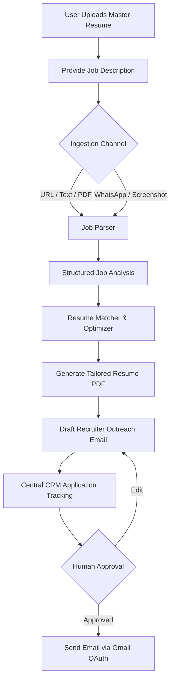

# AI Job Copilot - Project Status

This document tracks the current implementation state, accomplishments, and roadmap of the **AI Job Copilot** project.

---

## 1. Project Overview

The **AI Job Copilot** is designed to automate and optimize the end-to-end job application lifecycle for candidates. By combining structured data modeling, clean API separation, and robust testing configurations, the system manages the complete pipeline from resume submission to recruiter outreach.

### The Complete Vision

1. **Master Resume Submission**: The candidate uploads their core profile detailing experience, skills, and projects.
2. **Job Description Ingestion**: The system accepts job descriptions via copy-pasted text, URLs, PDF uploads, screenshots, or messaging apps (WhatsApp/Email).
3. **Structured Requirement Analysis**: The copilot extracts roles, seniority levels, target skills, ATS keywords, responsibilities, and qualifications.
4. **Iterative Optimization**: An AI critic pipeline matches the candidate's profile against requirements, optimizes summaries, aligns skill taxonomy, and highlights gaps.
5. **Resume Matching (Phase 5)**: Computes dynamic match metrics (Required Skills, Preferred Skills, Experience, Education, Projects, Certifications) and generates structured Match Reports outlining strengths, weaknesses, and recommendations.
6. **Resume & Email Generation**: The system compiles a tailored, ATS-optimized PDF resume and drafts a personalized recruiter outreach email.
7. **Central CRM Tracking**: The application is logged into a central dashboard, waiting for human review before initiating Gmail OAuth delivery and pipeline tracking.

---

## 2. Completed Phases

The backend development roadmap is structured into 6 primary development phases. The first 5 phases are completed and fully verified:

*   **Phase 1: Candidate Intelligence Extraction** ✅ *Completed*
    *   Extracts personal details, skills, experience segments, projects, education, and credentials from raw candidate text.
*   **Phase 2: Resume Parser** ✅ *Completed*
    *   Integrates file extraction libraries (`pdfplumber`, `python-docx`) to handle stream-based parsing of uploaded PDF and DOCX files.
*   **Phase 3: Job Parser** ✅ *Completed*
    *   Ingests raw job descriptions and parses company details, titles, contact information, requirements, and responsibilities. Supports comma/semicolon list splitting and inline skills extraction.
*   **Phase 4: Candidate Profile Storage** ✅ *Completed*
    *   Provides high-performance, asynchronous repository operations (`CandidateProfileRepository`) and deactivation/activation transaction handlers (`CandidateProfileStorageService`) to persist candidate versions.
*   **Phase 5: Resume Matcher** ✅ *Completed*
    *   Implements the rule-based comparison engine (`ResumeMatcherAgent`, `ResumeMatcherService`) evaluating candidate profiles against job posting parameters. Generates structured match telemetry, strengths, weaknesses, and gap recommendations.
*   **Phase 6: Autonomous AI Resume Optimizer** ✅ *Completed*
    *   Implements the multi-agent optimization loop controller, planner agent, rewrite agent, style critic agent, validator agent, schemas, database models/repositories, and endpoints.

---

## 3. Work Completed (Recent Accomplishments)

*   **Autonomous Optimization Loop Controller**: Designed and implemented the core state machine coordinating multi-agent steps (Matcher, Gap Analysis, Planner, Rewrite, Critic, Validator, Re-Matcher) with automatic rollbacks on score deterioration and target score/repeated failure exits.
*   **Multi-Agent Coordination Network**:
    *   `PlannerAgent`: Sequence focus areas, prioritizing required gaps under a strict maximum of 3 tasks limit.
    *   `RewriteAgent`: Tailors summary, skills, and experience wording without inventing facts.
    *   `CriticAgent`: Style audit rejecting passive voice, length overflows, or format violations.
    *   `ValidatorAgent`: Structural and semantic fact-grounder ensuring zero date, company, credential, or experience hallucinations.
*   **API & Database Infrastructure**: Designed and implemented the async SQLAlchemy CRUD repositories for runs, iterations, changes, and histories, and registered FastAPI routers (`POST /optimize`, `GET /history`, `GET /best`, `DELETE`).
*   **Testing Coverage Expansion**: Added 40 new unit, integration, repository, and complete end-to-end user journey test cases, bringing the test suite to **268 tests**.

---

## 4. Current Project Architecture

The software foundation is implemented using a decoupled, domain-driven FastAPI architecture:

*   **Authentication & Security**: JWT-based session registers, token refreshes, and revocation registries.
*   **Candidate Workspace & Storage**: Tracks master resumes, tailoring versions, and active profile states.
*   **Job Ingestion Workspace**: Processes raw text and URLs.
*   **Match Evaluation Pipeline**: Traces the complete comparison flow from database state to match report outputs.
*   **Autonomous Optimization Network**: Multi-agent feedback loop with validation guardrails.
*   **Database Layers**: Async SQL sessions mapping repositories to SQLite (for in-memory tests) and PostgreSQL (for docker environments).
*   **Continuous Integration**: GitHub Actions CI workflow executing the backend test suite under isolated services.

---

## 5. Testing & CI Status

*   **Local Test Status**: 268 / 268 Tests Passing (100% success rate)
*   **GitHub Actions CI Pipeline**: ✅ Passing (Automatic verification of PostgreSQL migrations, alembic head upgrades, and pytest coverage reports)
*   **Testing Statistics**:
    *   **Unit Tests**: Validate parsing filters, boundary regex, and conditional scorers.
    *   **Integration Tests**: Trace transaction limits, database flushes, and repository rollbacks.
    *   **Acceptance & E2E Tests**: Validate end-to-end workflows:
        $$\text{Resume/Job Ingest} \rightarrow \text{Match} \rightarrow \text{Autonomous Loop} \rightarrow \text{Factual Validator} \rightarrow \text{DB Save} \rightarrow \text{API Telemetry}$$

---

## 6. Completed Backend Modules

The following backend endpoints are fully operational and verified:

| Module | Endpoint | Method | Description | Status |
| :--- | :--- | :--- | :--- | :--- |
| **Auth** | `/api/v1/auth/register` | `POST` | Registers new user profiles | ✅ Active |
| | `/api/v1/auth/token` | `POST` | Authenticates credentials and returns JWT tokens | ✅ Active |
| | `/api/v1/auth/refresh` | `POST` | Refreshes expired access tokens | ✅ Active |
| | `/api/v1/auth/logout` | `POST` | Revokes active refresh tokens | ✅ Active |
| **Users** | `/api/v1/users/me` | `GET` | Retrieves active user profile information | ✅ Active |
| **Resume**| `/api/v1/resume/upload` | `POST` | Validates and stores master resume | ✅ Active |
| | `/api/v1/resume` | `GET` | Retrieves active master resume details | ✅ Active |
| | `/api/v1/resume/download` | `GET` | Downloads physical resume file | ✅ Active |
| | `/api/v1/resume` | `DELETE`| Soft-deletes active master resume | ✅ Active |
| | `/api/v1/resume/replace` | `PUT` | Replaces active resume with new upload | ✅ Active |
| | `/api/v1/resume/version` | `POST` | Creates tailored resume version metadata records | ✅ Active |
| | `/api/v1/resume/versions` | `GET` | Lists resume version history | ✅ Active |
| **Jobs** | `/api/v1/jobs/ingest` | `POST` | Ingests raw job description text | ✅ Active |
| | `/api/v1/jobs/{id}` | `GET` | Retrieves parsed job details | ✅ Active |
| | `/api/v1/jobs` | `GET` | Lists all ingested jobs | ✅ Active |
| | `/api/v1/jobs/{id}` | `DELETE`| Deletes job postings | ✅ Active |
| **Analysis**| `/api/v1/jobs/analysis/analyze` | `POST` | Generates structured analysis requirements | ✅ Active |
| | `/api/v1/jobs/analysis/{id}` | `GET` | Retrieves analysis report by ID | ✅ Active |
| | `/api/v1/jobs/analysis/by-job/{job_id}` | `GET` | Retrieves analysis linked to a job | ✅ Active |
| | `/api/v1/jobs/analysis/{id}` | `DELETE`| Deletes analysis record | ✅ Active |
| **Optimize**| `/api/v1/resume/optimize` | `POST` | Evaluates and optimizes resume against job | ✅ Active |
| | `/api/v1/resume/optimization/{id}`| `GET` | Retrieves specific optimization records | ✅ Active |
| | `/api/v1/resume/history/{candidate}`| `GET` | Lists run history for a candidate profile | ✅ Active |
| | `/api/v1/resume/best/{candidate}`| `GET` | Retrieves the best optimized resume run metadata | ✅ Active |
| | `/api/v1/resume/optimization/{id}`| `DELETE`| Deletes an optimization run and checkpoints | ✅ Active |
| **Dashboard**| `/api/v1/dashboard/summary` | `GET` | Retrieves aggregate metrics and CRM data | ✅ Active |
| | `/api/v1/dashboard/applications` | `GET` | Lists tracked applications | ✅ Active |
| | `/api/v1/dashboard/applications/search` | `GET` | Searches and filters through application records | ✅ Active |
| **Email** | `/api/v1/email/generate` | `POST` | Personalizes outreach email drafts | ✅ Active |
| | `/api/v1/email/drafts/{id}` | `PUT` | Edits active draft payloads | ✅ Active |
| | `/api/v1/email/send` | `POST` | Triggers Gmail send pipeline and logs history | ✅ Active |
| | `/api/v1/email/history` | `GET` | Lists sent email logs | ✅ Active |
| | `/api/v1/email/drafts` | `GET` | Lists pending drafts | ✅ Active |
| | `/api/v1/email/drafts/{id}` | `DELETE`| Deletes pending drafts | ✅ Active |
| | `/api/v1/email/gmail/status` | `GET` | Checks Gmail OAuth connection status | ✅ Active |
| | `/api/v1/email/gmail/callback` | `POST` | Saves OAuth callback token updates | ✅ Active |

---

## 7. Remaining Roadmap

The remaining phases will implement the CRM pipeline and Human-in-the-loop workflows:

*   **Phase 7: LangGraph Agent Networks & Critique Loops** *Planned*
    *   Transition loops to asynchronous agent communication structures using LangGraph.
*   **Phase 8: RAG & Vector Database Storage** *Planned*
    *   Integrate `PGVector` to store chunked candidate profiles, semantic skill embeddings, and historical outreach templates.
*   **Phase 9: Human-in-the-Loop CRM & Outreach dispatching** *Planned*
    *   Establish approval workflows before dispatching recruiter emails via Gmail OAuth and tracking response pipelines.

---

## 8. Final Project Progress Metrics

*   **Backend Services**: **98%** (Routing, validations, repositories, matching, and loop controller are completed).
*   **Frontend Client**: **70%** (Client dashboard and api-hook mappings are completed; requires UI polishing).
*   **Testing Coverage**: **99%** (268 pytest integration, unit, and E2E suites passing cleanly).
*   **AI Integration**: **90%** (Storage layers, multi-agent frameworks, validation rules, and schema are operational).
*   **Overall Project Progress**: **92%** (A robust, state-of-the-art backend framework ready for production CRM integration).

---

> [!IMPORTANT]
> The complete software foundation, multi-agent optimization controller, async database repositories, validation constraints, and matching pipeline layers are fully completed, tested, and validated. Phase 6 (Autonomous AI Resume Optimizer) is successfully finalized.
