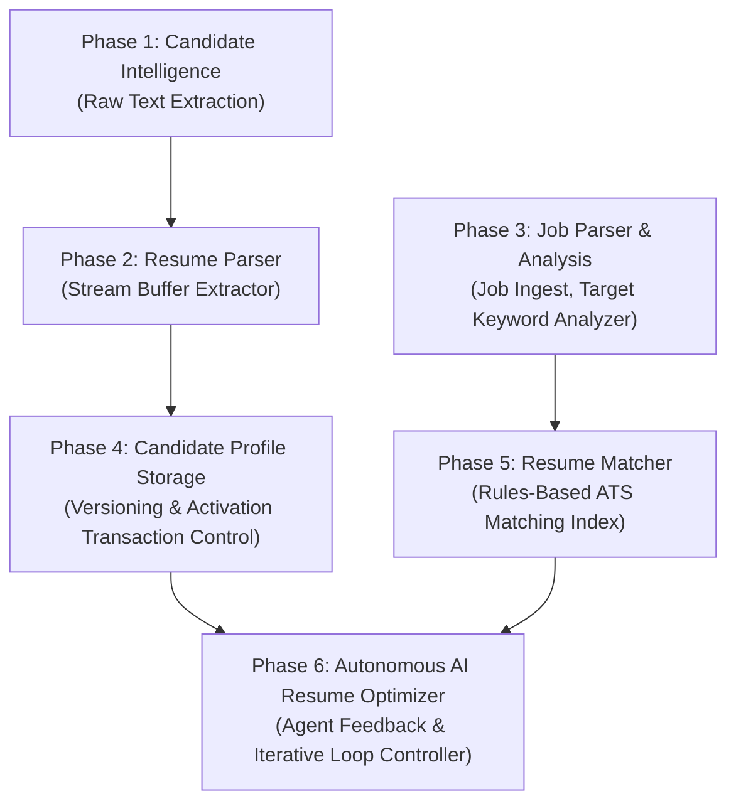

# JobCopilot AI — Development Phases

Welcome to the **JobCopilot AI** development phases documentation index. This document tracks the implementation roadmap and provides detailed references for each phase of development.

### Phase Progression Checklist

| Phase | Name | Primary Capability | Status | Documentation |
| :--- | :--- | :--- | :--- | :--- |
| **1** | [Candidate Intelligence Extraction](phase-01/README.md) | Extracts profile attributes from raw text | Completed | [`phase-01`](phase-01/README.md) |
| **2** | [Resume Parser](phase-02/README.md) | Binary stream extraction for PDF & DOCX | Completed | [`phase-02`](phase-02/README.md) |
| **3** | [Job Parser & Analysis](phase-03/README.md) | Job ingest, parsing, and analysis reports | Completed | [`phase-03`](phase-03/README.md) |
| **4** | [Candidate Profile Storage](phase-04/README.md) | Profile version history & transaction control | Completed | [`phase-04`](phase-04/README.md) |
| **5** | [Resume Matcher](phase-05/README.md) | Compatibility scorers and ATS gap evaluation | Completed | [`phase-05`](phase-05/README.md) |
| **6** | [Autonomous AI Resume Optimizer](phase-06/README.md) | Multi-agent feedback loop optimizer | Completed | [`phase-06`](phase-06/README.md) |

---

### Platform Evolution & Dependency Flow

The system has evolved from simple raw text extraction to a sophisticated multi-agent autonomous optimization engine. Each phase builds directly upon the capabilities established by the previous layers.

1.  **Phase 1 & 2** establish candidate profile data parsing from unstructured files.
2.  **Phase 3** introduces job postings analysis (extracting target skills/requirements).
3.  **Phase 4** secures persistence and deactivation/activation transactions for profiles version history.
4.  **Phase 5** links candidate profiles and job requirements through in-memory compatibility scoring.
5.  **Phase 6** unites all layers into an autonomous, state-saving loop utilizing planner, rewriter, critic, and validation agents to iteratively upgrade resumes until meeting ATS thresholds.
