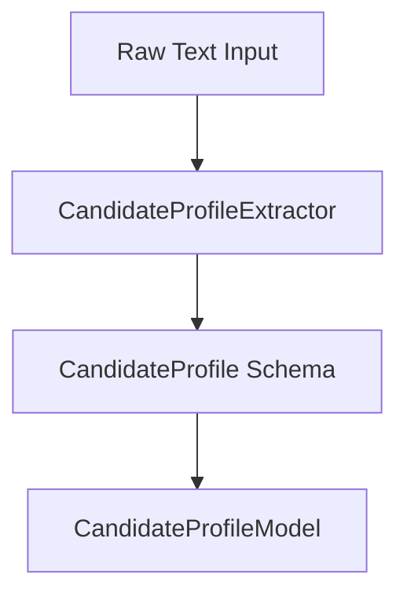

# Phase 1 — Architecture

### 1. Overview
Phase 1 implements a pipeline that ingests raw resume text and translates it into a structured SQL database schema using structured LLM schemas.

### 2. Component Diagram

### 3. Data Flow
1.  **Input Ingestion**: The system receives raw candidate experience text.
2.  **LLM Processing**: The text is formatted with schema parsing rules and submitted to the NLP agent.
3.  **Validation**: The parsed JSON is validated against Pydantic attributes.
4.  **Database Mapping**: The validated schemas are loaded into the database session.

### 4. Component Responsibilities
*   `CandidateProfileExtractor`: Maps raw string structures into detailed profile blocks.
*   `CandidateProfileModel`: Stores parsed fields (name, email, skills, experience, education, projects).

### 5. External Dependencies
*   Python LLM interface libraries (NLP extraction calls).

### 6. Database Interaction
*   Performs database insertion into the `candidate_profiles` table.
