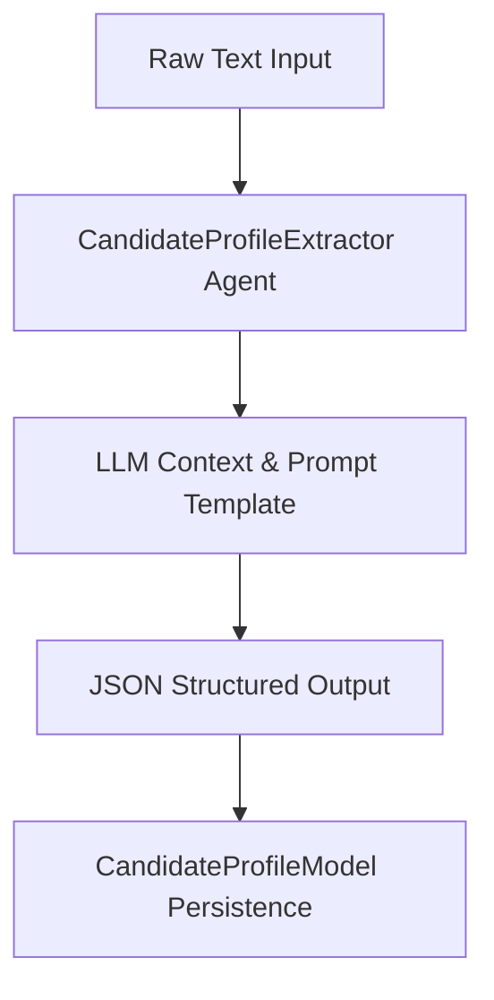

# Phase 1 — Candidate Intelligence Extraction

### 1. Objective
Extract structured candidate profile information (personal details, skills, experience, projects, education) from raw candidate/resume text.

### 2. Problem
Unstructured resume text is highly variable in formatting, labeling, and wording, making it unusable for automated keyword matching, database searches, or comparison algorithms.

### 3. Solution
Implement an LLM-based profile details extractor (`CandidateProfileExtractor`) that parses raw text segments and formats them into a clean, structured JSON structure conforming to the candidate profile schema.

### 4. Main Components
*   `CandidateProfileExtractor`: Agent coordinating LLM prompts and extraction parsing.
*   `CandidateProfileModel`: SQLAlchemy database model representing candidate profiles.

### 5. Data Flow

### 6. APIs
*   Integrated via base upload controller (`POST /api/v1/resume/upload`).

### 7. Database
*   Table: `candidate_profiles` (`CandidateProfileModel`).

### 8. Testing
*   Test Files: `backend/tests/test_candidate_profile_extractor.py`, `backend/tests/test_candidate_profile.py`.

### 9. Dependencies on Previous Phases
*   None (this is the base system initialization layer).

### 10. Output / Result
*   A validated Pydantic model (`CandidateProfile`) populated with structured resume data.

### 11. Related Documentation
*   `Docs/core/PROJECT.md`
*   `Docs/specs/BACKEND.md`
