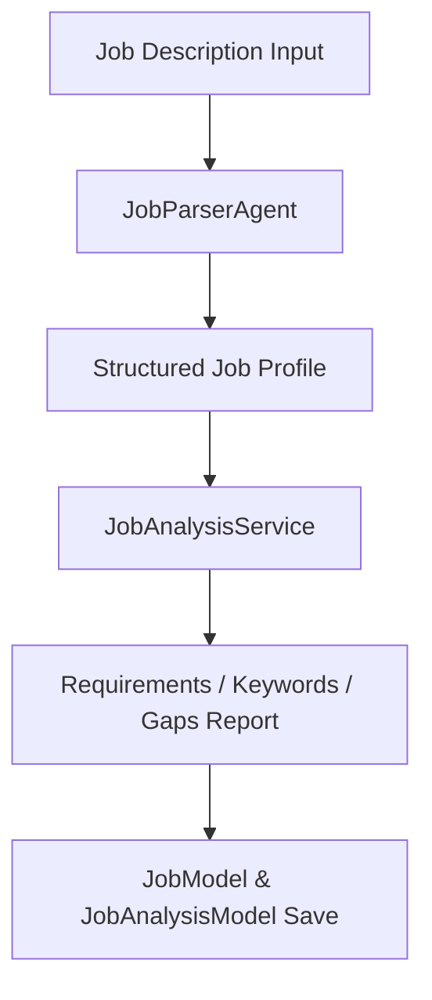

# Phase 3 — Architecture

### 1. Overview
Phase 3 establishes the job description ingestion pipeline and requirements analyzer.

### 2. Component Diagram

### 3. Data Flow
1.  **Ingestion**: Job description payload submitted via endpoint.
2.  **Job Parsing**: Agent separates title, company, skills, and qualifications.
3.  **Job Analysis**: Service calculates requirements baseline.
4.  **Database Save**: Inserts to `jobs` and `job_analyses` tables.

### 4. Component Responsibilities
*   `JobParserAgent`: Utilizes prompt templates to structure text content.
*   `JobAnalysisService`: Determines skill weights and experience deficits.

### 5. External Dependencies
*   NLP extraction engine (for matching keywords and parsing text).

### 6. Database Interaction
*   Stores data in the `jobs` and `job_analyses` tables.
