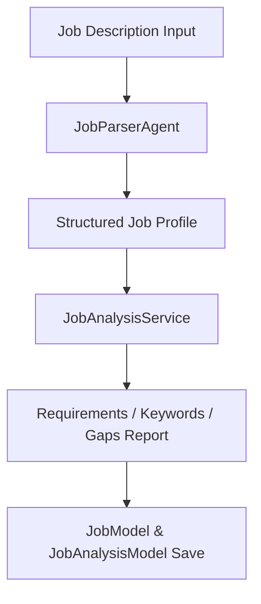

# Phase 3 — Job Parser & Analysis

### 1. Objective
Ingest raw job posting specifications, parse organizational components, and evaluate target requirements (keywords, skills gap lists).

### 2. Problem
To optimize a resume, the system must first understand what skills, education levels, and experience milestones a target job description requires.

### 3. Solution
Implement an LLM parser (`JobParserAgent`) that translates raw job texts into structured schemas, coupled with `JobAnalysisService` which performs requirement gap scoring.

### 4. Main Components
*   `JobParserAgent`: Extracts companies, roles, and lists of required/preferred skills.
*   `JobService`: Ingests and registers target job opportunities.
*   `JobAnalysisService`: Analyzes target job parameters to generate structural match indexes.
*   `JobModel` & `JobAnalysisModel`: Database models for job metadata.

### 5. Data Flow

### 6. APIs
*   `POST /api/v1/jobs/ingest`
*   `GET /api/v1/jobs/{id}`
*   `POST /api/v1/jobs/analysis/analyze`
*   `GET /api/v1/jobs/analysis/{id}`
*   `GET /api/v1/jobs/analysis/by-job/{job_id}`
*   `DELETE /api/v1/jobs/{id}`

### 7. Database
*   Tables: `jobs` (`JobModel`), `job_analyses` (`JobAnalysisModel`).

### 8. Testing
*   Test Files: `backend/tests/test_job_parser.py`, `backend/tests/test_job_parser_integration.py`, `backend/tests/test_job_analysis.py`, `backend/tests/test_jobs.py`.

### 9. Dependencies on Previous Phases
*   None (functions as an independent job intelligence ingestion context).

### 10. Output / Result
*   Parsed `Job` attributes and a structured `JobAnalysis` checklist.

### 11. Related Documentation
*   `backend/app/jobs/README.md`
*   `backend/app/jobs/README_ANALYSIS.md`
