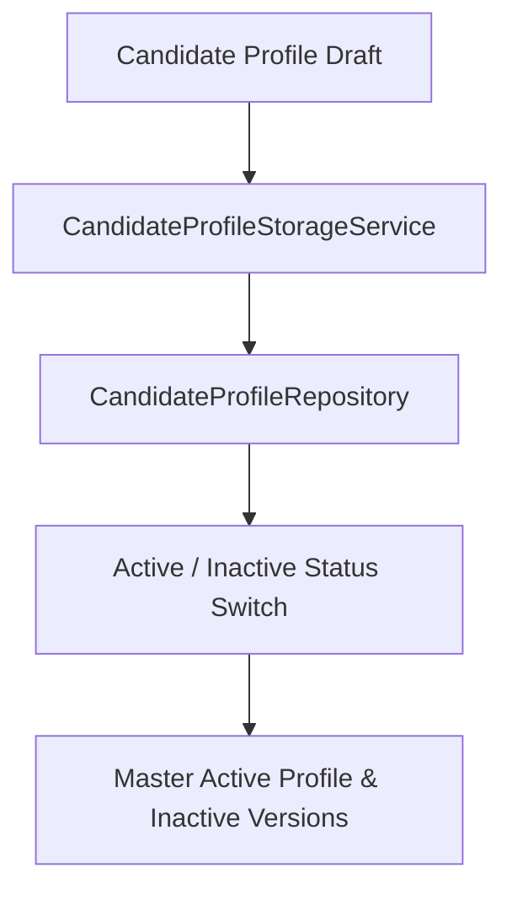

# Phase 4 — Architecture

### 1. Overview
Phase 4 implements the data access and transactional lifecycle layer for profiles.

### 2. Component Diagram

### 3. Data Flow
1.  **Incoming Save**: A new profile version is submitted.
2.  **Service Action**: Storage service queries existing active profiles.
3.  **Transaction Execution**: Deactivates previous versions and activates the target profile.
4.  **Deterministic Sorting**: Sorts by `created_at.desc()` and `id.desc()` to guarantee deterministic profile retrieval inside the test suite.

### 4. Component Responsibilities
*   `CandidateProfileStorageService`: Enforces business rules surrounding profile status integrity.
*   `CandidateProfileRepository`: Executes transactional SQLAlchemy selects and updates.

### 5. External Dependencies
*   Asyncpg (for async database transactions).

### 6. Database Interaction
*   Performs select, update, and inserts into `candidate_profiles`.
