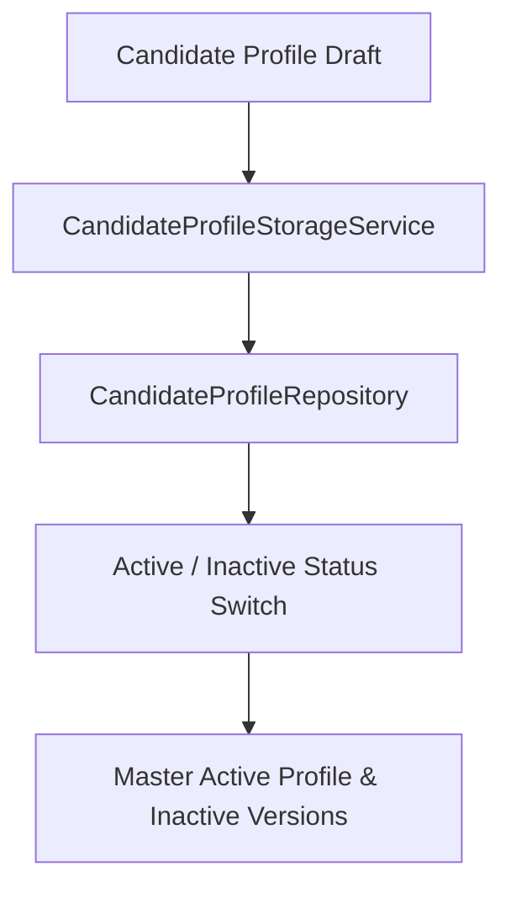

# Phase 4 — Candidate Profile Storage

### 1. Objective
Provide a version control persistence layer for candidate profiles, supporting transactional switches to maintain exactly one active profile version per user.

### 2. Problem
When a resume is optimized, it creates a new profile version. The system must store this version history securely and manage active/inactive statuses to prevent concurrency conflicts.

### 3. Solution
Implement `CandidateProfileStorageService` and repository methods that enforce transactional updates, automatically setting previous profiles to inactive when a new master profile is activated.

### 4. Main Components
*   `CandidateProfileStorageService`: Handles transaction-driven deactivation and activation switches.
*   `CandidateProfileRepository`: Executes async SQL queries.
*   `CandidateProfileModel`: Stores active/inactive flag states and metadata.

### 5. Data Flow

### 6. APIs
*   `POST /api/v1/resume/version` (creates tailored resume metadata)
*   `GET /api/v1/resume/versions` (lists version history)

### 7. Database
*   Table: `candidate_profiles` (`CandidateProfileModel`).

### 8. Testing
*   Test Files: `backend/tests/test_candidate_profile_storage.py`, `backend/tests/test_candidate_profile_storage_integration.py`.

### 9. Dependencies on Previous Phases
*   Depends on **Phase 1** data structures to populate the profile entities.

### 10. Output / Result
*   Database-enforced active profile integrity.

### 11. Related Documentation
*   `Docs/specs/DATABASE.md`
