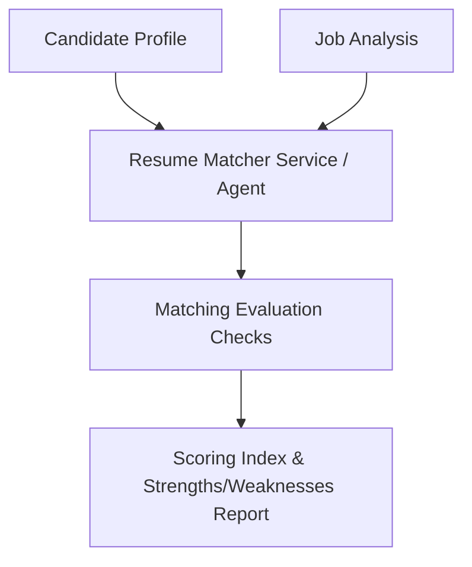

# Phase 5 — Architecture

### 1. Overview
Phase 5 implements the compatibility analysis and ATS keyword scorer.

### 2. Component Diagram

### 3. Data Flow
1.  **Ingestion**: Receives candidate profile structure and parsed job parameters.
2.  **Scoring Engine**: Evaluates skills mapping (required vs preferred), experience (years deficit), and education checks.
3.  **Output**: Compiles strengths list, gaps, and an overall compatibility score index.

### 4. Component Responsibilities
*   `ResumeMatcherAgent`: Performs detailed attribute comparison.
*   `ResumeMatcherService`: Manages business rules for score calculation.

### 5. External Dependencies
*   NLP model calls (for keyword relevance evaluation).

### 6. Database Interaction
*   None (in-memory calculations).
