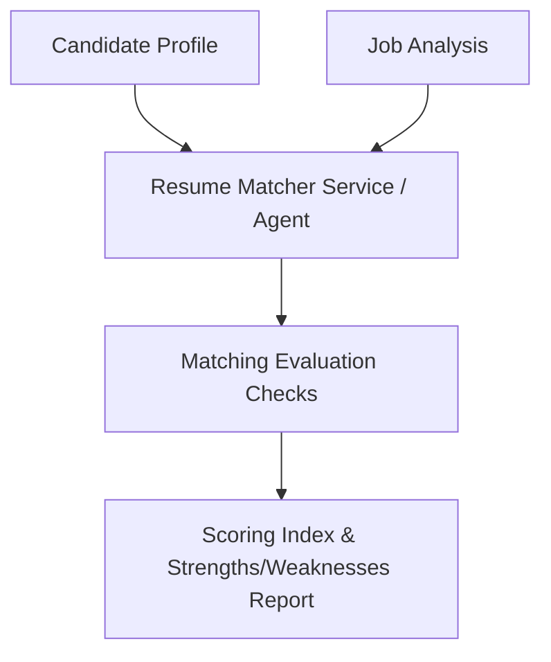

# Phase 5 — Resume Matcher

### 1. Objective
Compare candidate profiles against structured job posting requirements, generating detailed gap analysis (skills, experience deficits, education mismatch) and target matching score indexes.

### 2. Problem
To guide optimization, the system must evaluate how well a candidate's profile aligns with a specific job's qualifications in a repeatable, structured format.

### 3. Solution
Implement `ResumeMatcherService` and `ResumeMatcherAgent` to execute rule-based evaluation matrices, generating strengths, weaknesses, and keyword recommendations.

### 4. Main Components
*   `ResumeMatcherAgent`: Compares text matches using LLM evaluations.
*   `ResumeMatcherService`: Orchestrates matching pipelines and computes score indexes.

### 5. Data Flow

### 6. APIs
*   Called internally during resume evaluations.

### 7. Database
*   None (evaluations are computed dynamically in-memory).

### 8. Testing
*   Test Files: `backend/tests/test_resume_matcher.py`, `backend/tests/test_resume_matcher_integration.py`, `backend/tests/test_phase5_acceptance.py`.

### 9. Dependencies on Previous Phases
*   Requires **Phase 1** (Candidate Profile) and **Phase 3** (Job Parser & Analysis) models.

### 10. Output / Result
*   An `overall_match_score` value and keyword alignment feedback reports.

### 11. Related Documentation
*   `backend/app/resume/README_OPTIMIZATION.md`
