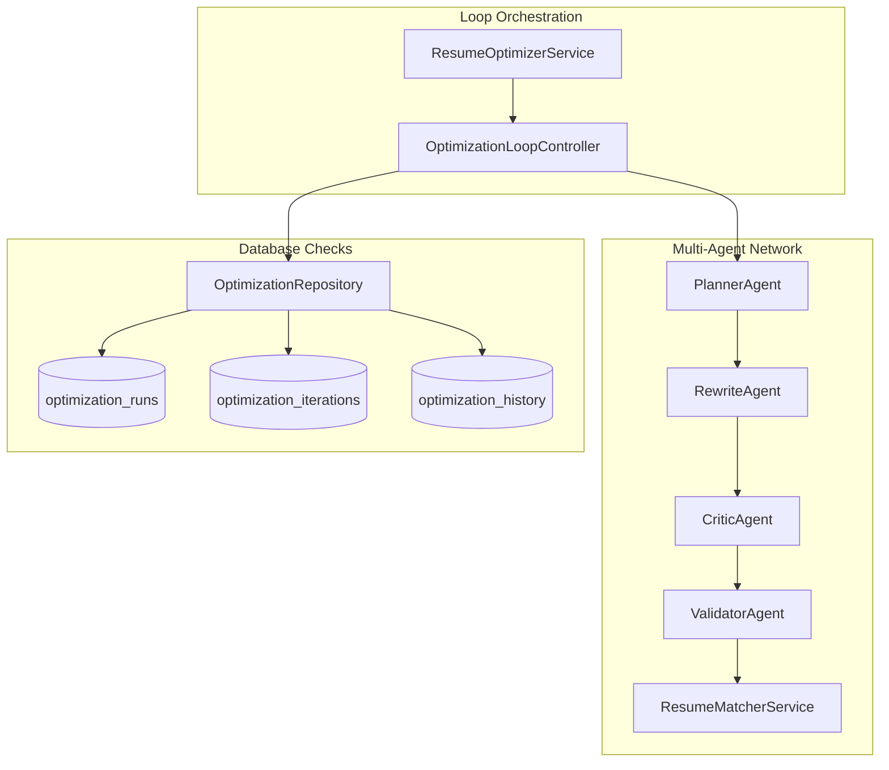

# Phase 6 — Architecture

### 1. Overview
Phase 6 implements the multi-agent orchestration state machine loop and transaction checkpoint trackers.

### 2. Component Diagram

### 3. Data Flow
1.  **Ingest**: `ResumeOptimizerService.optimize_resume()` maps input requests.
2.  **Plan**: `PlannerAgent` outlines specific target focus areas.
3.  **Refine**: `RewriteAgent` applies modifications to the resume drafts.
4.  **Audit**: `CriticAgent` ensures formatting rules are respected.
5.  **Grounding**: `ValidatorAgent` prevents date/company/degree hallucinations.
6.  **Match Check**: `ResumeMatcherService` scores the iteration results.
7.  **Loop decision**: If score declines, controller executes rollback; if it meets threshold, it saves.

### 4. Component Responsibilities
*   `OptimizationLoopController`: Coordinates step executions and manages transaction states.
*   `PlannerAgent`: Analyzes keywords to isolate max 3 task items.
*   `RewriteAgent`: Formulates resume wording mutations.
*   `CriticAgent`: Detects stylistic layout or structure errors.
*   `ValidatorAgent`: Asserts strict factual alignment.

### 5. External Dependencies
*   NLP and prompt extraction packages.

### 6. Database Interaction
*   Stores optimization checkpoints in `optimization_runs`, `optimization_iterations`, and `optimization_history` with foreign key cascade deletions.
