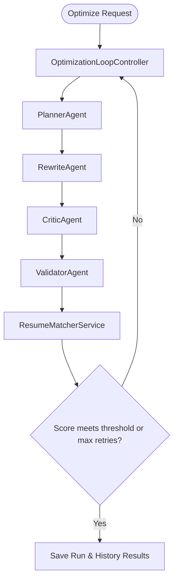

# Phase 6 — Autonomous AI Resume Optimizer

### 1. Objective
Implement the autonomous multi-agent optimization cycle (Gap analysis, Planning, Rewrite mutation, Critic layout audit, Validator fact compliance check, Re-Matcher score verification) to iteratively improve ATS compatibility scores.

### 2. Problem
Static matching only identifies gaps; candidates still need to manually rewrite summaries, highlights, and bullet points, introducing latency, style errors, or factual hallucinations.

### 3. Solution
Configure a state machine controller (`OptimizationLoopController`) that coordinates a network of specialized agents to automatically refine a candidate's resume, keeping modifications grounded to the original source.

### 4. Main Components
*   `OptimizationLoopController`: Oversees the iteration loop and rollback steps.
*   `PlannerAgent`: Sequence focus tasks, prioritizing required gaps.
*   `RewriteAgent`: Tailors summary, skills, and experience wording.
*   `CriticAgent`: Verifies layout boundaries, style, and formatting rules.
*   `ValidatorAgent`: Performs zero-hallucination semantic fact audits.
*   `ResumeMatcherService`: Re-evaluates matches after each loop iteration.

### 5. Data Flow

### 6. APIs
*   `POST /api/v1/resume/optimize`
*   `GET /api/v1/resume/optimization/{id}`
*   `GET /api/v1/resume/history/{candidate}`
*   `GET /api/v1/resume/best/{candidate}`
*   `DELETE /api/v1/resume/optimization/{id}`

### 7. Database
*   Tables: `optimization_runs` (`OptimizationRunModel`), `optimization_iterations` (`OptimizationIterationModel`), `optimization_history` (`OptimizationHistoryModel`).

### 8. Testing
*   Test Files: `backend/tests/test_phase6_e2e.py`, and complete suite under `backend/tests/ai/`.

### 9. Dependencies on Previous Phases
*   Depends on **Phase 1** (Extraction), **Phase 3** (Job Analysis), **Phase 4** (Storage), and **Phase 5** (Matcher) schemas and services.

### 10. Output / Result
*   An optimized resume profile record reaching $\ge 90$ ATS match score, with version runs history persisted.

### 11. Related Documentation
*   `Docs/phases/phase-06/COMPLETION.md`
