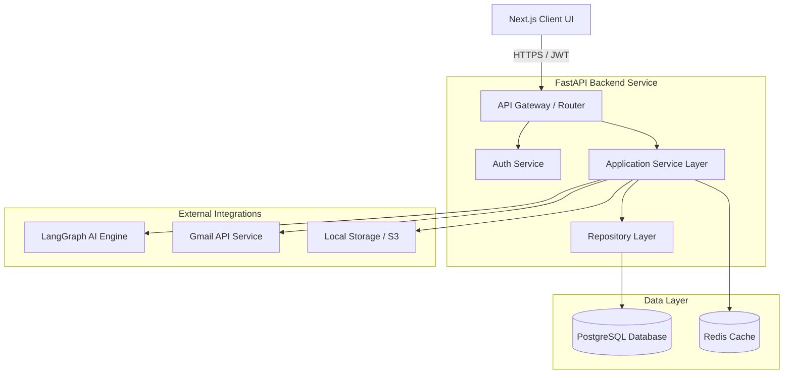

# Backend Design Document
## Project Name: AI Job Copilot
### Document Version: 1.0.0 (Phase 5 – Backend API & Service Design)
### Date: 2026-08-04

---

## 1. Backend Architecture Overview

The backend system for **AI Job Copilot** is designed as a high-performance API Gateway and application server using the **FastAPI** framework. It acts as the orchestrator connecting the Presentation Layer with the database, local storage, and the LangGraph AI Engine.

### 1.1 Technology Selection: FastAPI
FastAPI was selected for several key reasons:
*   **Asynchronous Support**: Built natively on ASGI, it handles high-concurrency requests efficiently, which is critical during web scraping and LLM API operations.
*   **Automatic OpenAPI Generation**: Generates real-time Swagger and Redoc interactive API documentation from code definitions.
*   **Pydantic Validation**: Uses standard Python type hints to perform high-speed request serialization and validation.

### 1.2 System Component Diagram



---

## 2. API Design Philosophy

The backend application follows several REST design principles:

*   **REST Principles**: APIs are designed around resource paths (nouns) and utilize standard HTTP methods (`GET` to fetch, `POST` to create, `PUT` to update, and `DELETE` to remove resources).
*   **Stateless Communication**: The server does not store client session states. Every API request must include a bearer token in the HTTP Authorization header to authenticate the client.
*   **API Versioning**: All API paths are versioned (e.g. `/api/v1/...`) to allow system updates without breaking active client applications.
*   **Pagination**: All listing endpoints (such as dashboard application lists) implement limit-offset parameters (`limit` and `page`) to optimize response sizes.
*   **Idempotency**: Retrying identical requests (e.g. creating applications or optimizations) uses transaction checks to prevent duplicate database writes.
*   **Consistent Response Format**: All responses conform to a unified JSON format containing status codes, data payloads, and validation error lists.

---

## 3. Authentication APIs

Manages registration, secure login, Google OAuth callbacks, and token refreshes.

### 3.1 Endpoint Specifications

#### 1. Register User
*   **HTTP Method**: `POST`
*   **URL**: `/api/v1/auth/register`
*   **Purpose**: Register a new user account.
*   **Request Body**:
    ```json
    {
      "email": "user@example.com",
      "password": "StrongPassword123",
      "first_name": "Surya",
      "last_name": "Charan"
    }
    ```
*   **Response Body (201 Created)**:
    ```json
    {
      "success": true,
      "data": {
        "user_id": 1,
        "email": "user@example.com"
      }
    }
    ```
*   **Authentication Requirement**: None.
*   **Validation Rules**: Email syntax validation and a minimum password length of 8 characters.
*   **Possible Errors**: `409 Conflict` (if the email is already registered), `422 Unprocessable Entity` (for invalid registration data).

#### 2. Authenticate User
*   **HTTP Method**: `POST`
*   **URL**: `/api/v1/auth/token`
*   **Purpose**: Log in a user and retrieve a JWT token.
*   **Request Body**: Form URL-encoded data (`username=user@example.com&password=StrongPassword123`).
*   **Response Body (200 OK)**:
    ```json
    {
      "access_token": "eyJhbGciOiJIUzI1...",
      "refresh_token": "eyJhbGciOiJIUzI1...",
      "token_type": "bearer"
    }
    ```
*   **Authentication Requirement**: None.
*   **Validation Rules**: Format validations.
*   **Possible Errors**: `401 Unauthorized` (for invalid credentials).

#### 3. Refresh Access Token
*   **HTTP Method**: `POST`
*   **URL**: `/api/v1/auth/refresh`
*   **Purpose**: Refresh an expired access token using a valid refresh token.
*   **Request Body**:
    ```json
    {
      "refresh_token": "eyJhbGciOiJIUzI1..."
    }
    ```
*   **Response Body (200 OK)**:
    ```json
    {
      "access_token": "eyJhbGciOiJIUzI1...",
      "token_type": "bearer"
    }
    ```
*   **Authentication Requirement**: None.
*   **Possible Errors**: `401 Unauthorized` (if the refresh token is expired or invalid).

---

## 4. Resume APIs

Manages master resumes and tailored version documents.

### 4.1 Endpoint Specifications

#### 1. Upload Master Resume
*   **HTTP Method**: `POST`
*   **URL**: `/api/v1/resumes/master`
*   **Purpose**: Ingest and store the user's master resume template.
*   **Request Body**: Multipart Form Data (key `file`, containing the binary `.docx` file).
*   **Response Body (201 Created)**:
    ```json
    {
      "success": true,
      "data": {
        "master_resume_id": 5,
        "filename": "master_user_1.docx",
        "parsed_profile": {
          "name": "Surya Charan",
          "skills": ["Python", "FastAPI"]
        }
      }
    }
    ```
*   **Authentication Requirement**: Required (Bearer Token).
*   **Validation Rules**: Limits file size to 10MB and validates file format (`.docx`).
*   **Possible Errors**: `413 Payload Too Large` (if the file exceeds 10MB), `415 Unsupported Media Type` (if the format is not `.docx`).

#### 2. Optimize Resume
*   **HTTP Method**: `POST`
*   **URL**: `/api/v1/resumes/optimize`
*   **Purpose**: Tailor the resume to match specific job requirements.
*   **Request Body**:
    ```json
    {
      "application_id": 101,
      "master_resume_id": 5
    }
    ```
*   **Response Body (200 OK)**:
    ```json
    {
      "success": true,
      "data": {
        "tailored_resume_id": 12,
        "fit_score": 85,
        "preview_url": "/api/v1/resumes/download/12",
        "optimized_bullets": [
          {
            "original": "Managed database backups.",
            "optimized": "Optimized database backup routines to ensure system reliability."
          }
        ]
      }
    }
    ```
*   **Authentication Requirement**: Required (Bearer Token).
*   **Possible Errors**: `404 Not Found` (if the application or master resume ID is missing), `422 Unprocessable Entity` (if the AI tailoring step fails).

---

## 5. Job Ingestion APIs

Extracts job requirements from multiple input formats.

### 5.1 Endpoint Specifications

#### 1. Parse Job Ingestion URL
*   **HTTP Method**: `POST`
*   **URL**: `/api/v1/jobs/parse`
*   **Purpose**: Parse a job listing from a URL.
*   **Request Body**:
    ```json
    {
      "source_type": "url",
      "payload": "https://greenhouse.io/google/jobs/101"
    }
    ```
*   **Response Body (200 OK)**:
    ```json
    {
      "success": true,
      "data": {
        "job_id": 45,
        "company_name": "Google",
        "job_title": "Senior AI Engineer",
        "parsed_requirements": {
          "core_skills": ["Python", "System Design"],
          "recruiter_email": "hiring@google.com"
        }
      }
    }
    ```
*   **Authentication Requirement**: Required (Bearer Token).
*   **Possible Errors**: `400 Bad Request` (for invalid URLs), `504 Gateway Timeout` (if web scraping fails).

---

## 6. AI Interface APIs

Provides backend endpoints for individual AI operations.

### 6.1 Endpoint Specifications

#### 1. Analyze Job Requirements
*   **HTTP Method**: `POST`
*   **URL**: `/api/v1/ai/parse-job`
*   **Purpose**: Parse unstructured job posting text into structured JSON.
*   **Request Body**:
    ```json
    {
      "raw_text": "We are looking for a Senior Developer with 5 years of Python experience..."
    }
    ```
*   **Response Body (200 OK)**:
    ```json
    {
      "success": true,
      "data": {
        "company": "Unknown",
        "role": "Senior Developer",
        "skills": ["Python"],
        "experience_years": 5
      }
    }
    ```
*   **Authentication Requirement**: Required (Bearer Token).

---

## 7. Email Outreach APIs

Manages recruiter email drafting and delivery.

### 7.1 Endpoint Specifications

#### 1. Send Outreach Email
*   **HTTP Method**: `POST`
*   **URL**: `/api/v1/emails/send`
*   **Purpose**: Send the outreach email with the tailored resume as an attachment.
*   **Request Body**:
    ```json
    {
      "application_id": 101,
      "recipient_email": "recruiter@google.com",
      "subject": "Application for Senior AI Engineer - Surya Charan",
      "body_text": "Dear Recruiter, ..."
    }
    ```
*   **Response Body (200 OK)**:
    ```json
    {
      "success": true,
      "data": {
        "message_id": "MSG12345",
        "status": "sent"
      }
    }
    ```
*   **Authentication Requirement**: Required (Bearer Token).
*   **Possible Errors**: `428 Precondition Required` (if Gmail OAuth is not connected), `400 Bad Request` (for validation errors).

---

## 8. Dashboard APIs

Provides aggregation metrics and application history for the main dashboard view.

### 8.1 Endpoint Specifications

#### 1. Get Applications History
*   **HTTP Method**: `GET`
*   **URL**: `/api/v1/dashboard/applications`
*   **Purpose**: Retrieve application history records for the user.
*   **Request Parameters**: `page` (default: 1), `limit` (default: 10), `search` (optional string query).
*   **Response Body (200 OK)**:
    ```json
    {
      "success": true,
      "data": {
        "items": [
          {
            "application_id": 101,
            "company_name": "Google",
            "role_title": "Senior AI Engineer",
            "status": "tailored",
            "application_date": "2026-08-04"
          }
        ],
        "total_count": 142,
        "page": 1,
        "limit": 10
      }
    }
    ```
*   **Authentication Requirement**: Required (Bearer Token).

---

## 9. Storage APIs

Manages document downloads and file uploads.

### 9.1 Endpoint Specifications

#### 1. Retrieve Tailored Resume PDF
*   **HTTP Method**: `GET`
*   **URL**: `/api/v1/resumes/download/{resume_version_id}`
*   **Purpose**: Download a generated resume PDF.
*   **Response**: Binary PDF file stream (`Content-Type: application/pdf`).
*   **Authentication Requirement**: Required (Bearer Token).
*   **Possible Errors**: `403 Forbidden` (if the user does not own the requested document file), `404 Not Found` (if the file is missing).

---

## 10. Service Layer Design

The Service Layer coordinates business workflows and execution steps across modules.

### 10.1 Service Class Specifications

#### 1. Authentication Service
*   **Purpose**: Manages credential hashing, authentication, and session tokens.
*   **Responsibilities**:
    - Hash password strings using `bcrypt`.
    - Generate JWT access and refresh tokens.
    - Validate tokens and return user context details.
*   **Dependencies**: UserRepository.

#### 2. Resume Service
*   **Purpose**: Coordinates resume uploads, optimization tasks, and file compilation.
*   **Responsibilities**:
    - Validate DOCX uploads and parse profile schemas.
    - Run the AI engine to generate optimized text.
    - Call the Document Compiler to merge text into templates and generate PDF files.
*   **Dependencies**: ResumeRepository, AI Engine Adapter, Storage Service.

#### 3. Job Service
*   **Purpose**: Coordinates scraping and OCR processing to parse job listings.
*   **Responsibilities**:
    - Select scrapers or OCR engines based on input formats.
    - Parse requirements using the AI Engine.
    - Log job postings and initialize application records in the database.
*   **Dependencies**: JobRepository, AI Engine Adapter, Storage Service.

#### 4. Email Service
*   **Purpose**: Coordinates outreach email drafting and delivery.
*   **Responsibilities**:
    - Draft recruiter emails based on tailored resume points.
    - Connect to Gmail and send messages with attachments.
*   **Dependencies**: EmailRepository, Gmail API Client, Resume Service.

---

## 11. Repository Layer Design

The Repository Layer encapsulates database transactions using SQLAlchemy, isolating the application layer from SQL details.

```
[Application Service] --> [Repository Interface] --> [SQLAlchemy Repository Implementation] --> [Database]
```

### 11.1 Repository Specifications

#### 1. UserRepository
*   **Purpose**: Manage database transactions for the `users` and `user_settings` tables.
*   **Common Queries**:
    - `get_by_email(email: str) -> User`: Retrieve user records for login validation.
    - `save(user: User) -> User`: Register new users.

#### 2. ResumeRepository
*   **Purpose**: Manage transactions for the `master_resumes` and `resume_versions` tables.
*   **Common Queries**:
    - `get_master_by_user(user_id: int) -> MasterResume`: Retrieve active master templates.
    - `save_version(version: ResumeVersion) -> ResumeVersion`: Save generated resume versions.

#### 3. ApplicationRepository
*   **Purpose**: Manage transactions for the `applications` and `application_metadata` tables.
*   **Common Queries**:
    - `get_by_user_paginated(user_id: int, offset: int, limit: int, query: str) -> List[Application]`: Fetch dashboard lists.
    - `get_details(app_id: int) -> Application`: Retrieve application details, resume paths, and email drafts.

---

## 12. Request Validation

The backend validates all incoming payloads using Pydantic schemas to ensure data consistency and prevent injection issues:

*   **URL Pattern Checks**: Verifies that input URLs use HTTPS, correspond to supported domains, and match standard URL patterns before scraping.
*   **Email Structure Checks**: Validates email strings using standard formatting constraints (e.g. `UserRegisterRequest.email`).
*   **File Size & MIME Limits**: Validates that resume uploads do not exceed 10MB and match supported DOCX MIME-types.
*   **JSON Schema Verification**: Runs all structured inputs through Pydantic model checks to ensure data structures conform to system rules before processing.

---

## 13. API Response Models

All API endpoints return responses conforming to a unified structure.

### 13.1 Success Response Schema
```json
{
  "success": true,
  "data": {
    "application_id": 101,
    "company_name": "Google",
    "status": "tailored"
  }
}
```

### 13.2 Validation Error Response Schema
```json
{
  "success": false,
  "error": {
    "code": "VALIDATION_ERROR",
    "message": "Invalid request fields.",
    "details": [
      {
        "field": "email",
        "issue": "value is not a valid email address"
      }
    ]
  }
}
```

### 13.3 Business Rule Exception Schema
```json
{
  "success": false,
  "error": {
    "code": "QUOTA_EXCEEDED",
    "message": "Daily resume optimization limit reached (Max 5 per day)."
  }
}
```

---

## 14. Exception Handling Strategy

The backend uses custom exceptions and middleware handlers to catch and format errors, returning consistent JSON responses to the client:

*   **HTTPException Handler**: Catches standard FastAPI HTTP exceptions (e.g., 404, 401) and formats them into standard error schemas.
*   **RequestValidationError Handler**: Catches Pydantic validation errors and returns a `422 Unprocessable Entity` status with detailed field error lists.
*   **Database Exceptions**: Catches database integrity issues (e.g., duplicate email registrations) and returns a `409 Conflict` error to prevent raw database errors from leaking.
*   **Integrity Errors**: Catches system constraints violations and return standard `400 Bad Request` responses.

---

## 15. Background Processing Tasks

To keep API responses fast, long-running operations are offloaded to run asynchronously:

*   **Document Compilations**: Merging tailored text into DOCX templates and converting files to PDF is run as an asynchronous task, updating the database status once complete.
*   **Web Scraping Tasks**: Scrapes job postings asynchronously to prevent network issues from blocking API endpoints.
*   **Email Sending**: Outreach emails are sent as background tasks to prevent SMTP network delays from slow-loading pages.
*   **Celery Migration Plan**: For the MVP, background tasks run using FastAPI's built-in `BackgroundTasks`. As traffic grows, they can be migrated to Celery workers managed via a Redis message broker with no changes needed to core use case logic.

---

## 16. Security Infrastructure

The backend implements several security measures to protect user data and secure API endpoints:

*   **Stateless Authentication**: Secures API routes using JWT tokens containing encrypted user IDs and expiration dates.
*   **Credential Hashing**: Hashes passwords using `bcrypt` before storage.
*   **OAuth Authorization**: Connects to the Gmail API using Google OAuth2 to securely authenticate outreach emails.
*   **Input Sanitization**: Web scraping inputs and text boxes are sanitized to strip out executable script tags.
*   **CORS Policies**: Implements strict CORS policies to restrict API access to verified client domains.
*   **Rate Limiting**: Restricts API calls (e.g. limit optimization requests to 10 per minute per IP) to prevent service abuse.

---

## 17. API Documentation & Testing

FastAPI automatically generates interactive API documentation from code configurations:

*   **Interactive Docs (Swagger)**: Exposes interactive Swagger docs at `/docs` in development, allowing developers to test API endpoints in the browser.
*   **Alternative Docs (Redoc)**: Exposes Redoc API layouts at `/redoc`.
*   **Mock Testing**: Repository interfaces allow developers to mock database connections during tests, simplifying validation.

---

## 18. Performance Optimization

The backend implements several optimizations to improve responsiveness and reduce load times:

*   **Database Connection Pooling**: Maintains a pool of active database connections, reducing the overhead of establishing new connections for each query.
*   **Redis Caching**: Caches scraped job descriptions and match analysis results to reduce API calls to third-party services.
*   **Gzip Compression Middleware**: Compresses API response bodies, reducing data transfer times for returning users.
*   **Paginated Queries**: Restricts database response sizes using limit-offset parameters on history search endpoints.

---

## 19. Extensibility Strategy

The modular monolith design allows adding new features without modifying existing code:

*   **Adding Interview Coach APIs**: Can be built by adding an `/api/v1/interviews` router, importing the user and resume repositories with no changes needed to core tailoring code.
*   **Adding LinkedIn Integration**: Can be integrated by adding a `/api/v1/linkedin` router and implementing a LinkedIn API client in the Infrastructure Layer.
*   **Adding SaaS Multitenancy**: Can be integrated by adding tenant validation middleware to check user access scopes before forwarding requests to use cases.

---

## 20. Backend Design Decisions & Trade-offs

This section records key backend decisions, detailing the trade-offs, advantages, and limitations of each:

### 20.1 FastAPI vs. Django
*   **Considered Alternative**: Django.
*   **Selected Path**: FastAPI.
*   **Rationale**: FastAPI offers superior performance, built-in async support, and native Pydantic validation, making it ideal for high-concurrency scraping and AI operations.
*   **Trade-off**: Lacks Django's built-in admin dashboard and ORM out-of-the-box, meaning database configurations and database migrations must be set up manually using Alembic.

### 20.2 Pydantic Validation vs. Marshmallow
*   **Considered Alternative**: Marshmallow.
*   **Selected Path**: Pydantic.
*   **Rationale**: Pydantic integrates natively with FastAPI, performs validation at high speeds (using Rust under the hood in Pydantic v2), and provides clean type hinting support.
*   **Trade-off**: Migrating between Pydantic version updates can require code refactoring.

### 20.3 Async Database Drivers (asyncpg) vs. Synchronous ORM
*   **Considered Alternative**: Sync SQLAlchemy database queries.
*   **Selected Path**: Async Database Drivers.
*   **Rationale**: Using async database drivers prevents database operations from blocking the single-threaded event loop, improving performance during high-concurrency requests.
*   **Trade-off**: Increases query writing complexity.
