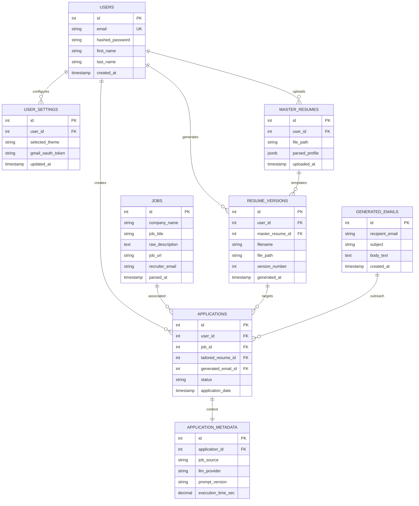
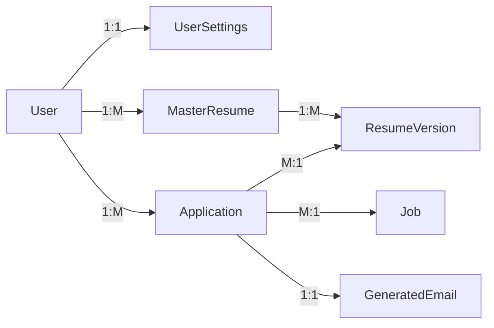
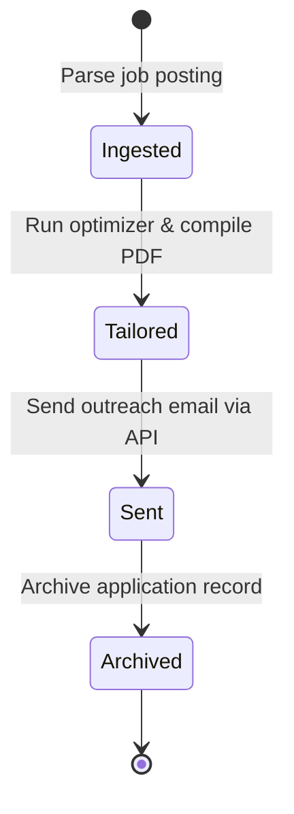

# Database Design Document (DDD)
## Project Name: AI Job Copilot
### Document Version: 1.0.0 (Phase 4 – Database Design & Data Modeling)
### Date: 2026-08-04

---

## 1. Database Design Philosophy

The database design for **AI Job Copilot** is structured to support a highly transactional, data-consistent, and secure platform. The design is optimized to scale from a single-user MVP into a multi-tenant SaaS application.

### 1.1 Technology Selection: PostgreSQL
PostgreSQL was selected as the primary database engine due to several key advantages:
*   **ACID Compliance**: Ensures strong transactional guarantees, preventing data corruption during application creations.
*   **JSONB Support**: Allows storing semi-structured data (such as parsed resumes and matching analytics) in a queryable format alongside structured relational data.
*   **Security & Extensions**: Supports robust authentication features, Row-Level Security (RLS), and extensions like `pgcrypto` and `uuid-ossp`.

### 1.2 Relational Model vs. NoSQL
A relational model fits this project because the core entity relationships (Users, Applications, Resumes, and Outreach Emails) are highly structured and interdependent. While resume profiles benefit from the flexibility of JSON storage, the overall application lifecycle requires referential integrity, cascading deletes, and complex joins best handled by a relational database.

### 1.3 Normalization Strategy
The database follows Third Normal Form (3NF) design practices:
*   **First Normal Form (1NF)**: All columns contain atomic values, and each record is uniquely identified by a primary key.
*   **Second Normal Form (2NF)**: All non-key columns depend entirely on the table's primary key.
*   **Third Normal Form (3NF)**: Non-key columns depend only on the primary key, eliminating transitive dependencies. For example, recruiter details are moved to a separate metadata table to avoid duplication in the main application log.

```
       +-----------------------+
       |   User (1 to Many)    |
       +-----------------------+
                   |
         +---------+---------+
         |                   |
         v                   v
+-----------------+ +-----------------+
|   ResumeFile    | |   Application   |
+-----------------+ +-----------------+
```

### 1.4 Data & Referential Integrity
*   **Primary Keys**: All tables use auto-incrementing integers or UUIDs as primary keys.
*   **Foreign Keys**: Enforce relationships between tables with cascading rules (`ON DELETE CASCADE` or `ON DELETE SET NULL`) to maintain referential integrity.
*   **Check Constraints**: Enforce validation rules directly at the database level (e.g. limiting application status fields to defined states).

---

## 2. Domain Data Model

The database is structured around nine core business entities:

1.  **User**: Represents a registered user account.
2.  **MasterResume**: Stores the parsed JSON data and file path of the user's master resume.
3.  **ResumeVersion**: Stores metadata, template configurations, and file paths for tailored resume versions.
4.  **Job**: Stores parsed job requirements, descriptions, and metadata.
5.  **JobSource**: Represents the source of a job listing (e.g. scraped URL, PDF upload, screenshot).
6.  **Application**: Tracks a specific job application record.
7.  **GeneratedEmail**: Stores outreach email subjects, bodies, and attachment paths.
8.  **ApplicationMetadata**: Stores scraper analytics and API usage metrics.
9.  **UserSettings**: Stores user configurations, OAuth tokens, and theme settings.

### 2.1 Entity Lifecycles

```
User (Active) ──> MasterResume (Uploaded) ──> Job (Ingested)
                                                 │
                                                 v
Application (Draft) ──> ResumeVersion (Generated) ──> GeneratedEmail (Drafted)
                                                 │
                                                 v
                                       Application (Emailed)
```

---

## 3. Entity Relationship Diagram (ERD)

The ER diagram below shows the primary keys, foreign keys, cardinality, and relationships between tables.



---

## 4. Database Table Design

This section details the design of each database table, specifying column types, keys, constraints, and validation rules.

### 4.1 Users Table
Stores credentials, profile details, and account creation dates.

*   **Primary Key**: `id` (SERIAL)
*   **Indexes**: Unique index on `email`.
*   **Database Constraints**: `email` must be unique and cannot be null.

| Column | Data Type | Constraints | Default | Description |
| :--- | :--- | :--- | :--- | :--- |
| **id** | INT (SERIAL) | PRIMARY KEY, NOT NULL | | Unique internal user ID. |
| **email** | VARCHAR(255) | UNIQUE, NOT NULL | | Primary account email. |
| **hashed_password**| VARCHAR(255) | NOT NULL | | Bcrypt password hash. |
| **first_name** | VARCHAR(100) | NOT NULL | | User's first name. |
| **last_name** | VARCHAR(100) | NOT NULL | | User's last name. |
| **created_at** | TIMESTAMP WITH TZ | NOT NULL | CURRENT_TIMESTAMP | Date and time of account creation. |

---

### 4.2 User Settings Table
Stores user configurations and encrypted OAuth refresh tokens.

*   **Primary Key**: `id` (SERIAL)
*   **Foreign Keys**: `user_id` referencing `users(id)` with cascading deletes.

| Column | Data Type | Constraints | Default | Description |
| :--- | :--- | :--- | :--- | :--- |
| **id** | INT (SERIAL) | PRIMARY KEY, NOT NULL | | Unique settings ID. |
| **user_id** | INT | FOREIGN KEY, UNIQUE, NOT NULL | | Associated user ID. |
| **selected_theme** | VARCHAR(50) | NOT NULL | 'dark' | Theme setting ('light' or 'dark'). |
| **gmail_oauth_token**| TEXT | | NULL | Encrypted Gmail OAuth refresh token. |
| **updated_at** | TIMESTAMP WITH TZ | NOT NULL | CURRENT_TIMESTAMP | Last settings update timestamp. |

---

### 4.3 Master Resumes Table
Stores the raw file path and parsed JSON structure of the user's master resume.

*   **Primary Key**: `id` (SERIAL)
*   **Foreign Keys**: `user_id` referencing `users(id)` with cascading deletes.

| Column | Data Type | Constraints | Default | Description |
| :--- | :--- | :--- | :--- | :--- |
| **id** | INT (SERIAL) | PRIMARY KEY, NOT NULL | | Unique master resume ID. |
| **user_id** | INT | FOREIGN KEY, NOT NULL | | Owner's user ID. |
| **file_path** | VARCHAR(512) | NOT NULL | | Local/S3 storage file path. |
| **parsed_profile** | JSONB | NOT NULL | | Structured JSON profile details. |
| **uploaded_at** | TIMESTAMP WITH TZ | NOT NULL | CURRENT_TIMESTAMP | Upload timestamp. |

---

### 4.4 Resume Versions Table
Tracks tailored resume versions generated for specific applications.

*   **Primary Key**: `id` (SERIAL)
*   **Foreign Keys**:
    - `user_id` referencing `users(id)` with cascading deletes.
    - `master_resume_id` referencing `master_resumes(id)` on delete set null.
*   **Indexes**: Index on `(user_id, master_resume_id)`.

| Column | Data Type | Constraints | Default | Description |
| :--- | :--- | :--- | :--- | :--- |
| **id** | INT (SERIAL) | PRIMARY KEY, NOT NULL | | Unique resume version ID. |
| **user_id** | INT | FOREIGN KEY, NOT NULL | | Associated user ID. |
| **master_resume_id**| INT | FOREIGN KEY, SET NULL | | Source master resume ID. |
| **filename** | VARCHAR(255) | NOT NULL | | Target file name (e.g. `SuryaC_Google.pdf`). |
| **file_path** | VARCHAR(512) | NOT NULL | | Document storage file path. |
| **version_number** | INT | NOT NULL | 1 | Incremental version number. |
| **generated_at** | TIMESTAMP WITH TZ | NOT NULL | CURRENT_TIMESTAMP | Generation timestamp. |

---

### 4.5 Jobs Table
Stores job descriptions and extracted requirements metadata.

*   **Primary Key**: `id` (SERIAL)
*   **Indexes**: Full-text search index on `raw_description`.

| Column | Data Type | Constraints | Default | Description |
| :--- | :--- | :--- | :--- | :--- |
| **id** | INT (SERIAL) | PRIMARY KEY, NOT NULL | | Unique job ID. |
| **company_name** | VARCHAR(255) | NOT NULL | | Target employer name. |
| **job_title** | VARCHAR(255) | NOT NULL | | Target job title. |
| **raw_description** | TEXT | NOT NULL | | Unstructured job description text. |
| **job_url** | VARCHAR(2048) | | NULL | Source job posting URL. |
| **recruiter_email** | VARCHAR(255) | | NULL | Extracted recruiter contact. |
| **parsed_at** | TIMESTAMP WITH TZ | NOT NULL | CURRENT_TIMESTAMP | Ingestion timestamp. |

---

### 4.6 Applications Table
Tracks specific job application records, matching user profiles with job requirements.

*   **Primary Key**: `id` (SERIAL)
*   **Foreign Keys**:
    - `user_id` referencing `users(id)` with cascading deletes.
    - `job_id` referencing `jobs(id)` with cascading deletes.
    - `tailored_resume_id` referencing `resume_versions(id)` on delete set null.
    - `generated_email_id` referencing `generated_emails(id)` on delete set null.
*   **Constraints**: Application status must be one of: `ingested`, `tailored`, `sent`, `archived`.

| Column | Data Type | Constraints | Default | Description |
| :--- | :--- | :--- | :--- | :--- |
| **id** | INT (SERIAL) | PRIMARY KEY, NOT NULL | | Unique application ID. |
| **user_id** | INT | FOREIGN KEY, NOT NULL | | Associated user ID. |
| **job_id** | INT | FOREIGN KEY, NOT NULL | | Associated job ID. |
| **tailored_resume_id**| INT | FOREIGN KEY, SET NULL | NULL | Tailored resume version ID. |
| **generated_email_id**| INT | FOREIGN KEY, SET NULL | NULL | Generated email draft ID. |
| **status** | VARCHAR(50) | CHECK, NOT NULL | 'ingested' | Application status state. |
| **application_date**| TIMESTAMP WITH TZ | NOT NULL | CURRENT_TIMESTAMP | Application timestamp. |

---

### 4.7 Generated Emails Table
Stores recruiter outreach drafts and attachment file paths.

*   **Primary Key**: `id` (SERIAL)

| Column | Data Type | Constraints | Default | Description |
| :--- | :--- | :--- | :--- | :--- |
| **id** | INT (SERIAL) | PRIMARY KEY, NOT NULL | | Unique email ID. |
| **recipient_email** | VARCHAR(255) | NOT NULL | | Recruiter email address. |
| **subject** | VARCHAR(255) | NOT NULL | | Outreach subject line. |
| **body_text** | TEXT | NOT NULL | | Outreach body text. |
| **created_at** | TIMESTAMP WITH TZ | NOT NULL | CURRENT_TIMESTAMP | Email draft creation timestamp. |

---

### 4.8 Application Metadata Table
Stores processing analytics, LLM settings, and API metrics for system optimization.

*   **Primary Key**: `id` (SERIAL)
*   **Foreign Keys**: `application_id` referencing `applications(id)` with cascading deletes.

| Column | Data Type | Constraints | Default | Description |
| :--- | :--- | :--- | :--- | :--- |
| **id** | INT (SERIAL) | PRIMARY KEY, NOT NULL | | Unique metadata ID. |
| **application_id** | INT | FOREIGN KEY, UNIQUE, NOT NULL | | Associated application ID. |
| **job_source** | VARCHAR(50) | NOT NULL | 'text' | Ingest type ('url', 'pdf', 'image', 'text'). |
| **llm_provider** | VARCHAR(50) | NOT NULL | 'gemini' | LLM engine provider ('gemini', 'openai'). |
| **prompt_version** | VARCHAR(50) | NOT NULL | 'v1' | Prompts version. |
| **execution_time_sec**| DECIMAL(6,3) | NOT NULL | 0.000 | Processing duration. |

---

## 5. SQL Implementation Examples

The SQL examples below demonstrate how the database schema and constraints are defined:

### 5.1 Tables Creation DDL
```sql
-- Create custom status type
CREATE TYPE app_status AS ENUM ('ingested', 'tailored', 'sent', 'archived');

-- Create Applications table with constraints
CREATE TABLE applications (
    id SERIAL PRIMARY KEY,
    user_id INT NOT NULL,
    job_id INT NOT NULL,
    tailored_resume_id INT,
    generated_email_id INT,
    status app_status DEFAULT 'ingested'::app_status NOT NULL,
    application_date TIMESTAMP WITH TIME ZONE DEFAULT CURRENT_TIMESTAMP NOT NULL,

    FOREIGN KEY (user_id) REFERENCES users(id) ON DELETE CASCADE,
    FOREIGN KEY (job_id) REFERENCES jobs(id) ON DELETE CASCADE,
    FOREIGN KEY (tailored_resume_id) REFERENCES resume_versions(id) ON DELETE SET NULL,
    FOREIGN KEY (generated_email_id) REFERENCES generated_emails(id) ON DELETE SET NULL
);
```

### 5.2 Quotas Check Trigger
This trigger checks that a user has not exceeded their daily resume optimization quota before inserting a new record.

```sql
CREATE OR REPLACE FUNCTION check_user_optimization_quota()
RETURNS TRIGGER AS $$
DECLARE
    daily_count INT;
BEGIN
    -- Count optimized resumes generated by the user in the last 24 hours
    SELECT COUNT(*) INTO daily_count
    FROM resume_versions
    WHERE user_id = NEW.user_id
      AND generated_at > NOW() - INTERVAL '24 hours';

    -- Enforce quota check
    IF daily_count >= 5 THEN
        RAISE EXCEPTION 'Daily resume optimization quota exceeded (Max 5 per 24 hours)';
    END IF;

    RETURN NEW;
END;
$$ LANGUAGE plpgsql;

CREATE TRIGGER trg_quota_check
BEFORE INSERT ON resume_versions
FOR EACH ROW
EXECUTE FUNCTION check_user_optimization_quota();
```

---

## 6. Relationships & Cardinality

The system relationships are designed to support cascading data management:

*   **User $\rightarrow$ Settings (1 to 1)**: Each user has one configuration settings record.
*   **User $\rightarrow$ Master Resume (1 to Many)**: A user can upload multiple master resumes (e.g. for different roles), but only one is marked as active.
*   **User $\rightarrow$ Applications (1 to Many)**: A user can submit multiple job applications.
*   **Master Resume $\rightarrow$ Resume Versions (1 to Many)**: Each tailored version is generated from a single master resume template.
*   **Application $\rightarrow$ Resume Version (Many to 1)**: An application points to a single tailored resume version.
*   **Application $\rightarrow$ Job (Many to 1)**: An application is associated with a single job description.
*   **Application $\rightarrow$ Generated Email (1 to 1)**: An application has one generated outreach email draft.



---

## 7. Indexing Strategy

To support fast queries and maintain database performance as the platform scales, the schema defines several indexes:

### 7.1 Primary Keys & Foreign Keys
PostgreSQL automatically indexes all primary keys. Additionally, all foreign keys are indexed manually to speed up join operations (e.g. indexing `applications.user_id` and `applications.job_id`).

### 7.2 Secondary Search Indexes
*   **Full-Text Search Index**: A `GIN` index on `jobs.raw_description` using `to_tsvector` enables fast keyword searches across saved job postings.
*   **Query Indexing**: A composite index on `(user_id, status)` speeds up dashboard status queries.
*   **Application Search Index**: An index on `(company_name, role_title)` on the `jobs` table optimizes history searches.

---

## 8. File Storage Design

To prevent database bloat, physical resume files are saved to the storage system rather than stored as database byte streams:

```
[DOCX/PDF files] ──> Storage System (/storage/applications/)
                             │
                             v
      [Database Records] ──> Save file paths (resume_versions.file_path)
```

*   **Master Resumes**: Saved to `/storage/master_resumes/master_[user_id].docx`.
*   **Tailored Resumes**: Saved to `/storage/applications/app_[id]/[filename].pdf`.
*   **S3 Compatibility**: The `file_path` column stores relative file paths. This allows the system to transition from local file storage in the MVP to cloud object storage (such as AWS S3 or MinIO) in production without requiring schema updates.

---

## 9. Data Validation Rules

The database enforces data validation rules using check constraints and data types:

*   **Email Constraints**: Validates email syntax using standard formats.
*   **URL Checks**: Verifies job URLs start with `http://` or `https://` protocols.
*   **Status Constraints**: Limits application status values to: `ingested`, `tailored`, `sent`, `archived`.
*   **Version Numbers**: Restricts resume version numbers to positive integers.
*   **Processing Speeds**: Restricts processing times to positive numbers.

---

## 10. Data Lifecycles

This section details how records move through the database during core operations.



*   **Job Ingestion**: Ingesting a job details URL creates a record in the `jobs` table and maps it to a new `applications` entry with the status `ingested`.
*   **Resume Optimization**: Running the tailoring engine creates a `resume_versions` record and updates the parent application status to `tailored`.
*   **Email Outreach**: Sending the outreach email creates a `generated_emails` record and updates the parent application status to `sent`.
*   **Soft Deletion**: To preserve metrics and history data, deleting an application record updates its status to `archived` rather than deleting the database row.

---

## 11. Backup & Recovery Strategy

To prevent data loss, the database implements automated backup and recovery procedures:

*   **Daily Dumps**: Runs pg_dump daily to capture full database snapshots, storing backups in a separate secure directory.
*   **Write-Ahead Logging (WAL)**: Tracks ongoing transactions, enabling Point-in-Time Recovery (PITR) if data corruption occurs.
*   **File Backups**: Syncs the `/storage/` directory daily with separate backup systems.
*   **Recovery Checks**: Validates backup recovery steps monthly on separate staging database instances to ensure data integrity.

---

## 12. Security Considerations

The database implements several security measures to protect user data:

*   **Data Encryption at Rest**: Uses system encryption tools to secure database volumes and storage directories on disk.
*   **Credential Protection**: Passwords are encrypted using the `bcrypt` algorithm before they are saved.
*   **Encrypted Tokens**: Google OAuth refresh tokens are encrypted using `AES-GCM-256` before storage, with keys managed in environment variables.
*   **Data Isolation**: PostgreSQL Row-Level Security (RLS) is used to ensure users can only access their own records.
*   **Database Permissions**: Backend applications connect using restricted database users with minimal necessary permissions.

---

## 13. Scalability Strategy

The database schema is designed to scale as usage grows:

*   **Read Replicas**: Main queries are run against write databases, while read-only operations (such as dashboard searches) are routed to read replicas.
*   **Table Partitioning**: As the applications table grows, it can be partitioned by year or user range to maintain query performance.
*   **Database Isolation**: The schema supports multi-tenant SaaS structures by scoping queries using a tenant identifier (`user_id` or `workspace_id`).

---

## 14. Future Database Expansion

The database schema is designed to support future features without requiring major modifications to existing tables:

*   **Interview Tracking**: Can be integrated by adding an `interviews` table linked to the `applications` table:
    `interviews (id, application_id, interview_date, status, feedback)`.
*   **Recruiter CRM**: Can be integrated by adding a `recruiters` table linked to target companies.
*   **AI Coach Logs**: Can be integrated by adding a `coach_sessions` table linked to users.
*   **Multi-Tenant Workspaces**: Can be integrated by adding a `workspaces` table and linking it to the `users` and `applications` tables.
*   **Notification Engine**: Can be integrated by adding a `notifications` table linked to users.
*   **Analytics Aggregations**: Can be integrated by building materialized views on the `applications` and `metadata` tables to cache summary metrics.
