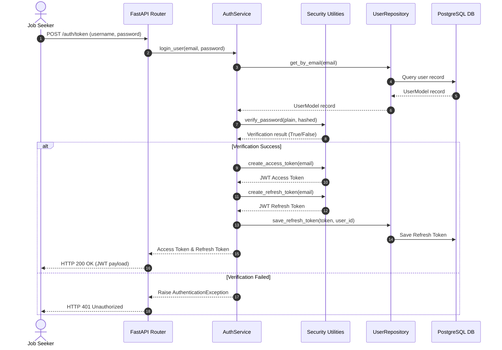

# Authentication & User Management Module

This module manages registration, secure login, Google OAuth callbacks, JWT tokens validation, and user profile management, implementing Clean Architecture and Domain-Driven Design (DDD) principles.

---

## 1. Module Architecture & Flow Diagram

The diagram below shows the login flow through the module components:

---

## 2. API Endpoint Specification

*   `POST /api/v1/auth/register`: Register new users.
*   `POST /api/v1/auth/token`: OAuth2 login endpoint (returns access and refresh tokens).
*   `POST /api/v1/auth/refresh`: Refresh access tokens using refresh tokens.
*   `POST /api/v1/auth/logout`: Revoke active refresh tokens.
*   `GET /api/v1/users/me`: Retrieve current authenticated user profile details.
*   `PUT /api/v1/users/me`: Update first/last names on the active user profile.

---

## 3. Design Decisions & Trade-offs

*   **Bcrypt Hashing**: User credentials are encrypted using the `bcrypt` algorithm before storage, securing them against dictionary and brute-force lookup attacks.
*   **Split Token Model**: Utilizes short-lived access tokens (expires after 24 hours) for API requests alongside long-lived refresh tokens (expires after 7 days) stored in the database to support seamless session updates.
*   **Domain Validation Rules**: Decouples validation logic by running email and syntax checks inside pure Python domain entities (`User` and `UserProfile`) before accessing SQL transactions.
