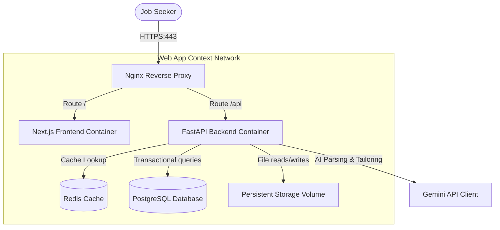
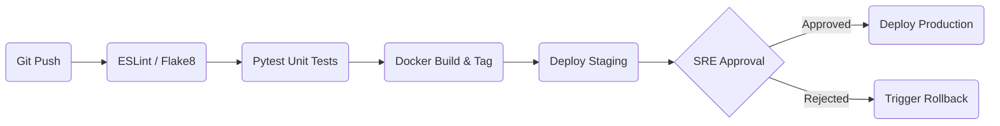

# Production Deployment & Version 1.0 Release Guide

This guide details deployment topology architectures, container builds instructions, database backup procedures, and the Go-Live launching checklist for the Version 1.0 release.

---

## 1. Production Deployment Topology

The diagram below represents the high-availability secure deployment topology:



---

## 2. Docker Compose Deploy Commands

### Initial Build & Starting Services
Ensure you copy `.env.example` to `.env` and populate secrets before running the stack:
```bash
# Clone repository and change to root directory
cd jobcopilot_ai

# Build and start all containers in background daemon mode
docker-compose up --build -d
```

---

## 3. Database Backups & Restore Runbooks

### Automated Database Backup Script
Run daily cron jobs utilizing `pg_dump` to save snapshots on mounted storage:
```bash
# Command to execute PostgreSQL dump
docker exec -t db_postgres pg_dumpall -U postgres > /app/storage/backups/db_backup_$(date +%F).sql
```

### Restore Procedures
To restore the database from a snapshot:
```bash
# Run psql import inside db container
cat db_backup_target.sql | docker exec -i db_postgres psql -U postgres -d jobcopilot_db
```

---

## 4. CI/CD Deployment Pipeline Flow

The deployment pipeline follows a standard testing and approval progression:



---

## 5. Go-Live Launch Checklist

Before deploying Version 1.0 to production, verify the following:

- [ ] **Secrets Rotated**: Verified that database passwords, JWT signing keys, and Gemini API keys are distinct from development environments.
- [ ] **SSL Configured**: Verified that HTTPS certificates are active and HTTP traffic successfully redirects to HTTPS.
- [ ] **Migrations Applied**: Verified that Alembic upgrades are completed on the production database.
- [ ] **Disk Space Audited**: Verified that persistent storage volumes have at least 50GB of free space.
- [ ] **Tests Passing**: Verified that backend and frontend test suites pass with 100% success rates.
