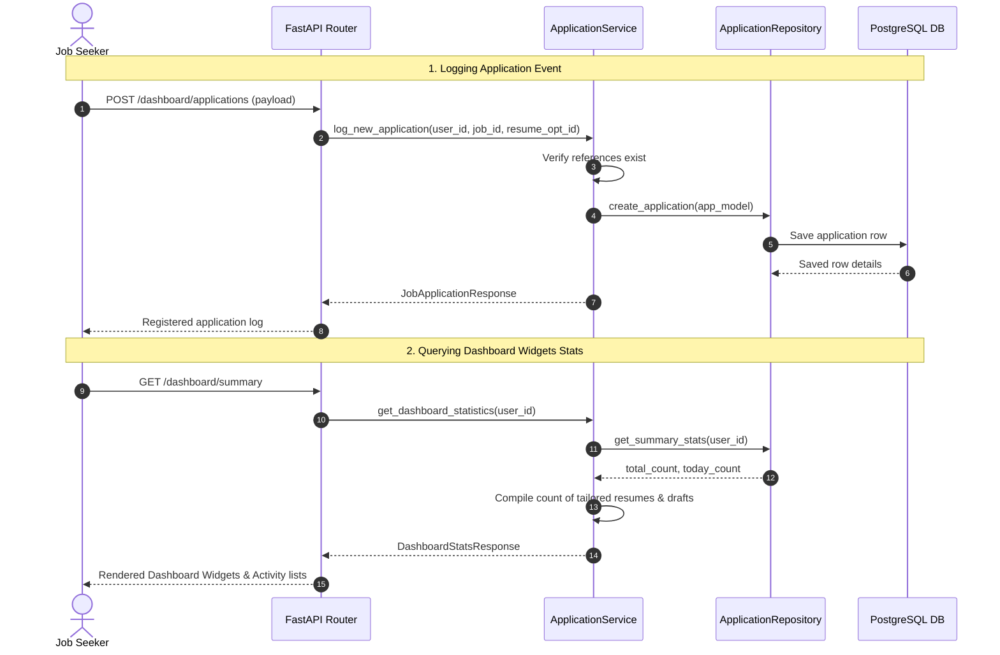

# Application Management & Dashboard Module

This module serves as the central hub of the candidate workspace, presenting aggregate dashboard widgets, tracking job applications logs, and exposing search utilities.

---

## 1. Dashboard Ingestion & Logging Workflow

The diagram below shows how applications are logged, details queried, and summaries loaded:

---

## 2. API Endpoint Specification

*   `GET /api/v1/dashboard/summary`: Retrieve aggregate counters and recent applications details.
*   `POST /api/v1/dashboard/applications`: Log a new job application event.
*   `GET /api/v1/dashboard/applications`: List all application logs.
*   `GET /api/v1/dashboard/applications/search`: Search and filter logged applications.
*   `GET /api/v1/dashboard/applications/{id}`: Retrieve details for a specific logged application by ID.
*   `DELETE /api/v1/dashboard/applications/{id}`: Delete an application log from database tables.

---

## 3. Design Decisions & Trade-offs

*   **Loose Coupling via Relational IDs**: The `applications` table stores UUID references to other entities (resumes, jobs, email histories) rather than duplicating job descriptions or email bodies. This ensures references stay consistent when updates occur elsewhere.
*   **Search Optimization Index**: The `company_name` and `job_title` columns have database indexes to keep search queries fast as the application log history grows.
*   **Encapsulated Stats Calculations**: Statistics queries are handled at the service layer to keep repository code focused on clean CRUD operations.
