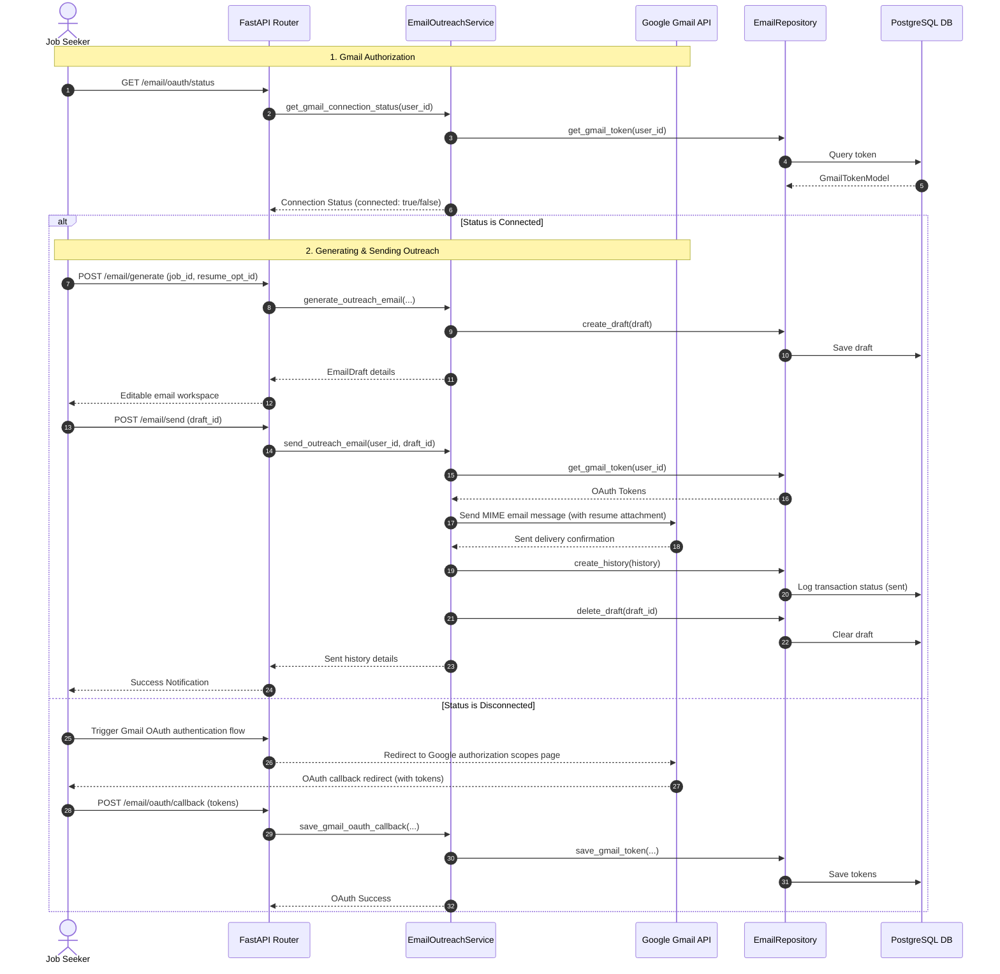

# Email Outreach & Gmail Integration Module

This module manages drafting recruiter outreach messages based on job details and tailored resumes, updates drafts, processes Google OAuth credentials, and delivers emails securely via the Gmail API.

---

## 1. OAuth & Outreach Delivery Sequence

The sequence diagram below shows the OAuth callbacks, email updates, and secure sending processes:

---

## 2. API Endpoint Specification

*   `POST /api/v1/email/generate`: Generate outreach draft text.
*   `PUT /api/v1/email/draft/{id}`: Update active draft details in the workspace.
*   `POST /api/v1/email/send`: Deliver the outreach email via the Gmail API (requires explicit user confirmation).
*   `GET /api/v1/email/drafts`: List active drafts.
*   `DELETE /api/v1/email/draft/{id}`: Delete an email draft.
*   `GET /api/v1/email/history`: List sent email history logs.
*   `GET /api/v1/email/oauth/status`: Check Gmail connection status.
*   `POST /api/v1/email/oauth/callback`: Save Google OAuth tokens.

---

## 3. Design Decisions & Trade-offs

*   **Explicit User Approval**: The system is strictly prohibited from sending emails automatically. Every message must be reviewed, edited, and approved by the user in the workspace before sending.
*   **Gmail API vs. Standard SMTP**: The system uses the Google Gmail API instead of SMTP. This allows the application to manage refresh tokens securely and send emails directly from the user's personal Gmail account.
*   **Encrypted Token Storage**: OAuth access and refresh tokens are encrypted before storage to protect Gmail session credentials.
