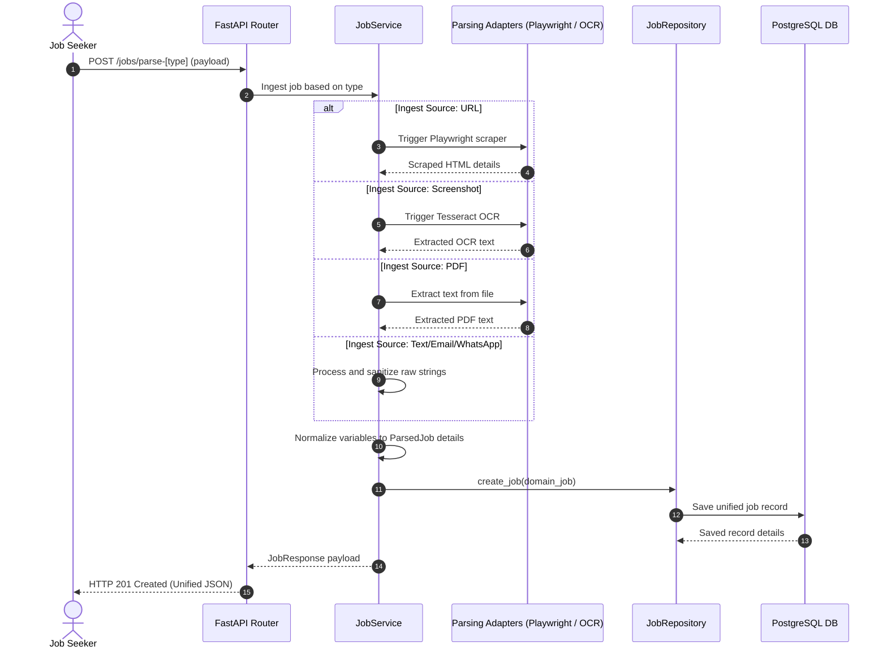

# Job Ingestion & Content Extraction Module

This module manages job posting ingestion from multiple sources, runs scrapers, OCR extractions, and structures information into a unified schema.

---

## 1. Job Ingestion Workflow

The diagram below shows the parsing and normalization sequence for different input formats:

---

## 2. API Endpoint Specification

*   `POST /api/v1/jobs/parse-url`: Scrape and parse jobs from URLs.
*   `POST /api/v1/jobs/parse-text`: Parse plain text job descriptions.
*   `POST /api/v1/jobs/parse-pdf`: Extract and parse job descriptions from PDF files.
*   `POST /api/v1/jobs/parse-image`: Ingest job details from screenshot images.
*   `POST /api/v1/jobs/parse-email`: Parse recruiter outreach email texts.
*   `POST /api/v1/jobs/parse-whatsapp`: Parse job referral text details pasted from WhatsApp.
*   `GET /api/v1/jobs/{id}`: Retrieve details for a previously parsed job posting.
*   `GET /api/v1/jobs`: List all job postings parsed by the current user.
*   `DELETE /api/v1/jobs/{id}`: Delete a parsed job posting from database logs.

---

## 3. Design Decisions & Trade-offs

*   **Unified Schema Target**: Regardless of input type (URLs, text, image, etc.), the system normalizes the data into a single, standardized structure. This simplifies the design of downstream modules like the *AI Optimization Module*.
*   **Decoupled Scrapers**: Playwright scraping configurations and OCR modules are structured as independent adapters. This allows upgrading extraction tools without changing the core FastAPI routing or service logic.
*   **User Data Security**: Endpoints verify JWT token subjects on every call. Database repositories filter queries by the authenticated user's UUID, ensuring users can only access their own jobs history.
