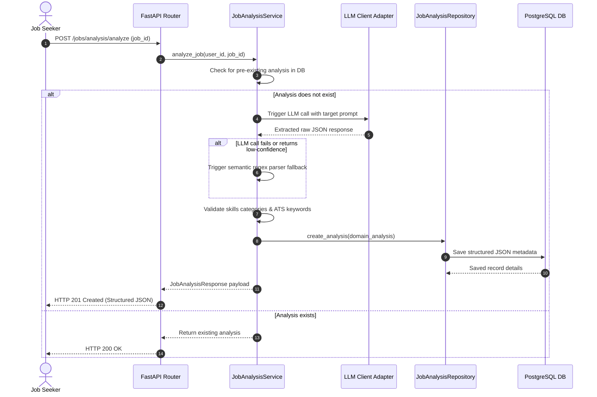

# AI Job Understanding Engine Module

This module runs semantic parses and LLM validations to extract structured, categorized job intelligence from raw job postings.

---

## 1. AI Analysis Workflow

The diagram below shows the processing, validation, and storage sequence:



---

## 2. API Endpoint Specification

*   `POST /api/v1/jobs/analysis/analyze`: Run AI analysis on a parsed job posting.
*   `GET /api/v1/jobs/analysis/{id}`: Retrieve details for a specific analysis by ID.
*   `GET /api/v1/jobs/analysis/by-job/{job_id}`: Retrieve analysis details by job ID.
*   `GET /api/v1/jobs/analysis`: List all job analyses parsed by the current user.
*   `DELETE /api/v1/jobs/analysis/{id}`: Delete a job analysis record from database logs.

---

## 3. JSON Output Structure Specification
The API returns structured job intelligence matching the following layout:
```json
{
  "id": "e305e7e0-94d7-463e-8f2b-98dfb01d36d4",
  "job_id": "ab65e7e0-94d7-463e-8f2b-98dfb01d36d1",
  "confidence_score": 0.95,
  "llm_provider": "gemini",
  "prompt_version": "1.0.0",
  "processing_time_ms": 350,
  "metadata": {
    "seniority": "Senior",
    "employment_type": "Full-Time",
    "education_requirements": "Bachelor's degree in Computer Science",
    "certifications": ["AWS Certified Solutions Architect"]
  },
  "skills": [
    {"name": "Python", "category": "Programming Languages", "importance": "Mandatory"},
    {"name": "React", "category": "Frameworks", "importance": "Preferred"}
  ],
  "ats_keywords": [
    {"word": "API", "category": "Technical"},
    {"word": "Develop", "category": "Action Verbs"}
  ],
  "responsibilities": [
    "Design and build scalable APIs.",
    "Collaborate with cross-functional teams."
  ],
  "qualifications": [
    "Bachelor's degree in Computer Science.",
    "3+ years of experience with Python."
  ],
  "created_at": "2026-08-04T16:47:00Z"
}
```
