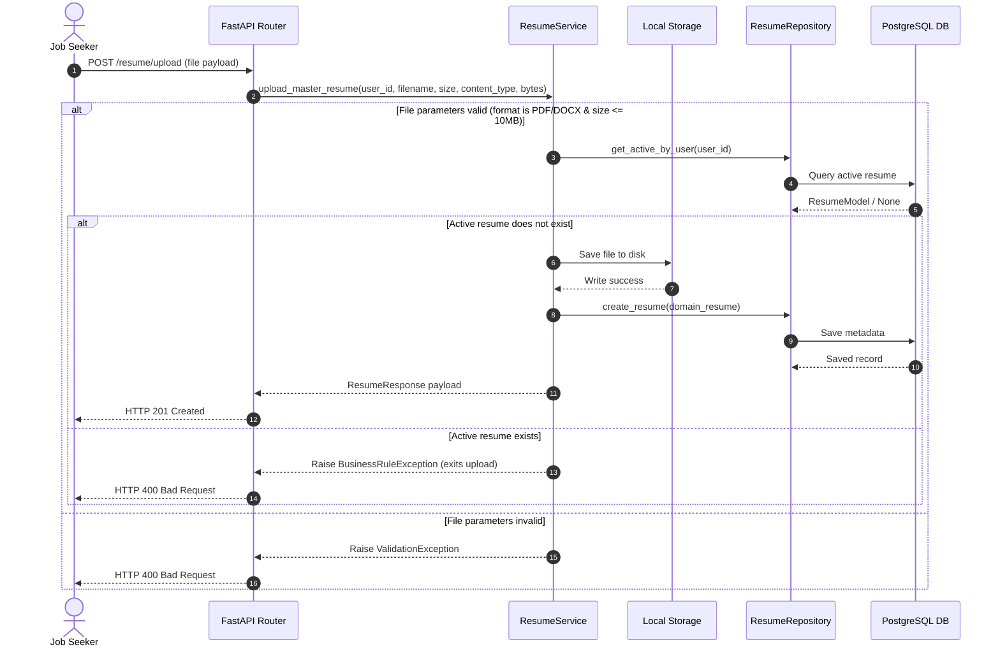

# Resume Management Module

This module manages master resume template uploads, file storage validation, replace commands, downloads, and tailored versions tracking.

---

## 1. File Upload Workflow

The diagram below shows the validation and storage steps during file uploads:

---

## 2. API Endpoint Specification

*   `POST /api/v1/resume/upload`: Upload master resume template.
*   `GET /api/v1/resume`: Retrieve details for active master resume.
*   `GET /api/v1/resume/download`: Download active master resume file.
*   `PUT /api/v1/resume/replace`: Replace active master resume.
*   `DELETE /api/v1/resume`: Soft-delete active master resume and clear files.
*   `GET /api/v1/resume/versions`: List tailored resume versions metadata.

---

## 3. Design Decisions & Trade-offs

*   **Immutable Master Resume**: The original uploaded file is never modified on disk. All optimized variants generated in the future are saved as separate files and tracked in the database as versions (`ResumeVersionModel`).
*   **Unique File Names**: Uploaded templates are saved using user-specific prefixes and timestamps (`[user_id]_[timestamp]_master.[ext]`) to avoid name collisions in local volumes.
*   **Local Storage Volatility**: Local filesystem storage is used for the MVP. This setup provides rapid reads/writes but requires volume persistence configurations in Docker Compose, which will be migrated to S3 object storage in production.
